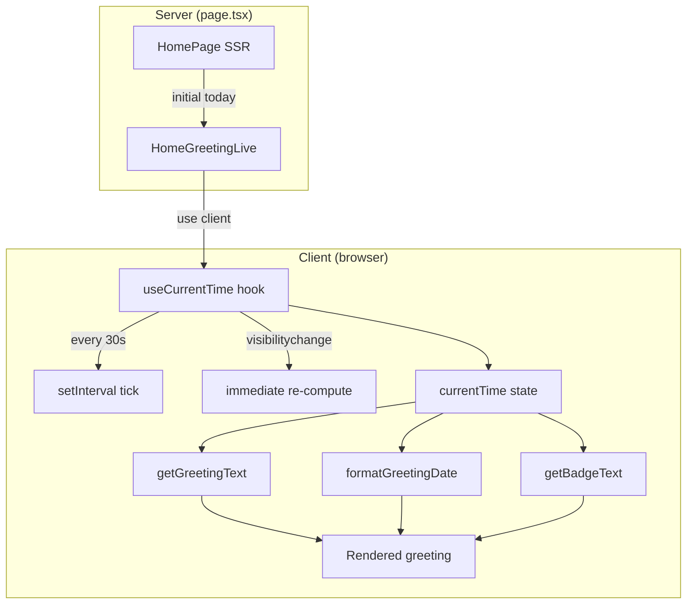

# Design Document — adhd-daily-app-mvp (Remaining Gaps)

## Overview

This design covers the remaining unimplemented features from the `adhd-daily-app-mvp` spec. Most requirements (1, 2, 4, 5, 6, 7) are already fully implemented through separate specs (`daily-log-system`, `weekly-task-system`, `weekly-calendar`, `reminder-system`).

**What remains:**
1. **Requirement 3, AC 6** — Live greeting/badge update when time crosses a period boundary or midnight, within 60s, without page reload.
2. **Requirement 3, AC 7** — Instant greeting/badge update when app resumes from background after a date/period change.

**Current state:** `HomeGreeting` is a React Server Component that receives `today` as a prop computed once at page load. It has no client-side reactivity — the greeting never updates unless the user navigates away and back.

**Solution:** Extract a client-side wrapper component that owns the current time state, auto-refreshes on interval, and re-renders on `visibilitychange`.

---

## Architecture



**Key decisions:**
- The existing `HomeGreeting` server component remains available for non-JS contexts (initial SSR), but the home page switches to a new `HomeGreetingLive` client component.
- A custom hook `useCurrentTime()` encapsulates the timer + visibility logic. This keeps the component pure and testable.
- The interval runs every 30s (well within the 60s requirement), checking if the period or date changed since last render.
- On `visibilitychange` (tab becomes visible), the hook immediately re-reads `new Date()` and triggers a re-render — satisfying AC 7's "first visible render" requirement.

---

## Components and Interfaces

### `useCurrentTime` hook

```typescript
// lib/hooks/useCurrentTime.ts
"use client";

import { useState, useEffect } from "react";

interface UseCurrentTimeOptions {
  /** Interval in ms between time checks. Default: 30000 (30s) */
  intervalMs?: number;
}

/**
 * Returns a reactive Date that updates:
 * - Every `intervalMs` milliseconds
 * - Immediately when document becomes visible after being hidden
 */
export function useCurrentTime(options?: UseCurrentTimeOptions): Date;
```

### `HomeGreetingLive` component

```typescript
// components/home/HomeGreetingLive.tsx
"use client";

interface HomeGreetingLiveProps {
  /** Initial server time for SSR hydration match */
  initialTime: string; // ISO string from server
}

/**
 * Client component that renders greeting, date, subtitle, and badge.
 * Uses useCurrentTime to stay synchronized with device clock.
 */
export function HomeGreetingLive({ initialTime }: HomeGreetingLiveProps): JSX.Element;
```

### Pure utility functions (extracted for testability)

```typescript
// lib/utils/greeting.ts

/** Returns greeting text based on hour (0-23) */
export function getGreetingText(hour: number): "Bom dia" | "Boa tarde" | "Boa noite";

/** Returns formatted date string: "segunda-feira, 7 de julho" */
export function formatGreetingDate(date: Date): string;

/** Returns badge text: "faltam N dias no mês" or "último dia do mês" */
export function getBadgeText(date: Date): string;

/** Returns the period key for a given hour */
export type TimePeriod = "morning" | "afternoon" | "evening";
export function getTimePeriod(hour: number): TimePeriod;
```

---

## Data Models

No new database models are needed. This feature is entirely client-side, operating on `Date` objects from the browser clock.

**State managed by `useCurrentTime`:**

| Field | Type | Description |
|-------|------|-------------|
| `currentTime` | `Date` | Current device time, refreshed on interval and visibility |

**Derived values (pure functions, no state):**

| Value | Source | Function |
|-------|--------|----------|
| Greeting text | `currentTime.getHours()` | `getGreetingText(hour)` |
| Formatted date | `currentTime` | `formatGreetingDate(date)` |
| Badge text | `currentTime` | `getBadgeText(date)` |

---

## Correctness Properties

*A property is a characteristic or behavior that should hold true across all valid executions of a system — essentially, a formal statement about what the system should do. Properties serve as the bridge between human-readable specifications and machine-verifiable correctness guarantees.*

### Property 1: Greeting period mapping is exhaustive and correct

*For any* integer hour in the range [0, 23], `getGreetingText(hour)` SHALL return "Bom dia" if hour ∈ [0, 11], "Boa tarde" if hour ∈ [12, 17], and "Boa noite" if hour ∈ [18, 23]. No other value shall be returned and no hour shall be unmapped.

**Validates: Requirements 3.1, 3.6**

### Property 2: Date formatting produces valid pt-BR pattern

*For any* valid Date object, `formatGreetingDate(date)` SHALL return a string matching the pattern `<weekday>, <day> de <month>` where weekday is a valid Portuguese day name, day is a 1–2 digit number, and month is a valid Portuguese month name.

**Validates: Requirements 3.2**

### Property 3: Badge text is consistent with date arithmetic

*For any* valid Date object, `getBadgeText(date)` SHALL return "último dia do mês" when `getDate(date) === getDaysInMonth(date)`, and "faltam N dias no mês" (where N = `getDaysInMonth(date) - getDate(date)`) otherwise. N is always a positive integer.

**Validates: Requirements 3.4, 3.5**

---

## Error Handling

| Scenario | Behavior |
|----------|----------|
| `useCurrentTime` called in SSR context | Falls back to `initialTime` prop (ISO string parsed to Date). No error thrown. |
| `document.visibilityState` not supported (old browser) | Hook gracefully degrades to interval-only updates. Feature still works within 30s. |
| Invalid `initialTime` prop (malformed ISO) | Defaults to `new Date()` at hydration time. |
| System clock jumps (e.g., NTP correction) | Next interval tick picks up new time naturally. No special handling needed. |

---

## Testing Strategy

### Unit Tests (example-based)

- `useCurrentTime` hook: verify it returns a Date, updates on `visibilitychange`, and ticks on interval.
- `HomeGreetingLive` component: render with a fixed time, verify greeting/date/badge text.
- Integration: verify that navigating from background triggers immediate update (simulated via `fireEvent`).

### Property-Based Tests (via `fast-check`)

The pure utility functions (`getGreetingText`, `formatGreetingDate`, `getBadgeText`) are ideal for property-based testing:

- **Library:** `fast-check` (already standard in the JS/TS ecosystem, compatible with Vitest)
- **Iterations:** Minimum 100 per property
- **Tag format:** `Feature: adhd-daily-app-mvp, Property N: <property text>`

| Property | Generator | Assertion |
|----------|-----------|-----------|
| 1: Greeting period mapping | `fc.integer({min: 0, max: 23})` | Output matches expected greeting for the hour's range |
| 2: Date format pattern | `fc.date({min: new Date(2020,0,1), max: new Date(2030,11,31)})` | Output matches `/^.+, \d{1,2} de .+$/` regex with valid pt-BR words |
| 3: Badge text arithmetic | `fc.date({min: new Date(2020,0,1), max: new Date(2030,11,31)})` | Output equals computed "faltam N" or "último dia" based on date math |

### What is NOT property-tested

- Timer/interval behavior (integration, not pure logic)
- `visibilitychange` wiring (integration/DOM event, example-based test)
- Component rendering (snapshot/example-based)
