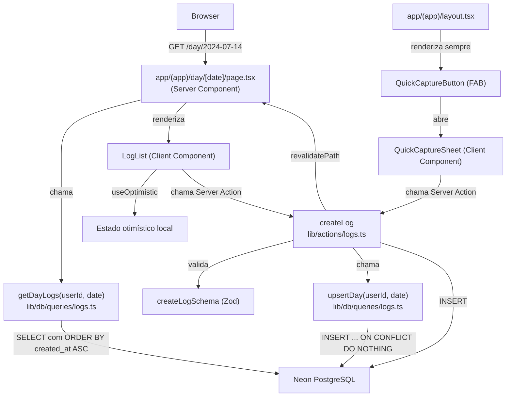

# Design Document — daily-log-system

## Overview

Este documento descreve o design técnico do **sistema de registro diário** do Weekly Companion App. Cobre a rota `/day/[date]` (Day View), as Server Actions de criação/edição/exclusão de logs, a query `getDayLogs`, a função `upsertDay`, o padrão de Optimistic UI com `useOptimistic`, e o QuickCaptureButton/Sheet disponível em todas as telas autenticadas.

O princípio central é **velocidade > estrutura**: o único campo obrigatório é o texto livre. A interface deve parecer instantânea — o log aparece na tela antes mesmo da confirmação do servidor. Nenhuma mecânica de culpa, nenhum bloqueio por dias futuros, nenhuma fricção adicional.

### Decisões de design relevantes

| Decisão | Escolha | Racional |
|---|---|---|
| Mutações | Server Actions (`lib/actions/logs.ts`) | Disparadas diretamente pela UI, sem necessidade de endpoint REST externo |
| Optimistic UI | `useOptimistic` (React 18) | Nativo ao React, sem biblioteca adicional, integra com Server Actions |
| Leitura de dados | Server Component (`DayPage`) com query direta | Sem waterfall cliente; dados chegam pré-renderizados |
| Validação | Zod com schema em `lib/validation/log.schema.ts` | Consistente com o restante da stack; valida antes de qualquer query |
| upsertDay | Query dedicada em `lib/db/queries/logs.ts` | Garante atomicidade; Day é criado ou retornado sem race condition |
| Navegação | Cálculo de `weekStart` com `getWeekStart()` de `lib/utils/date.ts` | Função pura, reutilizável, já coberta por testes no project-setup |
| QuickCapture | Renderizado no layout autenticado `app/(app)/layout.tsx` | Disponível em todas as rotas do grupo sem duplicação |


---

## Architecture

O fluxo da feature segue o padrão **RSC + Server Actions + Optimistic UI**:



### Camadas e responsabilidades

| Camada | Arquivo | Responsabilidade |
|---|---|---|
| Routing/Page | `app/(app)/day/[date]/page.tsx` | Validar param `date`, buscar dados, renderizar |
| Query | `lib/db/queries/logs.ts` | `getDayLogs`, `upsertDay` — toda lógica de banco |
| Server Actions | `lib/actions/logs.ts` | `createLog`, `updateLog`, `deleteLog` — validação + mutação |
| Validação | `lib/validation/log.schema.ts` | Schemas Zod para todos os payloads |
| Componentes | `components/logs/*` | UI interativa (lista, item, form, FAB, sheet) |
| Utilitários | `lib/utils/date.ts` | `getWeekStart` — já existente do project-setup |


---

## Components and Interfaces

### `app/(app)/day/[date]/page.tsx` — DayPage (Server Component)

Valida o parâmetro `date`, busca os logs via query e passa os dados para os componentes cliente.

```typescript
// app/(app)/day/[date]/page.tsx
import { z } from "zod";
import { notFound } from "next/navigation";
import { isValid, parseISO, format } from "date-fns";
import { ptBR } from "date-fns/locale";
import { getDayLogs } from "@/lib/db/queries/logs";
import { getWeekStart } from "@/lib/utils/date";
import { LogList } from "@/components/logs/LogList";
import { getCurrentUserId } from "@/lib/auth"; // da spec auth

const dateParamSchema = z
  .string()
  .regex(/^\d{4}-\d{2}-\d{2}$/, "Formato inválido")
  .refine((s) => isValid(parseISO(s)), "Data inválida");

interface DayPageProps {
  params: { date: string };
}

export default async function DayPage({ params }: DayPageProps) {
  const parsed = dateParamSchema.safeParse(params.date);
  if (!parsed.success) notFound();

  const date = parsed.data;
  const userId = await getCurrentUserId();
  const logs = await getDayLogs(userId, date);
  const weekStart = getWeekStart(date);
  const isToday = date === format(new Date(), "yyyy-MM-dd");
  const displayDate = format(parseISO(date), "EEEE, d 'de' MMMM", { locale: ptBR });

  return (
    <main>
      <header>
        <a href={`/week/${weekStart}`}>← Voltar à semana</a>
        <h1>{isToday ? "Hoje" : displayDate}</h1>
      </header>
      <LogList initialLogs={logs} date={date} />
    </main>
  );
}
```

**Decisão:** `notFound()` em vez de redirecionar — datas inválidas resultam em 404 limpo, não em loop de redirect.


---

### `components/logs/LogList.tsx` — Client Component (Optimistic UI)

Gerencia o estado otimístico da lista de logs e expõe o formulário de criação inline.

```typescript
// components/logs/LogList.tsx
"use client";

import { useOptimistic, useTransition } from "react";
import type { Log } from "@/drizzle/schema";
import { createLog } from "@/lib/actions/logs";
import { LogItem } from "./LogItem";
import { LogForm } from "./LogForm";

interface LogListProps {
  initialLogs: Log[];
  date: string;
}

type OptimisticAction =
  | { type: "add"; log: Log }
  | { type: "remove"; id: string }
  | { type: "update"; id: string; content: string };

function logsReducer(state: Log[], action: OptimisticAction): Log[] {
  switch (action.type) {
    case "add":    return [...state, action.log];
    case "remove": return state.filter((l) => l.id !== action.id);
    case "update": return state.map((l) =>
      l.id === action.id ? { ...l, content: action.content } : l
    );
  }
}

export function LogList({ initialLogs, date }: LogListProps) {
  const [optimisticLogs, dispatchOptimistic] = useOptimistic(
    initialLogs,
    logsReducer
  );
  const [, startTransition] = useTransition();

  const handleCreate = async (content: string) => {
    const tempId = crypto.randomUUID();
    const tempLog: Log = {
      id: tempId,
      dayId: "optimistic",
      content,
      mood: null,
      createdAt: new Date(),
    };
    startTransition(async () => {
      dispatchOptimistic({ type: "add", log: tempLog });
      const result = await createLog({ content, date });
      if (!result.success) {
        dispatchOptimistic({ type: "remove", id: tempId });
        // exibir erro inline — tratado pelo LogForm via return value
      }
    });
  };

  if (optimisticLogs.length === 0) {
    return (
      <section aria-label="Sem registros">
        <p>Nenhum registro ainda. Que tal começar agora?</p>
        <LogForm onSubmit={handleCreate} />
      </section>
    );
  }

  return (
    <section>
      <ul>
        {optimisticLogs.map((log) => (
          <LogItem key={log.id} log={log} dispatch={dispatchOptimistic} date={date} />
        ))}
      </ul>
      <LogForm onSubmit={handleCreate} />
    </section>
  );
}
```


---

### `components/logs/LogItem.tsx`

Exibe um log individual com opções de editar e excluir. Gerencia seu próprio estado de edição local.

```typescript
// components/logs/LogItem.tsx
"use client";

import { useState } from "react";
import type { Log } from "@/drizzle/schema";
import { updateLog, deleteLog } from "@/lib/actions/logs";
import type { OptimisticAction } from "./LogList"; // re-exportar o tipo

interface LogItemProps {
  log: Log;
  dispatch: (action: OptimisticAction) => void;
  date: string;
}

export function LogItem({ log, dispatch, date }: LogItemProps) {
  const [editing, setEditing] = useState(false);
  const [editContent, setEditContent] = useState(log.content);
  const [confirmingDelete, setConfirmingDelete] = useState(false);
  const [error, setError] = useState<string | null>(null);

  const handleUpdate = async () => {
    const result = await updateLog({ logId: log.id, content: editContent, date });
    if (result.success) {
      dispatch({ type: "update", id: log.id, content: editContent });
      setEditing(false);
      setError(null);
    } else {
      setEditContent(log.content); // restaurar
      setError(result.error ?? "Erro ao salvar");
    }
  };

  const handleDelete = async () => {
    dispatch({ type: "remove", id: log.id }); // otimístico
    const result = await deleteLog({ logId: log.id, date });
    if (!result.success) {
      // reverter — rehydrate via revalidatePath no server
      setError(result.error ?? "Erro ao excluir");
    }
  };

  if (editing) {
    return (
      <li>
        <textarea value={editContent} onChange={(e) => setEditContent(e.target.value)} />
        <button onClick={handleUpdate}>Salvar</button>
        <button onClick={() => { setEditing(false); setEditContent(log.content); }}>
          Cancelar
        </button>
        {error && <p role="alert">{error}</p>}
      </li>
    );
  }

  return (
    <li>
      <p>{log.content}</p>
      <button onClick={() => setEditing(true)}>Editar</button>
      {confirmingDelete ? (
        <>
          <button onClick={handleDelete}>Confirmar exclusão</button>
          <button onClick={() => setConfirmingDelete(false)}>Cancelar</button>
        </>
      ) : (
        <button onClick={() => setConfirmingDelete(true)}>Excluir</button>
      )}
      {error && <p role="alert">{error}</p>}
    </li>
  );
}
```

---

### `components/logs/LogForm.tsx`

Campo de entrada inline para criação de log. Gerencia validação client-side de whitespace.

```typescript
// components/logs/LogForm.tsx
"use client";

import { useState } from "react";

interface LogFormProps {
  onSubmit: (content: string) => Promise<void>;
}

export function LogForm({ onSubmit }: LogFormProps) {
  const [content, setContent] = useState("");
  const [error, setError] = useState<string | null>(null);

  const handleSubmit = async (e: React.FormEvent) => {
    e.preventDefault();
    if (!content.trim()) {
      setError("O registro não pode ser vazio.");
      return;
    }
    if (content.length > 2000) {
      setError("O registro deve ter no máximo 2000 caracteres.");
      return;
    }
    setError(null);
    await onSubmit(content.trim());
    setContent("");
  };

  return (
    <form onSubmit={handleSubmit}>
      <textarea
        value={content}
        onChange={(e) => setContent(e.target.value)}
        placeholder="O que aconteceu hoje?"
        maxLength={2000}
        aria-label="Novo registro"
      />
      {error && <p role="alert">{error}</p>}
      <button type="submit">Registrar</button>
    </form>
  );
}
```


---

### `components/logs/QuickCaptureButton.tsx` — FAB Global

Botão flutuante renderizado no layout autenticado. Gerencia o estado de abertura do sheet.

```typescript
// components/logs/QuickCaptureButton.tsx
"use client";

import { useState } from "react";
import { format } from "date-fns";
import { QuickCaptureSheet } from "./QuickCaptureSheet";

export function QuickCaptureButton() {
  const [open, setOpen] = useState(false);
  const today = format(new Date(), "yyyy-MM-dd");

  return (
    <>
      {!open && (
        <button
          aria-label="Captura rápida"
          onClick={() => setOpen(true)}
          className="fixed bottom-6 right-6 z-50 rounded-full bg-blue-600 p-4 text-white shadow-lg"
        >
          +
        </button>
      )}
      <QuickCaptureSheet open={open} onClose={() => setOpen(false)} date={today} />
    </>
  );
}
```

---

### `components/logs/QuickCaptureSheet.tsx`

Sheet/modal para captura rápida. Sempre associa o log à data atual, independente de qual tela o usuário está.

```typescript
// components/logs/QuickCaptureSheet.tsx
"use client";

import { useRef, useEffect, useState } from "react";
import { createLog } from "@/lib/actions/logs";

interface QuickCaptureSheetProps {
  open: boolean;
  onClose: () => void;
  date: string; // data atual (hoje)
}

export function QuickCaptureSheet({ open, onClose, date }: QuickCaptureSheetProps) {
  const textareaRef = useRef<HTMLTextAreaElement>(null);
  const [content, setContent] = useState("");
  const [error, setError] = useState<string | null>(null);

  useEffect(() => {
    if (open) {
      setTimeout(() => textareaRef.current?.focus(), 50);
    }
  }, [open]);

  const handleSubmit = async (e: React.FormEvent) => {
    e.preventDefault();
    if (!content.trim()) { setError("O registro não pode ser vazio."); return; }
    const result = await createLog({ content: content.trim(), date });
    if (result.success) {
      setContent("");
      setError(null);
      onClose();
    } else {
      setError(result.error ?? "Erro ao salvar. Tente novamente.");
    }
  };

  const handleKeyDown = (e: React.KeyboardEvent) => {
    if (e.key === "Escape") { onClose(); }
  };

  if (!open) return null;

  return (
    <div role="dialog" aria-modal="true" aria-label="Captura rápida" onKeyDown={handleKeyDown}>
      <div>
        <h2>Captura rápida</h2>
        <button onClick={onClose} aria-label="Fechar">✕</button>
      </div>
      <form onSubmit={handleSubmit}>
        <textarea
          ref={textareaRef}
          value={content}
          onChange={(e) => setContent(e.target.value)}
          placeholder="O que está acontecendo?"
          maxLength={2000}
        />
        {error && <p role="alert">{error}</p>}
        <button type="submit">Registrar</button>
      </form>
    </div>
  );
}
```

---

### `app/(app)/layout.tsx` — Layout Autenticado (atualizado)

Inclui o `QuickCaptureButton` para que esteja presente em todas as rotas do grupo autenticado.

```typescript
// app/(app)/layout.tsx
import { QuickCaptureButton } from "@/components/logs/QuickCaptureButton";

export default function AppLayout({ children }: { children: React.ReactNode }) {
  return (
    <>
      {children}
      <QuickCaptureButton />
    </>
  );
}
```

**Decisão:** O `QuickCaptureButton` é um Client Component renderizado no Server Component de layout. O Next.js App Router suporta isso sem problema — o Server Component é o shell, o Client Component hidrata no browser.


---

### `lib/validation/log.schema.ts` — Schemas Zod (atualizado)

```typescript
// lib/validation/log.schema.ts
import { z } from "zod";

const contentSchema = z
  .string()
  .min(1, "O conteúdo do log não pode ser vazio")
  .max(2000, "O conteúdo deve ter no máximo 2000 caracteres")
  .refine((s) => s.trim().length > 0, "O conteúdo não pode conter apenas espaços em branco");

const dateSchema = z
  .string()
  .regex(/^\d{4}-\d{2}-\d{2}$/, "Data deve estar no formato yyyy-MM-dd");

const logIdSchema = z.string().uuid("logId deve ser um UUID válido");

export const createLogSchema = z.object({
  content: contentSchema,
  date: dateSchema,
});

export const updateLogSchema = z.object({
  logId: logIdSchema,
  content: contentSchema,
  date: dateSchema,
});

export const deleteLogSchema = z.object({
  logId: logIdSchema,
  date: dateSchema,
});

export type CreateLogInput = z.infer<typeof createLogSchema>;
export type UpdateLogInput = z.infer<typeof updateLogSchema>;
export type DeleteLogInput = z.infer<typeof deleteLogSchema>;
```

---

### `lib/actions/logs.ts` — Server Actions

```typescript
// lib/actions/logs.ts
"use server";

import { revalidatePath } from "next/cache";
import { createLogSchema, updateLogSchema, deleteLogSchema } from "@/lib/validation/log.schema";
import { upsertDay, insertLog, updateLogById, deleteLogById, getLogOwner } from "@/lib/db/queries/logs";
import { getCurrentUserId } from "@/lib/auth";

type ActionResult = { success: true } | { success: false; error: string };

export async function createLog(input: unknown): Promise<ActionResult> {
  const parsed = createLogSchema.safeParse(input);
  if (!parsed.success) {
    return { success: false, error: parsed.error.issues[0]?.message ?? "Dados inválidos" };
  }
  const userId = await getCurrentUserId();
  const day = await upsertDay(userId, parsed.data.date);
  await insertLog({ dayId: day.id, content: parsed.data.content });
  revalidatePath(`/day/${parsed.data.date}`);
  return { success: true };
}

export async function updateLog(input: unknown): Promise<ActionResult> {
  const parsed = updateLogSchema.safeParse(input);
  if (!parsed.success) {
    return { success: false, error: parsed.error.issues[0]?.message ?? "Dados inválidos" };
  }
  const userId = await getCurrentUserId();
  const owner = await getLogOwner(parsed.data.logId);
  if (owner?.userId !== userId) {
    return { success: false, error: "Não autorizado" };
  }
  await updateLogById(parsed.data.logId, parsed.data.content);
  revalidatePath(`/day/${parsed.data.date}`);
  return { success: true };
}

export async function deleteLog(input: unknown): Promise<ActionResult> {
  const parsed = deleteLogSchema.safeParse(input);
  if (!parsed.success) {
    return { success: false, error: parsed.error.issues[0]?.message ?? "Dados inválidos" };
  }
  const userId = await getCurrentUserId();
  const owner = await getLogOwner(parsed.data.logId);
  if (owner?.userId !== userId) {
    return { success: false, error: "Não autorizado" };
  }
  await deleteLogById(parsed.data.logId);
  revalidatePath(`/day/${parsed.data.date}`);
  return { success: true };
}
```


---

### `lib/db/queries/logs.ts` — Queries

```typescript
// lib/db/queries/logs.ts
import { eq, and, asc } from "drizzle-orm";
import { db } from "@/lib/db/client";
import { days, logs } from "@/drizzle/schema";
import type { Log, Day } from "@/drizzle/schema";

/**
 * Retorna todos os logs de um dia específico para um usuário,
 * em ordem cronológica crescente de criação.
 */
export async function getDayLogs(userId: string, date: string): Promise<Log[]> {
  const result = await db
    .select({ log: logs })
    .from(logs)
    .innerJoin(days, eq(logs.dayId, days.id))
    .where(and(eq(days.userId, userId), eq(days.date, date)))
    .orderBy(asc(logs.createdAt));

  return result.map((r) => r.log);
}

/**
 * Cria ou retorna o Day existente para a combinação userId + date.
 * Usa INSERT ... ON CONFLICT DO NOTHING seguido de SELECT para garantir
 * atomicidade sem race condition em ambiente serverless.
 */
export async function upsertDay(userId: string, date: string): Promise<Day> {
  await db
    .insert(days)
    .values({ userId, date })
    .onConflictDoNothing();

  const [day] = await db
    .select()
    .from(days)
    .where(and(eq(days.userId, userId), eq(days.date, date)))
    .limit(1);

  return day;
}

export async function insertLog(input: { dayId: string; content: string }): Promise<Log> {
  const [log] = await db.insert(logs).values(input).returning();
  return log;
}

export async function updateLogById(logId: string, content: string): Promise<void> {
  await db.update(logs).set({ content }).where(eq(logs.id, logId));
}

export async function deleteLogById(logId: string): Promise<void> {
  await db.delete(logs).where(eq(logs.id, logId));
}

/**
 * Retorna o userId do dono de um log via join days → userId.
 * Usado para verificação de autorização nas Server Actions.
 */
export async function getLogOwner(
  logId: string
): Promise<{ userId: string } | undefined> {
  const [result] = await db
    .select({ userId: days.userId })
    .from(logs)
    .innerJoin(days, eq(logs.dayId, days.id))
    .where(eq(logs.id, logId))
    .limit(1);
  return result;
}
```

**Decisão sobre `upsertDay`:** O padrão `INSERT ON CONFLICT DO NOTHING` + `SELECT` garante que em ambientes serverless com múltiplas instâncias paralelas, apenas um Day será criado. O `UNIQUE` constraint na combinação `(userId, date)` na tabela `days` é necessário para este padrão funcionar — deve ser adicionado ao schema.


---

## Data Models

### Schema (adições/alterações ao `drizzle/schema.ts`)

A tabela `days` precisa de um **unique constraint** em `(user_id, date)` para suportar o padrão `upsertDay` sem race condition:

```typescript
// Adição ao drizzle/schema.ts — tabela days com unique constraint
import { uniqueIndex } from "drizzle-orm/pg-core";

export const days = pgTable(
  "days",
  {
    id: uuid("id").primaryKey().defaultRandom(),
    userId: uuid("user_id")
      .notNull()
      .references(() => users.id, { onDelete: "cascade" }),
    date: date("date").notNull(),
    createdAt: timestamp("created_at", { withTimezone: true }).notNull().defaultNow(),
  },
  (table) => ({
    userDateUnique: uniqueIndex("days_user_id_date_unique").on(table.userId, table.date),
  })
);
```

### Diagrama ER (contexto desta feature)

```mermaid
erDiagram
    users {
        uuid id PK
        timestamp created_at
    }

    days {
        uuid id PK
        uuid user_id FK
        date date
        timestamp created_at
        UNIQUE "user_id, date"
    }

    logs {
        uuid id PK
        uuid day_id FK
        text content
        integer mood "nullable"
        timestamp created_at
    }

    users ||--o{ days : "has"
    days ||--o{ logs : "contains"
```

### Tipos TypeScript relevantes

```typescript
// Inferidos do schema Drizzle
type Log = typeof logs.$inferSelect;
// { id: string; dayId: string; content: string; mood: number | null; createdAt: Date }

type Day = typeof days.$inferSelect;
// { id: string; userId: string; date: string; createdAt: Date }
```

### Mapeamento de campos

| Coluna SQL | Prop TypeScript | Notas |
|---|---|---|
| `day_id` | `dayId` | FK para `days.id` |
| `user_id` | `userId` | FK para `users.id` |
| `created_at` | `createdAt` | Usado para ORDER BY nos logs |
| `date` | `date` | String `yyyy-MM-dd` no Drizzle (type `date` PostgreSQL) |


---

## Correctness Properties

*Uma propriedade é uma característica ou comportamento que deve ser verdadeiro em todas as execuções válidas do sistema — essencialmente uma declaração formal sobre o que o sistema deve fazer. Propriedades servem como ponte entre especificações legíveis por humanos e garantias de corretude verificáveis por máquinas.*

### Reflection de propriedades (eliminação de redundâncias)

Após o prework, identificamos as seguintes redundâncias:
- **2.2 e 3.3** (boundary de content 1–2000 chars) → combinadas em uma única **Property 1**
- **2.5 e 3.4** (rejeição de whitespace) → cobertas pela mesma validação Zod; incluídas na **Property 1**
- **2.7 e 5.8** (upsertDay idempotência) → combinadas em **Property 3**
- **8.1, 8.2 e 8.3** (validação Zod de payload) → consolidadas na **Property 1**
- **7.3** (weekStart correto) → já coberta no project-setup; mantida brevemente como **Property 6** por ser critical path desta feature

Propriedades resultantes após reflection: **6 propriedades** com valor único de validação.

---

### Property 1: Boundary de conteúdo — aceita válido, rejeita inválido

*Para qualquer* string `content`, o schema Zod `createLogSchema` deve aceitar `content` como válido se e somente se: (1) o comprimento está entre 1 e 2000 caracteres inclusive, e (2) após trim, o comprimento é ≥ 1 (não é apenas whitespace). Qualquer string de comprimento 0, comprimento > 2000, ou composta inteiramente de whitespace, deve ser rejeitada com erro estruturado.

**Validates: Requirements 2.2, 2.5, 3.3, 3.4, 8.1, 8.2, 8.3**

---

### Property 2: Round-trip de criação e exclusão

*Para qualquer* `userId`, `date` válida e `content` válido (1–2000 chars, não whitespace), criar um log e em seguida excluí-lo deve resultar em `getDayLogs(userId, date)` não contendo mais aquele log — o estado da lista retorna ao mesmo conjunto de logs que existia antes da criação.

**Validates: Requirements 2.1, 4.2**

---

### Property 3: Idempotência do upsertDay

*Para qualquer* `userId` e `date` válidos, chamar `upsertDay(userId, date)` múltiplas vezes deve retornar sempre o mesmo `id` de Day. A segunda, terceira e N-ésima chamadas devem retornar o mesmo objeto que a primeira, sem criar registros duplicados.

**Validates: Requirements 2.7, 5.8**

---

### Property 4: Associação correta do log ao Day

*Para qualquer* `userId`, `date` válida e `content` válido, um log criado via `createLog({ content, date })` deve estar associado ao Day cujo `date` é igual à `date` de entrada e cujo `userId` é igual ao `userId` autenticado. O log não pode estar associado a um Day de outra data ou de outro usuário.

**Validates: Requirements 2.1, 5.4, 8.4**

---

### Property 5: Ordenação cronológica de getDayLogs

*Para qualquer* `userId` e `date`, a lista retornada por `getDayLogs(userId, date)` deve estar ordenada de forma que `logs[i].createdAt <= logs[i+1].createdAt` para todo `i` válido. A ordenação deve ser crescente independente da ordem de inserção no banco.

**Validates: Requirements 1.1**

---

### Property 6: weekStart calculado a partir de qualquer data

*Para qualquer* string `date` no formato `yyyy-MM-dd` representando uma data válida, `getWeekStart(date)` deve retornar uma string no formato `yyyy-MM-dd` cujo dia da semana ISO é 1 (segunda-feira), e essa segunda-feira deve pertencer à mesma semana ISO que `date`.

**Validates: Requirements 7.3**


---

## Error Handling

### Erros de validação (Server Actions)

| Situação | Comportamento | Localização |
|---|---|---|
| `content` vazio ou só whitespace | `createLogSchema.safeParse` falha; action retorna `{ success: false, error: "..." }` | `lib/actions/logs.ts` |
| `content` com > 2000 chars | Idem acima | `lib/actions/logs.ts` |
| `date` fora do formato `yyyy-MM-dd` | Idem acima | `lib/actions/logs.ts` |
| `logId` inválido (não-UUID) | Idem acima | `lib/actions/logs.ts` |
| Payload completamente ausente/malformado | `.safeParse` retorna error; `error.issues[0].message` é retornado | `lib/actions/logs.ts` |

### Erros de autorização

| Situação | Comportamento |
|---|---|
| `userId` autenticado ≠ dono do Day | Action retorna `{ success: false, error: "Não autorizado" }` sem tocar o banco |
| Log não encontrado | `getLogOwner` retorna `undefined`; action trata como não autorizado |

### Erros de banco de dados

| Situação | Comportamento |
|---|---|
| Falha de conexão com Neon | Erro propagado como exceção; Next.js retorna 500; UI reverte estado otimístico |
| Conflito de constraint (upsertDay) | Tratado pelo `ON CONFLICT DO NOTHING`; SELECT subsequente resolve |

### Erros de rota

| Situação | Comportamento |
|---|---|
| `date` param inválido em `/day/[date]` | `notFound()` → 404 |
| `date` param com formato correto mas data inválida (ex: 2024-02-30) | `isValid(parseISO(date))` falha → `notFound()` |

### Erros de UI (Optimistic UI)

O `logsReducer` em `LogList` reverte o estado otimístico quando a Server Action retorna `{ success: false }`. O componente exibe a mensagem de erro inline via `role="alert"` para acessibilidade, sem redirecionar o usuário ou exibir modais bloqueantes.


---

## Testing Strategy

### Avaliação de PBT para esta feature

Esta feature possui lógica pura testável com PBT (schemas Zod, queries com ordenação, upsert idempotente, cálculo de weekStart) combinada com comportamentos de UI verificáveis por exemplos. A biblioteca escolhida é **`fast-check`** — padrão para PBT em TypeScript, já adotada no project-setup.

**PBT é aplicado a:** Properties 1–6 (validação de schema, round-trip, idempotência, associação, ordenação, weekStart).

**Testes de exemplo são usados para:** comportamentos de UI (optimistic UI, estados de erro, empty state, focus no sheet, confirmação de exclusão).

**Configuração:** mínimo 100 iterações por property test (`numRuns: 100`).

**Tag format:** `// Feature: daily-log-system, Property N: <texto>`

---

### Property 1 — Boundary de conteúdo (Zod schema)

```typescript
// Feature: daily-log-system, Property 1: content boundary validation
import fc from "fast-check";
import { createLogSchema } from "@/lib/validation/log.schema";

const validDateArb = fc.date({ min: new Date("2000-01-01"), max: new Date("2099-12-31") })
  .map((d) => d.toISOString().slice(0, 10));

test("aceita content de 1–2000 chars não-whitespace", () => {
  fc.assert(
    fc.property(
      fc.string({ minLength: 1, maxLength: 2000 }).filter((s) => s.trim().length > 0),
      validDateArb,
      (content, date) => createLogSchema.safeParse({ content, date }).success === true
    ),
    { numRuns: 100 }
  );
});

test("rejeita content vazio, só-whitespace ou > 2000 chars", () => {
  // Vazio
  fc.assert(
    fc.property(validDateArb, (date) =>
      createLogSchema.safeParse({ content: "", date }).success === false
    ),
    { numRuns: 50 }
  );

  // Só whitespace
  const whitespaceArb = fc
    .array(fc.constantFrom(" ", "\t", "\n", "\r"), { minLength: 1, maxLength: 100 })
    .map((arr) => arr.join(""));
  fc.assert(
    fc.property(whitespaceArb, validDateArb, (content, date) =>
      createLogSchema.safeParse({ content, date }).success === false
    ),
    { numRuns: 100 }
  );

  // Comprimento > 2000
  fc.assert(
    fc.property(
      fc.string({ minLength: 2001, maxLength: 3000 }),
      validDateArb,
      (content, date) => createLogSchema.safeParse({ content, date }).success === false
    ),
    { numRuns: 100 }
  );
});
```

---

### Property 2 — Round-trip de criação e exclusão

```typescript
// Feature: daily-log-system, Property 2: create then delete round-trip
// Requer banco de testes dedicado (DATABASE_URL de teste)
import fc from "fast-check";
import { getDayLogs, upsertDay, insertLog, deleteLogById } from "@/lib/db/queries/logs";

test("criar então excluir log não deixa rastro na lista", async () => {
  await fc.assert(
    fc.asyncProperty(
      fc.uuid(),
      fc.date({ min: new Date("2024-01-01"), max: new Date("2025-12-31") })
        .map((d) => d.toISOString().slice(0, 10)),
      fc.string({ minLength: 1, maxLength: 500 }).filter((s) => s.trim().length > 0),
      async (userId, date, content) => {
        const day = await upsertDay(userId, date);
        const log = await insertLog({ dayId: day.id, content });
        await deleteLogById(log.id);
        const remaining = await getDayLogs(userId, date);
        return !remaining.some((l) => l.id === log.id);
      }
    ),
    { numRuns: 100 }
  );
});
```

---

### Property 3 — Idempotência do upsertDay

```typescript
// Feature: daily-log-system, Property 3: upsertDay idempotency
import fc from "fast-check";
import { upsertDay } from "@/lib/db/queries/logs";

test("upsertDay retorna sempre o mesmo id para userId+date", async () => {
  await fc.assert(
    fc.asyncProperty(
      fc.uuid(),
      fc.date({ min: new Date("2024-01-01"), max: new Date("2025-12-31") })
        .map((d) => d.toISOString().slice(0, 10)),
      async (userId, date) => {
        const day1 = await upsertDay(userId, date);
        const day2 = await upsertDay(userId, date);
        const day3 = await upsertDay(userId, date);
        return day1.id === day2.id && day2.id === day3.id;
      }
    ),
    { numRuns: 50 }
  );
});
```


---

### Property 4 — Associação correta do log ao Day

```typescript
// Feature: daily-log-system, Property 4: log is always associated to the correct day
import fc from "fast-check";
import { upsertDay, insertLog, getDayLogs } from "@/lib/db/queries/logs";

test("log criado para date D não aparece em getDayLogs de date D+1", async () => {
  await fc.assert(
    fc.asyncProperty(
      fc.uuid(),
      fc.date({ min: new Date("2024-01-01"), max: new Date("2025-06-30") })
        .map((d) => d.toISOString().slice(0, 10)),
      fc.string({ minLength: 1, maxLength: 200 }).filter((s) => s.trim().length > 0),
      async (userId, date, content) => {
        const day = await upsertDay(userId, date);
        await insertLog({ dayId: day.id, content });

        // Verificar data adjacente (dia seguinte)
        const nextDate = new Date(date);
        nextDate.setDate(nextDate.getDate() + 1);
        const nextDateStr = nextDate.toISOString().slice(0, 10);

        const logsForNext = await getDayLogs(userId, nextDateStr);
        return !logsForNext.some((l) => l.content === content && day.date !== nextDateStr);
      }
    ),
    { numRuns: 100 }
  );
});
```

---

### Property 5 — Ordenação cronológica de getDayLogs

```typescript
// Feature: daily-log-system, Property 5: getDayLogs returns logs in ascending chronological order
import fc from "fast-check";
import { upsertDay, insertLog, getDayLogs } from "@/lib/db/queries/logs";

test("getDayLogs retorna logs em ordem crescente de createdAt", async () => {
  await fc.assert(
    fc.asyncProperty(
      fc.uuid(),
      fc.date({ min: new Date("2024-01-01"), max: new Date("2025-12-31") })
        .map((d) => d.toISOString().slice(0, 10)),
      fc.array(
        fc.string({ minLength: 1, maxLength: 100 }).filter((s) => s.trim().length > 0),
        { minLength: 2, maxLength: 10 }
      ),
      async (userId, date, contents) => {
        const day = await upsertDay(userId, date);
        for (const content of contents) {
          await insertLog({ dayId: day.id, content });
        }
        const result = await getDayLogs(userId, date);
        for (let i = 1; i < result.length; i++) {
          if (result[i - 1].createdAt > result[i].createdAt) return false;
        }
        return true;
      }
    ),
    { numRuns: 50 }
  );
});
```

---

### Property 6 — weekStart calculado a partir de qualquer data

```typescript
// Feature: daily-log-system, Property 6: getWeekStart always returns the ISO Monday for any date
import fc from "fast-check";
import { getISODay, parseISO, getISOWeek, getISOWeekYear } from "date-fns";
import { format } from "date-fns";
import { getWeekStart } from "@/lib/utils/date";

test("getWeekStart retorna segunda-feira ISO da mesma semana para qualquer data", () => {
  fc.assert(
    fc.property(
      fc.date({ min: new Date("2000-01-01"), max: new Date("2030-12-31") }),
      (date) => {
        const dateStr = format(date, "yyyy-MM-dd");
        const weekStart = getWeekStart(dateStr);
        const weekStartDate = parseISO(weekStart);
        const isMonday = getISODay(weekStartDate) === 1;
        const sameWeek =
          getISOWeek(weekStartDate) === getISOWeek(date) &&
          getISOWeekYear(weekStartDate) === getISOWeekYear(date);
        return isMonday && sameWeek;
      }
    ),
    { numRuns: 100 }
  );
});
```

---

### Testes de exemplo (comportamentos de UI)

Os seguintes comportamentos são verificados por testes de exemplo com componentes renderizados (React Testing Library + jsdom via Vitest):

| Critério | Tipo | O que testar |
|---|---|---|
| Empty state neutro sem cobrança | Exemplo | Renderizar `LogList` com `initialLogs=[]`; verificar que não contém palavras de cobrança |
| Optimistic UI na criação | Exemplo | Submeter `LogForm`; verificar que item aparece antes da resposta do servidor |
| Rollback em falha de criação | Exemplo | Mock de `createLog` retornando `{ success: false }`; verificar que item some da lista |
| Confirmação antes de excluir | Exemplo | Clicar em "Excluir"; verificar botão "Confirmar exclusão" aparece |
| Focus automático no QuickCaptureSheet | Exemplo | Abrir sheet; verificar `document.activeElement` é o textarea |
| Fechar sheet com Escape sem criar log | Exemplo | Abrir sheet, digitar texto, pressionar Escape; verificar sheet fecha e nenhum log é criado |
| Campo limpo após criação bem-sucedida | Exemplo | Submeter form; verificar que textarea está vazio |
| QuickCaptureButton presente no layout autenticado | Exemplo | Renderizar `AppLayout`; verificar `aria-label="Captura rápida"` no DOM |
| Data exibida de forma legível no cabeçalho | Exemplo | `DayPage` com `date="2024-07-15"` → cabeçalho contém "segunda" e "julho" |
| Parâmetro `date` inválido resulta em 404 | Exemplo | `dateParamSchema.safeParse("not-a-date")` falha |


---

### Scripts de teste

Os testes de propriedade (Properties 2–5) que fazem queries no banco requerem `DATABASE_URL` apontando para um banco de testes dedicado:

```bash
# Testes unitários/PBT puros (sem banco)
npx vitest --run src/tests/unit

# Testes de integração (requer DATABASE_URL de teste)
DATABASE_URL=<test-db-url> npx vitest --run src/tests/integration
```

Configurar no `vitest.config.ts`:

```typescript
// vitest.config.ts
import { defineConfig } from "vitest/config";
import path from "path";

export default defineConfig({
  test: {
    environment: "node",
    globals: true,
  },
  resolve: {
    alias: { "@": path.resolve(__dirname, ".") },
  },
});
```

### Resumo de cobertura

| Requisito | Tipo de teste | Property/Exemplo |
|---|---|---|
| Req 1.1 — Ordenação cronológica | PBT | Property 5 |
| Req 2.1 — Log associado ao dia correto | PBT | Property 4 |
| Req 2.2 / 3.3 — Boundary 1–2000 chars | PBT | Property 1 |
| Req 2.5 / 3.4 — Rejeição de whitespace | PBT | Property 1 |
| Req 2.7 / 5.8 — upsertDay idempotente | PBT | Property 3 |
| Req 2.3 — Optimistic UI | Exemplo | LogList + mock |
| Req 3.2 — Preservação de id/dayId na edição | Exemplo | updateLog unit test |
| Req 4.2 — Round-trip criação/exclusão | PBT | Property 2 |
| Req 5.1 — FAB em todas as telas | Exemplo | AppLayout render |
| Req 5.4 — Quick Capture usa data atual | PBT | Property 4 (via createLog) |
| Req 6.1–6.5 — Empty state neutro | Exemplo | LogList com lista vazia |
| Req 7.3 — weekStart correto | PBT | Property 6 |
| Req 8.1–8.3 — Validação Zod antes do banco | PBT | Property 1 |
| Req 8.4 — Autorização por userId | Exemplo | updateLog/deleteLog com userId diferente |

