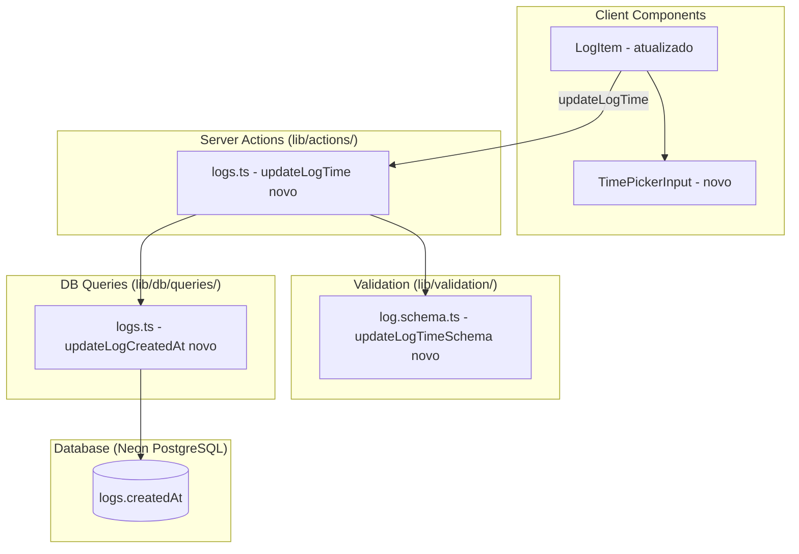
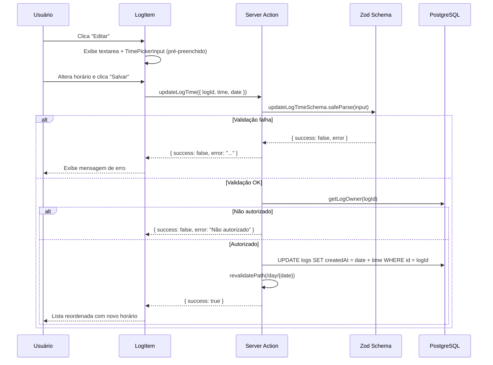

# Design Document — Edit Log Time

## Overview

Esta feature adiciona a capacidade de editar o horário (`createdAt`) de um log existente. Atualmente o `LogItem` permite editar apenas o conteúdo textual. A nova funcionalidade integra um seletor de horário (input `time` no formato HH:mm) ao modo de edição existente, com validação client-side e server-side, persistência via Server Action e reordenação automática da lista.

### Decisões de Design

| Decisão | Racional |
|---------|----------|
| Input `type="time"` nativo | Garante UX consistente por plataforma, suporte a teclado/acessibilidade nativo, e restringe input a HH:mm sem JS adicional. |
| Validação Zod server-side com regex + range | Mantém padrão existente (createLogSchema, updateLogSchema). Protege contra bypass do client. |
| Atualizar `createdAt` preservando data original | O log pertence a um `Day`. Mudar apenas a hora evita inconsistência entre `days.date` e `logs.createdAt`. |
| Reordenação via query existente (`ORDER BY createdAt ASC`) | Não requer lógica de reordenação adicional no client — basta revalidar a rota. |
| Server Action dedicada `updateLogTime` | Separação de concerns: editar conteúdo e editar horário são operações distintas com validações diferentes. |
| Combinar edição de horário no modo edição existente | Evita modal adicional. O seletor aparece junto ao textarea quando o usuário clica "Editar". |

---

## Architecture



### Fluxo de Dados



---

## Components and Interfaces

### 1. `updateLogTimeSchema` (lib/validation/log.schema.ts)

```typescript
export const updateLogTimeSchema = z.object({
  logId: z.string().uuid("logId deve ser um UUID válido"),
  time: z
    .string()
    .min(1, "O horário é obrigatório")
    .regex(/^\d{2}:\d{2}$/, "Formato esperado: HH:mm")
    .refine((s) => s.trim().length > 0, "O horário não pode conter apenas espaços")
    .refine((s) => {
      const [hh, mm] = s.split(":").map(Number);
      return hh >= 0 && hh <= 23 && mm >= 0 && mm <= 59;
    }, "Horário inválido. Horas: 00-23, Minutos: 00-59"),
  date: z.string().regex(/^\d{4}-\d{2}-\d{2}$/, "Data deve estar no formato yyyy-MM-dd"),
});

export type UpdateLogTimeInput = z.infer<typeof updateLogTimeSchema>;
```

### 2. `updateLogCreatedAt` (lib/db/queries/logs.ts)

```typescript
export async function updateLogCreatedAt(logId: string, newCreatedAt: Date): Promise<void> {
  await db.update(logs).set({ createdAt: newCreatedAt }).where(eq(logs.id, logId));
}
```

### 3. `updateLogTime` Server Action (lib/actions/logs.ts)

```typescript
export async function updateLogTime(input: unknown): Promise<ActionResult> {
  const parsed = updateLogTimeSchema.safeParse(input);
  if (!parsed.success) {
    return { success: false, error: parsed.error.issues[0]?.message ?? "Dados inválidos" };
  }

  const userId = await getCurrentUserId();
  const owner = await getLogOwner(parsed.data.logId);

  if (!owner) {
    return { success: false, error: "Registro não encontrado" };
  }
  if (owner.userId !== userId) {
    return { success: false, error: "Não autorizado" };
  }

  // Construir novo timestamp: date do log + time informado
  const [hh, mm] = parsed.data.time.split(":").map(Number);
  const newCreatedAt = new Date(`${parsed.data.date}T${parsed.data.time}:00`);

  await updateLogCreatedAt(parsed.data.logId, newCreatedAt);
  revalidatePath(`/day/${parsed.data.date}`);

  return { success: true };
}
```

### 4. `LogItem` Component Update (components/logs/LogItem.tsx)

Alterações no componente existente:
- Adicionar state `editTime` inicializado com `format(new Date(log.createdAt), "HH:mm")`
- Renderizar `<input type="time">` no modo de edição, ao lado do textarea
- No `handleUpdate`, chamar `updateLogTime` quando o horário mudou
- No cancelamento, reverter `editTime` ao valor original

### 5. Interface do `TimePickerInput` (opcional — pode ser input nativo)

```typescript
interface TimePickerInputProps {
  value: string;           // "HH:mm"
  onChange: (time: string) => void;
  error?: string | null;
  "aria-label": string;
}
```

O input nativo `<input type="time">` já fornece:
- Navegação por Tab
- Incremento via setas
- Formato HH:mm
- Suporte a aria-label

---

## Data Models

### Tabela `logs` (sem alteração de schema)

O campo `createdAt` já existe como `timestamp("created_at", { withTimezone: true })`. Nenhuma migração é necessária.

### Payload da Server Action

```typescript
{
  logId: string;    // UUID do log
  time: string;     // "HH:mm" — novo horário
  date: string;     // "yyyy-MM-dd" — data do dia (para construir o timestamp e revalidar rota)
}
```

### Construção do novo `createdAt`

```
newCreatedAt = parseISO(`${date}T${time}:00`)
```

O timezone é preservado pelo PostgreSQL (coluna `with timezone`) usando o timezone do servidor/conexão.

---

## Correctness Properties

*A property is a characteristic or behavior that should hold true across all valid executions of a system — essentially, a formal statement about what the system should do. Properties serve as the bridge between human-readable specifications and machine-verifiable correctness guarantees.*

### Property 1: Time validation accepts valid times and rejects invalid ones

*For any* string `s`, the `updateLogTimeSchema` time field validation SHALL accept `s` if and only if `s` matches the regex `/^\d{2}:\d{2}$/` AND the numeric value of the first two digits is in [0, 23] AND the numeric value of the last two digits is in [0, 59]. All other strings (empty, whitespace-only, wrong format, out-of-range values) SHALL be rejected.

**Validates: Requirements 1.4, 2.1, 2.2, 2.4**

### Property 2: Time update preserves date portion

*For any* valid date string `d` (yyyy-MM-dd) and any valid time string `t` (HH:mm within 00:00–23:59), constructing a new `createdAt` from `d` and `t` SHALL produce a timestamp where the date portion equals `d` and the hours/minutes equal the values from `t`.

**Validates: Requirements 1.2**

### Property 3: Non-owner authorization is always rejected

*For any* authenticated user whose ID differs from the log owner's ID, calling `updateLogTime` with that log's ID SHALL return an authorization error and SHALL NOT modify the log's `createdAt` field.

**Validates: Requirements 3.2**

---

## Error Handling

| Cenário | Resposta Server Action | UI Behavior |
|---------|----------------------|-------------|
| Validação Zod falha (formato/range) | `{ success: false, error: "Formato esperado: HH:mm" }` ou `"Horário inválido..."` | Exibe erro abaixo do input, mantém valor anterior |
| Horário vazio/whitespace | `{ success: false, error: "O horário é obrigatório" }` | Exibe erro, impede submit |
| Log não encontrado | `{ success: false, error: "Registro não encontrado" }` | Exibe erro genérico |
| Não autorizado | `{ success: false, error: "Não autorizado" }` | Exibe erro genérico |
| Erro de rede/servidor | `{ success: false, error: "Erro ao salvar horário. Tente novamente." }` | Exibe mensagem, reverte horário no input |
| Cancelamento pelo usuário | N/A | Descarta alterações, reverte ao último valor salvo |

### Padrão de error handling no client

```typescript
const handleUpdateTime = async () => {
  const result = await updateLogTime({ logId: log.id, time: editTime, date });
  if (result.success) {
    dispatch({ type: "updateTime", id: log.id, time: editTime });
    setError(null);
  } else {
    setEditTime(originalTime); // reverte
    setError(result.error ?? "Erro ao salvar horário. Tente novamente.");
  }
};
```

---

## Testing Strategy

### Unit Tests (example-based)

| Teste | O que valida |
|-------|-------------|
| Schema aceita "00:00", "12:30", "23:59" | Happy path de formatos válidos |
| Schema rejeita "", " ", "abc", "1:30", "25:00", "12:60" | Edge cases de validação |
| LogItem renderiza TimePickerInput pré-preenchido | Req 1.1, 4.1 |
| LogItem reverte horário no cancelamento | Req 4.4 |
| LogItem exibe erro quando server action falha | Req 1.5 |
| Server action retorna "Não autorizado" para não-dono | Req 3.2 |
| Server action retorna "Registro não encontrado" para UUID inexistente | Req 3.3 |
| Input time tem aria-label correto | Req 4.6 |

### Property-Based Tests (fast-check)

| Property | Configuração |
|----------|-------------|
| Property 1: Time validation | 100+ iterações, gera strings aleatórias e verifica aceitação/rejeição conforme regras |
| Property 2: Date preservation | 100+ iterações, gera datas e horários válidos, verifica preservação do date |
| Property 3: Non-owner rejection | 100+ iterações, gera pares de userId ≠ ownerId, verifica rejeição |

**Biblioteca**: `fast-check` (já utilizada no projeto)

**Configuração**:
- Mínimo 100 iterações por property test
- Cada test referencia a property do design document
- Tag format: **Feature: edit-log-time, Property {number}: {property_text}**

### Integration Tests

| Teste | O que valida |
|-------|-------------|
| Atualizar horário e verificar reordenação na lista | Req 1.3 |
| Server action valida antes de persistir (chamada direta com input inválido) | Req 2.3 |
