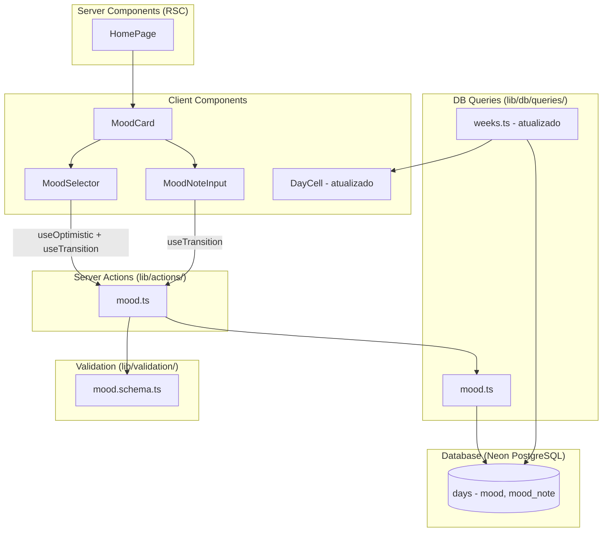

# Design Document — Mood Tracking

## Overview

O recurso de Mood Tracking adiciona ao app a capacidade de registrar humor diário com um único toque, usando 5 opções de emoji fixas. O humor é um atributo do dia (coluna na tabela `days`), não um tipo de log separado, mantendo consistência com a modelagem existente onde o dia é a unidade atômica.

O design segue o princípio de **zero pressão**: o registro de humor é totalmente opcional, não produz métricas comparativas, e pode ser alterado ou removido livremente a qualquer momento.

### Decisões de Design

| Decisão | Racional |
|---------|----------|
| `mood` como coluna na tabela `days` (não nova tabela) | Um humor por dia, consistente com a modelagem existente. Reusa `upsertDay` + UPDATE. |
| Tipo `text` nullable (não enum DB) | Migração aditiva sem ALTER TYPE. Validação no app layer via Zod. |
| `mood_note` na tabela `days` (não na tabela `logs`) | Nota descreve o humor do dia, não um registro textual. Separação clara. |
| Optimistic update com rollback | Padrão já usado em logs e tarefas. Resposta imediata ao toque. |
| Tap em mood ativo = clear (toggle) | Permite desfazer sem botão extra. UX mínima. |
| Mood_Card separado do Daily_Log_Card | Separação visual e estrutural, evita confusão funcional. |
| Mood_Dot no calendário (sem emoji) | Informação discreta; emoji completo (😞😕🙂😄🤩) só na Mood_Card. |

---

## Architecture



### Ordem das seções na HomePage (top-to-bottom)

A `HomePage` (RSC) renderiza as seções na seguinte ordem vertical fixa, conforme Requisito 5.5:

1. **Calendar** (`HomeCalendarSection`)
2. **Mood_Card** (`MoodCard`)
3. **Today's Logs** (`TodayLogsCard`)
4. **Daily_Log_Card** (`DailyLogPanel`)
5. **Weekly Tasks** (`WeeklyTasksPanel`)

Essa ordem é determinística e não pode ser reordenada pelo usuário.

### Fluxo de dados

1. **Leitura**: `HomePage` (RSC) busca o humor do dia atual via query em `days` e repassa para `MoodCard`.
2. **Mutação de mood**: `MoodSelector` usa `useTransition` + `useOptimistic` para chamar `saveMood` Server Action.
3. **Mutação de note**: `MoodNoteInput` usa `useTransition` para chamar `saveMoodNote` Server Action.
4. **Revalidação**: Server Actions chamam `revalidatePath("/")` após sucesso.
5. **Rollback**: Em caso de erro, o estado otimista é revertido e um aviso inline é exibido.
6. **Calendário**: `getWeekStatus` é atualizado para ler `days.mood` em vez de retornar `null` fixo.

---

## Components and Interfaces

### MoodCard (Client Component)

```typescript
interface MoodCardProps {
  date: string;          // yyyy-MM-dd
  initialMood: MoodValue | null;
  initialNote: string | null;
}
```

**Responsabilidades:**
- Container card com título "Humor de hoje" e subtitle explicativo
- Gerencia estado otimista do mood
- Renderiza `MoodSelector` e controla visibilidade do `MoodNoteInput`
- Link trigger "adicionar uma palavra sobre esse humor (opcional)" que faz toggle do input de nota

**Estado interno:**
- `optimisticMood: MoodValue | null` (via `useOptimistic`)
- `noteVisible: boolean` (toggle do input de nota)
- `error: string | null` (mensagem inline de erro)

---

### MoodSelector (Subcomponente de MoodCard)

```typescript
interface MoodSelectorProps {
  currentMood: MoodValue | null;
  onSelect: (mood: MoodValue | null) => void;
  disabled?: boolean;
}
```

**Comportamento:**
- Renderiza 5 emojis em row horizontal:  � 🙂 � 🤩 (awful → great)
- Se `currentMood` é null: todos com peso visual igual
- Se `currentMood` é set: ativo highlighted, demais dimmed
- Tap em opção não-ativa: chama `onSelect(mood)`
- Tap em opção ativa: chama `onSelect(null)` (toggle off)
- Cada emoji tem `aria-label` em PT-BR descritivo conforme tabela de mapeamento (ex: "Humor: ótimo")

**Emoji Mapping & Aria-labels (PT-BR):**

| MoodValue (enum interno) | Emoji | aria-label (PT-BR) |
|--------------------------|-------|---------------------|
| `awful` | 😞 | "Humor: péssimo" |
| `bad` | 😕 | "Humor: ruim" |
| `neutral` | 🙂 | "Humor: neutro" |
| `good` | 😄 | "Humor: bom" |
| `great` | 🤩 | "Humor: ótimo" |

A função `getMoodEmoji(mood: MoodValue)` retorna o emoji correspondente e a função `getMoodAriaLabel(mood: MoodValue)` retorna o aria-label em PT-BR. Os valores internos do enum permanecem em inglês.

---

### MoodNoteInput (Subcomponente de MoodCard)

```typescript
interface MoodNoteInputProps {
  date: string;
  initialNote: string | null;
}
```

**Comportamento:**
- Input de texto com max 80 caracteres
- Indicador de contagem "X/80"
- Botão "Salvar" que persiste a nota
- Se nota vazia/whitespace ao salvar: persiste null
- Limite de 80 chars no input (impede digitação além)
- Ao atingir 80 chars: indicador de contagem muda de cor

---

### DayCell (Atualização)

O `DayCell` já suporta a prop `mood: MoodValue | null` e renderiza o Mood_Dot. A atualização necessária é apenas no lado da query (`getWeekStatus`) para ler o valor real de `days.mood`.

Revisão do requisito 6: O componente `DayCell` atual exibe o emoji completo como mood indicator. Para atender ao requisito 6.2 (NÃO exibir emoji no calendário), o DayCell será atualizado para renderizar apenas um ponto colorido (`day-cell__mood-dot`) em vez do emoji, mantendo o `aria-label`.

---

### Server Actions

#### `lib/actions/mood.ts`

```typescript
"use server";

type ActionResult = { success: true } | { success: false; error: string };

// Salvar ou limpar o humor do dia
export async function saveMood(input: unknown): Promise<ActionResult>;

// Salvar ou limpar a nota do humor
export async function saveMoodNote(input: unknown): Promise<ActionResult>;
```

**Fluxo `saveMood`:**
1. Valida payload com `saveMoodSchema` (Zod)
2. Obtém userId via `getCurrentUserId()`
3. Chama `upsertDay(userId, date)` para garantir que a row existe
4. Chama `updateDayMood(dayId, mood)` — mood pode ser null (clear)
5. `revalidatePath("/")`
6. Retorna `{ success: true }`

**Fluxo `saveMoodNote`:**
1. Valida payload com `saveMoodNoteSchema` (Zod)
2. Obtém userId via `getCurrentUserId()`
3. Chama `upsertDay(userId, date)` para garantir que a row existe
4. Chama `updateDayMoodNote(dayId, note)` — note pode ser null (clear)
5. `revalidatePath("/")`
6. Retorna `{ success: true }`

---

## Data Models

### Schema Migration (Additive)

Adicionar duas colunas nullable à tabela `days`:

```sql
ALTER TABLE days ADD COLUMN mood text;
ALTER TABLE days ADD COLUMN mood_note text;
```

Nenhuma coluna existente é alterada, renomeada ou removida. Migration puramente aditiva.

### Drizzle Schema Update (`drizzle/schema.ts`)

```typescript
export const days = pgTable(
  "days",
  {
    id: uuid("id").primaryKey().defaultRandom(),
    userId: uuid("user_id")
      .notNull()
      .references(() => users.id, { onDelete: "cascade" }),
    date: date("date").notNull(),
    mood: text("mood"),          // nullable: 'great'|'good'|'neutral'|'bad'|'awful'
    moodNote: text("mood_note"), // nullable: max 80 chars (validação no app)
    createdAt: timestamp("created_at", { withTimezone: true })
      .notNull()
      .defaultNow(),
  },
  (table) => ({
    userDateUnique: uniqueIndex("days_user_id_date_unique").on(
      table.userId,
      table.date
    ),
  })
);
```

### Zod Validation Schemas (`lib/validation/mood.schema.ts`)

```typescript
import { z } from "zod";

export const MOOD_VALUES = ['great', 'good', 'neutral', 'bad', 'awful'] as const;
export type MoodValue = typeof MOOD_VALUES[number];

const dateSchema = z
  .string()
  .regex(/^\d{4}-\d{2}-\d{2}$/, "Data deve estar no formato yyyy-MM-dd");

const moodValueSchema = z.enum(MOOD_VALUES);

export const saveMoodSchema = z.object({
  date: dateSchema,
  mood: moodValueSchema.nullable(),
});

export const saveMoodNoteSchema = z.object({
  date: dateSchema,
  note: z
    .string()
    .max(80, "A nota deve ter no máximo 80 caracteres")
    .nullable()
    .transform((val) => {
      if (val === null) return null;
      const trimmed = val.trim();
      return trimmed.length === 0 ? null : trimmed;
    }),
});

export type SaveMoodInput = z.infer<typeof saveMoodSchema>;
export type SaveMoodNoteInput = z.infer<typeof saveMoodNoteSchema>;
```

### DB Queries (`lib/db/queries/mood.ts`)

```typescript
import { eq, and } from "drizzle-orm";
import { db } from "@/lib/db/client";
import { days } from "@/drizzle/schema";
import type { MoodValue } from "@/lib/validation/mood.schema";

export async function updateDayMood(
  dayId: string,
  mood: MoodValue | null
): Promise<void> {
  await db.update(days).set({ mood }).where(eq(days.id, dayId));
}

export async function updateDayMoodNote(
  dayId: string,
  note: string | null
): Promise<void> {
  await db.update(days).set({ moodNote: note }).where(eq(days.id, dayId));
}

export async function getDayMood(
  userId: string,
  date: string
): Promise<{ mood: MoodValue | null; moodNote: string | null }> {
  const [row] = await db
    .select({ mood: days.mood, moodNote: days.moodNote })
    .from(days)
    .where(and(eq(days.userId, userId), eq(days.date, date)))
    .limit(1);

  if (!row) return { mood: null, moodNote: null };

  // Validate mood value at read time
  const validMoods = ['great', 'good', 'neutral', 'bad', 'awful'];
  const mood = validMoods.includes(row.mood ?? '') ? (row.mood as MoodValue) : null;

  return { mood, moodNote: row.moodNote };
}
```

### Query `getWeekStatus` Update

```typescript
// Atualizar para ler days.mood da tabela
export async function getWeekStatus(userId: string, weekStart: Date): Promise<DayStatus[]> {
  const weekDates: string[] = [];
  for (let i = 0; i < 7; i++) {
    weekDates.push(format(addDays(weekStart, i), 'yyyy-MM-dd'));
  }

  const results = await db
    .select({
      date: days.date,
      logCount: count(logs.id),
      mood: days.mood,  // <-- nova coluna lida
    })
    .from(days)
    .leftJoin(logs, eq(logs.dayId, days.id))
    .where(and(
      eq(days.userId, userId),
      sql`${days.date} >= ${weekDates[0]} AND ${days.date} <= ${weekDates[6]}`
    ))
    .groupBy(days.date, days.mood);  // <-- mood adicionado ao GROUP BY

  const dayMap: Record<string, { logCount: number; mood: string | null }> = {};
  for (const r of results) {
    dayMap[r.date] = { logCount: r.logCount, mood: r.mood };
  }

  const validMoods = ['great', 'good', 'neutral', 'bad', 'awful'];

  return weekDates.map((dateStr) => {
    const entry = dayMap[dateStr];
    const rawMood = entry?.mood ?? null;
    return {
      date: new Date(dateStr + 'T12:00:00Z'),
      logCount: entry?.logCount ?? 0,
      mood: (rawMood && validMoods.includes(rawMood)) ? rawMood as MoodValue : null,
    };
  });
}
```

### TypeScript Types

O tipo `MoodValue` já existe em `lib/types/calendar.ts`:

```typescript
export type MoodValue = 'great' | 'good' | 'neutral' | 'bad' | 'awful';
```

Será reexportado de `lib/validation/mood.schema.ts` para manter a fonte canônica no schema de validação.

---


## Correctness Properties

*A property is a characteristic or behavior that should hold true across all valid executions of a system — essentially, a formal statement about what the system should do. Properties serve as the bridge between human-readable specifications and machine-verifiable correctness guarantees.*

### Property 1: Mood emoji mapping is complete and correct

*For any* valid MoodValue, the emoji mapping function SHALL return the correct emoji (awful→�, bad→�, neutral→�, good→�, great→🤩) and the aria-label function SHALL return the corresponding PT-BR accessible label ("péssimo", "ruim", "neutro", "bom", "ótimo").

**Validates: Requirements 1.1, 1.5**

### Property 2: Mood toggle state machine

*For any* pair (currentMood, tappedMood) where both are valid MoodValues or currentMood is null, the resulting mood after a tap SHALL be: null if currentMood equals tappedMood (toggle off), or tappedMood otherwise (set/replace).

**Validates: Requirements 2.1, 2.2, 2.3**

### Property 3: Optimistic UI highlight invariant

*For any* valid MoodValue set as the optimistic mood, exactly 1 emoji option SHALL have the "active" visual state and exactly 4 SHALL have the "dimmed" visual state. When optimistic mood is null, all 5 SHALL have equal visual weight (no active, no dimmed).

**Validates: Requirements 2.4, 1.4**

### Property 4: Optimistic rollback preserves previous state

*For any* previous mood state (MoodValue or null) and any attempted mood change that results in a server failure, the UI state SHALL revert to exactly the previous mood state.

**Validates: Requirements 2.5**

### Property 5: Mood value validation accepts only valid enums

*For any* arbitrary string, the mood validation schema SHALL accept it if and only if it is one of the exactly 5 valid MoodValue strings ('great', 'good', 'neutral', 'bad', 'awful'). All other strings (including empty, whitespace, mixed case, substrings of valid values) SHALL be rejected.

**Validates: Requirements 3.5**

### Property 6: Clearing mood preserves other columns

*For any* day row with existing data (non-null mood_note, associated logs, other columns), setting mood to null SHALL only change the mood column to null — all other column values on that row SHALL remain identical.

**Validates: Requirements 3.6**

### Property 7: Mood note validation

*For any* string, the mood note validation SHALL accept it if and only if: its length is between 1 and 80 characters (inclusive) AND it contains at least 1 non-whitespace character. Strings exceeding 80 characters or containing only whitespace SHALL be rejected.

**Validates: Requirements 3.7, 4.5**

### Property 8: Whitespace-only note transforms to null

*For any* string composed entirely of whitespace characters (spaces, tabs, newlines, or empty string), the note validation transform SHALL produce null as the output value, ensuring no whitespace-only notes are persisted.

**Validates: Requirements 4.6**

### Property 9: Mood note save round-trip

*For any* valid mood note string (1–80 characters, at least 1 non-whitespace), saving the note via saveMoodNote and then reading it back via getDayMood SHALL return the trimmed version of the original string.

**Validates: Requirements 4.7**

### Property 10: Invalid mood values normalize to null on read

*For any* string stored in the mood column that does NOT exactly match one of the 5 valid MoodValue strings, the query layer normalization function SHALL return null, ensuring invalid data never propagates to the UI.

**Validates: Requirements 6.5**

### Property 11: Mood dot presence and accessibility

*For any* valid MoodValue passed to DayCell, the component SHALL render a mood-dot indicator element with an aria-label. When mood is null, no mood-dot element SHALL be rendered.

**Validates: Requirements 6.1, 6.3, 6.6**

---

## Error Handling

### Strategy

O padrão de tratamento de erros segue o mesmo modelo já estabelecido no projeto:

| Camada | Tratamento |
|--------|------------|
| **Client (validação)** | `maxLength=80` no input impede entrada excessiva. Enum fixo de 5 opções impede mood inválido. |
| **Client (otimismo)** | `useOptimistic` atualiza mood/highlight imediatamente; rollback em caso de erro. |
| **Server Action (Zod)** | `safeParse` → retorna `{ success: false, error }` se input inválido. |
| **Server Action (auth)** | Verifica `getCurrentUserId()` → retorna erro "Não autorizado" se falhar. |
| **Server Action (DB)** | Try/catch → retorna erro genérico; nunca expõe detalhes do banco. |
| **Client (rollback)** | Detecta `success: false`, reverte estado otimista, exibe aviso inline. |

### Cenários específicos do mood tracking

| Cenário | Resposta |
|---------|----------|
| Mood inválido no payload | Zod rejeita; retorna `"Dados inválidos"` |
| Nota > 80 chars | Input bloqueado no client (maxLength); Zod rejeita no server |
| Nota só whitespace | Transform para null; persiste null silenciosamente |
| DB indisponível | Rollback do optimistic; exibe "Não foi possível salvar. Tente novamente." |
| Valor inválido no DB (dados corrompidos) | Query normaliza para null; UI trata como "sem humor" |
| Usuário não autenticado | Server Action retorna `"Não autorizado"` |

### Avisos inline

- Sem modais de erro (coerente com o princípio zero-pressão).
- Mensagens breves e neutras: "Não foi possível salvar. Tente novamente."
- Desaparecem após 5 segundos ou na próxima interação bem-sucedida.

---

## Testing Strategy

### Dual Testing Approach

O projeto já utiliza **Vitest** como test runner e **fast-check** para property-based testing.

#### Property-Based Tests (PBT)

- **Biblioteca**: `fast-check` (já instalada no projeto)
- **Mínimo 100 iterações** por property test
- **Tag**: Cada teste deve conter um comentário referenciando a propriedade do design:
  ```
  // Feature: mood-tracking, Property {N}: {título}
  ```

**Testes de propriedade a implementar:**

| # | Property | Módulo testado |
|---|----------|----------------|
| 1 | Mood emoji mapping (emoji + aria-label PT-BR) | `components/mood/moodConstants.ts` (função pura) |
| 2 | Mood toggle state machine | `components/mood/MoodCard.tsx` (lógica de toggle) |
| 3 | Optimistic UI highlight invariant | `components/mood/MoodSelector.tsx` (classes CSS) |
| 4 | Optimistic rollback | `components/mood/MoodCard.tsx` (estado otimista) |
| 5 | Mood value validation | `lib/validation/mood.schema.ts` |
| 6 | Clearing mood preserves other columns | `lib/db/queries/mood.ts` |
| 7 | Mood note validation | `lib/validation/mood.schema.ts` |
| 8 | Whitespace note → null | `lib/validation/mood.schema.ts` (transform) |
| 9 | Mood note save round-trip | `lib/actions/mood.ts` + `lib/db/queries/mood.ts` |
| 10 | Invalid mood normalization | `lib/db/queries/mood.ts` (normalização na leitura) |
| 11 | Mood dot presence/accessibility | `components/calendar/DayCell.tsx` |

#### Unit Tests (example-based)

- Renderização do MoodCard com mood=null (estado inicial)
- Renderização do MoodCard com mood ativo (highlight correto)
- Toggle do input de nota (visibilidade)
- Contador de caracteres "0/80" → "80/80"
- Input com maxLength=80 bloqueando caracteres extras
- Separação visual entre MoodCard e DailyLogPanel (DOM order)
- DayCell sem mood (sem dot renderizado)
- Ordem das seções na HomePage: Calendar → MoodCard → TodayLogsCard → DailyLogPanel → WeeklyTasksPanel (Requisito 5.5)

#### Integration Tests

- Fluxo completo: tap mood → persist → read back → calendário mostra dot
- Mood_note independente do mood (salvar nota sem mood ativo)
- Clear mood não afeta logs existentes do dia
- getWeekStatus retorna mood real do DB (não null fixo)

### Estrutura de arquivos de teste

```
lib/validation/__tests__/mood.schema.test.ts
lib/db/queries/__tests__/mood.test.ts
lib/actions/__tests__/mood.test.ts
components/mood/__tests__/MoodCard.test.tsx
components/mood/__tests__/MoodSelector.test.tsx
components/calendar/__tests__/DayCell.mood.test.tsx
```
