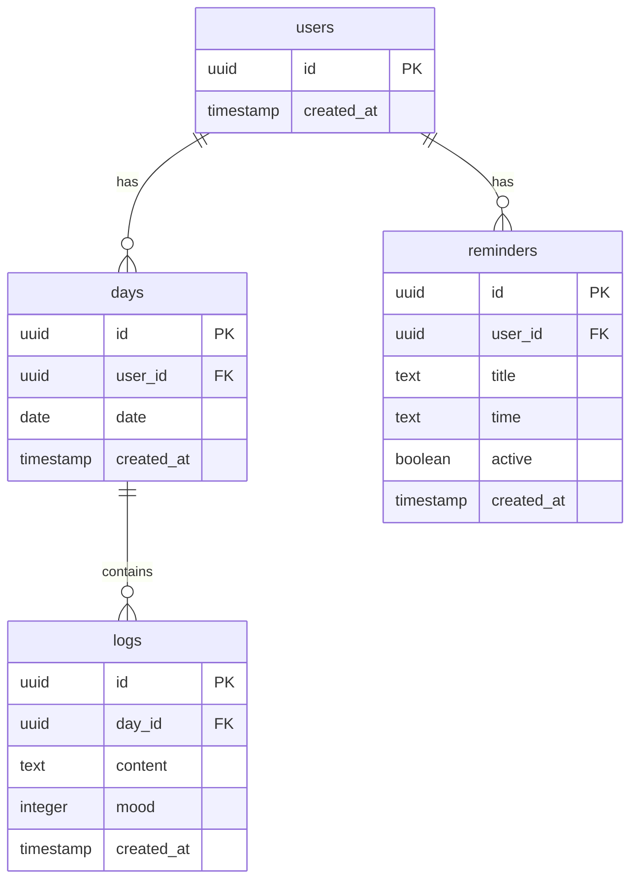

# Design Document — project-setup

## Overview

Este documento descreve o design técnico do scaffold inicial do **Weekly Companion App**. O objetivo é criar toda a infraestrutura base (banco de dados, ORM, validação, roteamento, estilos) de forma que o projeto compile sem erros e esteja pronto para receber as features do MVP sem refatoração posterior.

A stack adotada é: **Next.js 14+ (App Router)**, **TypeScript estrito**, **Neon PostgreSQL** via `@neondatabase/serverless`, **Drizzle ORM**, **Zod**, **Tailwind CSS** e **date-fns**.

### Decisões de design relevantes

| Decisão | Escolha | Racional |
|---|---|---|
| Runtime do banco | `@neondatabase/serverless` | Compatível com edge/serverless, zero overhead em cold start |
| ORM | Drizzle ORM | Leve, type-safe, suporte nativo a Neon, sem magia de runtime |
| Validação | Zod | Padrão adotado para Server Actions e Route Handlers conforme steering |
| Datas | date-fns + ISO week | `startOfISOWeek` garante semana começando sempre na segunda-feira |
| Rotas dinâmicas | segmento `[weekStart]` no path | Deep-link previsível, cache determinístico, sem query strings |

---

## Architecture

O projeto segue o padrão **React Server Components (RSC)** do Next.js App Router. A maioria das páginas é Server Component por padrão; Client Components são introduzidos apenas onde há interatividade real (fora do escopo desta spec).

```mermaid
graph TD
    Browser -->|GET /| RootPage["app/page.tsx (Server Component)"]
    RootPage -->|redirect()| WeekPage["app/(app)/week/[weekStart]/page.tsx"]
    WeekPage -->|lê banco| DbQueries["lib/db/queries/*"]
    DbQueries -->|SQL via Drizzle| NeonClient["lib/db/client.ts"]
    NeonClient -->|neon()| NeonDB["Neon PostgreSQL"]

    RootPage -.->|usa| DateUtils["lib/utils/date.ts"]
    NeonClient -.->|valida| EnvModule["lib/env.ts (Zod)"]

    ServerActions["lib/actions/*"] -->|valida input| ZodSchemas["lib/validation/*.schema.ts"]
    ServerActions -->|executa query| DbQueries
```

### Camadas

1. **Routing** (`app/`) — Páginas e layouts do App Router.
2. **Data Access** (`lib/db/`) — Cliente Neon + queries tipadas com Drizzle.
3. **Business Logic** (`lib/actions/`, `lib/utils/`) — Server Actions e utilitários puros.
4. **Validation** (`lib/validation/`) — Schemas Zod para todos os payloads de entrada.
5. **Database Schema** (`drizzle/schema.ts`) — Source of truth das tabelas.

---

## Components and Interfaces

### `lib/env.ts`

Valida e exporta as variáveis de ambiente obrigatórias. É importado por `lib/db/client.ts` e qualquer outro módulo que precise de configuração de ambiente.

```typescript
// lib/env.ts
import { z } from "zod";

const envSchema = z.object({
  DATABASE_URL: z.string().min(1, "DATABASE_URL is not defined"),
});

export const env = envSchema.parse(process.env);
```

> **Decisão:** `z.string().min(1)` em vez de apenas `z.string()` garante que uma string vazia também seja rejeitada — equivalente a "não definida" do ponto de vista funcional.

---

### `lib/db/client.ts`

Instância única do cliente Neon. Importa `env` para garantir validação prévia da `DATABASE_URL`.

```typescript
// lib/db/client.ts
import { neon } from "@neondatabase/serverless";
import { drizzle } from "drizzle-orm/neon-http";
import { env } from "@/lib/env";
import * as schema from "@/drizzle/schema";

const sql = neon(env.DATABASE_URL);
export const db = drizzle(sql, { schema });
```

**Interface exportada:** `db` — instância `NeonHttpDatabase<typeof schema>` totalmente tipada.

---

### `drizzle/schema.ts`

Schema completo das tabelas core. Todas as definições em `snake_case` para nomes de colunas SQL; os tipos TypeScript inferidos ficam em `camelCase` via Drizzle.

```typescript
// drizzle/schema.ts
import {
  pgTable,
  uuid,
  text,
  integer,
  boolean,
  timestamp,
  date,
} from "drizzle-orm/pg-core";

export const users = pgTable("users", {
  id: uuid("id").primaryKey().defaultRandom(),
  createdAt: timestamp("created_at", { withTimezone: true }).notNull().defaultNow(),
});

export const days = pgTable("days", {
  id: uuid("id").primaryKey().defaultRandom(),
  userId: uuid("user_id")
    .notNull()
    .references(() => users.id, { onDelete: "cascade" }),
  date: date("date").notNull(),
  createdAt: timestamp("created_at", { withTimezone: true }).notNull().defaultNow(),
});

export const logs = pgTable("logs", {
  id: uuid("id").primaryKey().defaultRandom(),
  dayId: uuid("day_id")
    .notNull()
    .references(() => days.id, { onDelete: "cascade" }),
  content: text("content").notNull(),
  mood: integer("mood"),
  createdAt: timestamp("created_at", { withTimezone: true }).notNull().defaultNow(),
});

export const reminders = pgTable("reminders", {
  id: uuid("id").primaryKey().defaultRandom(),
  userId: uuid("user_id")
    .notNull()
    .references(() => users.id, { onDelete: "cascade" }),
  title: text("title").notNull(),
  time: text("time").notNull(),
  active: boolean("active").notNull().default(true),
  createdAt: timestamp("created_at", { withTimezone: true }).notNull().defaultNow(),
});
```

**Tipos TypeScript inferidos** (disponíveis via `typeof users.$inferSelect`):

```typescript
// Exemplos de tipos inferidos pelo Drizzle:
type User     = typeof users.$inferSelect;     // { id: string; createdAt: Date }
type NewUser  = typeof users.$inferInsert;     // { id?: string; createdAt?: Date }

type Day      = typeof days.$inferSelect;      // { id: string; userId: string; date: string; createdAt: Date }
type Log      = typeof logs.$inferSelect;      // { id: string; dayId: string; content: string; mood: number | null; createdAt: Date }
type Reminder = typeof reminders.$inferSelect; // { id: string; userId: string; title: string; time: string; active: boolean; createdAt: Date }
```

---

### `drizzle.config.ts`

```typescript
// drizzle.config.ts (raiz do projeto)
import { defineConfig } from "drizzle-kit";

export default defineConfig({
  schema: "./drizzle/schema.ts",
  out: "./drizzle/migrations",
  dialect: "postgresql",
  dbCredentials: {
    url: process.env.DATABASE_URL!,
  },
});
```

> **Nota:** `drizzle.config.ts` usa `process.env.DATABASE_URL!` diretamente (sem importar `lib/env.ts`) porque este arquivo é executado pelo Drizzle Kit CLI, fora do runtime Next.js. A validação completa ocorre apenas em `lib/env.ts` durante a execução da aplicação.

---

### `lib/utils/date.ts`

Utilitários de data usados em toda a aplicação. Centraliza o cálculo de semana ISO para evitar inconsistências entre páginas.

```typescript
// lib/utils/date.ts
import { startOfISOWeek, format } from "date-fns";

/**
 * Retorna a data ISO da segunda-feira da semana atual no formato "yyyy-MM-dd".
 * Usa ISO week (segunda-feira = dia 1), compatível com o segmento de rota [weekStart].
 */
export function getCurrentWeekStart(): string {
  const monday = startOfISOWeek(new Date());
  return format(monday, "yyyy-MM-dd");
}

/**
 * Dada uma string de data no formato "yyyy-MM-dd",
 * retorna a data da segunda-feira da semana ISO correspondente.
 */
export function getWeekStart(dateStr: string): string {
  const monday = startOfISOWeek(new Date(dateStr));
  return format(monday, "yyyy-MM-dd");
}
```

---

### `lib/validation/log.schema.ts`

```typescript
// lib/validation/log.schema.ts
import { z } from "zod";

export const createLogSchema = z.object({
  content: z.string().min(1, "O conteúdo do log não pode ser vazio"),
  mood: z.number().int().min(1).max(5).optional(),
});

export type CreateLogInput = z.infer<typeof createLogSchema>;
```

---

### `lib/validation/reminder.schema.ts`

```typescript
// lib/validation/reminder.schema.ts
import { z } from "zod";

export const createReminderSchema = z.object({
  title: z.string().min(1, "O título do lembrete não pode ser vazio"),
  time: z
    .string()
    .regex(/^([01]\d|2[0-3]):[0-5]\d$/, "Formato inválido — use HH:MM"),
});

export type CreateReminderInput = z.infer<typeof createReminderSchema>;
```

---

### `app/layout.tsx` (Root Layout)

```typescript
// app/layout.tsx
import type { Metadata } from "next";
import "./globals.css";

export const metadata: Metadata = {
  title: "Weekly Companion",
  description: "Seu calendário semanal para uma semana mais clara.",
};

export default function RootLayout({
  children,
}: {
  children: React.ReactNode;
}) {
  return (
    <html lang="pt-BR">
      <body className="bg-white text-gray-900 font-sans antialiased">
        {children}
      </body>
    </html>
  );
}
```

---

### `app/(app)/layout.tsx` (Authenticated Group Layout — stub)

```typescript
// app/(app)/layout.tsx
export default function AppLayout({
  children,
}: {
  children: React.ReactNode;
}) {
  // Stub: navegação e autenticação serão implementadas em specs subsequentes.
  return <>{children}</>;
}
```

---

### `app/page.tsx` (Root Page — redirect)

```typescript
// app/page.tsx
import { redirect } from "next/navigation";
import { getCurrentWeekStart } from "@/lib/utils/date";

export default function RootPage() {
  const weekStart = getCurrentWeekStart();
  redirect(`/week/${weekStart}`);
}
```

---

### `app/(app)/week/[weekStart]/page.tsx` (stub)

```typescript
// app/(app)/week/[weekStart]/page.tsx

interface WeekPageProps {
  params: { weekStart: string };
}

export default function WeekPage({ params }: WeekPageProps) {
  // Stub: implementação completa na spec weekly-calendar.
  return (
    <main>
      <h1>Semana de {params.weekStart}</h1>
    </main>
  );
}
```

---

## Data Models

### Diagrama ER



### Mapeamento snake_case → camelCase

| Coluna SQL | Propriedade TypeScript | Tipo |
|---|---|---|
| `user_id` | `userId` | `string` (uuid) |
| `day_id` | `dayId` | `string` (uuid) |
| `created_at` | `createdAt` | `Date` |

O Drizzle realiza este mapeamento automaticamente quando o segundo argumento de cada helper (ex: `uuid("user_id")`) define o nome SQL, enquanto a chave do objeto define o nome TypeScript.

### Schemas Zod de validação

| Schema | Campos | Validações |
|---|---|---|
| `createLogSchema` | `content: string`, `mood?: number` | `content` min 1 char; `mood` int [1–5] |
| `createReminderSchema` | `title: string`, `time: string` | `title` min 1 char; `time` regex `HH:MM` |

---

## Correctness Properties

*Uma propriedade é uma característica ou comportamento que deve ser verdadeiro em todas as execuções válidas do sistema — essencialmente uma declaração formal sobre o que o sistema deve fazer. Propriedades servem como ponte entre especificações legíveis por humanos e garantias de corretude verificáveis por máquinas.*

---

### Property 1: Validação de variáveis de ambiente

*Para qualquer* objeto que represente `process.env`, o módulo `lib/env.ts` **deve** retornar um objeto tipado com `DATABASE_URL` como string não vazia quando `DATABASE_URL` está presente e não vazia; e **deve** lançar um erro de validação (Zod `ZodError`) quando `DATABASE_URL` está ausente ou é uma string vazia.

**Validates: Requirements 3.3, 6.4**

---

### Property 2: Validação do schema de log

*Para qualquer* objeto `input` com campos `content: string` e `mood?: number`, `createLogSchema.safeParse(input)` retorna `{ success: true }` se e somente se `content` tem comprimento ≥ 1 e, quando `mood` está presente, é um inteiro no intervalo `[1, 5]`.

**Validates: Requirements 8.2**

---

### Property 3: Validação do schema de reminder

*Para qualquer* objeto `input` com campos `title: string` e `time: string`, `createReminderSchema.safeParse(input)` retorna `{ success: true }` se e somente se `title` tem comprimento ≥ 1 e `time` satisfaz o padrão `HH:MM` (hora 00–23, minuto 00–59).

**Validates: Requirements 8.3**

---

### Property 4: getCurrentWeekStart sempre retorna uma segunda-feira

*Para qualquer* data (qualquer dia da semana, qualquer mês, qualquer ano), `getCurrentWeekStart()` deve retornar uma string no formato `yyyy-MM-dd` que, ao ser parseada com `date-fns`, representa um dia cujo `getISODay()` é `1` (segunda-feira ISO), e essa data pertence à mesma semana ISO da data de entrada.

**Validates: Requirements 10.1, 10.3, 10.5**

---

### Property 5: snake_case em nomes de colunas SQL do schema Drizzle

*Para qualquer* coluna definida em `drizzle/schema.ts`, o nome SQL da coluna (primeiro argumento dos helpers Drizzle como `uuid()`, `text()`, `timestamp()`, etc.) deve satisfazer o padrão snake_case: composto apenas por letras minúsculas, dígitos e underscores, iniciando com letra minúscula (`^[a-z][a-z0-9_]*$`).

**Validates: Requirements 4.8**

---

## Error Handling

### Erros de configuração (startup)

| Situação | Comportamento | Onde tratado |
|---|---|---|
| `DATABASE_URL` ausente | `ZodError` lançado em `lib/env.ts` durante import | `lib/env.ts` |
| `DATABASE_URL` vazia | `ZodError` lançado em `lib/env.ts` | `lib/env.ts` |
| Schema inválido no Drizzle config | Erro de compilação TypeScript (tsc) | Compile time |
| `weekStart` fora do formato `yyyy-MM-dd` | Comportamento indefinido no stub; tratamento completo na spec `weekly-calendar` | `week/[weekStart]/page.tsx` |

### Erros de validação Zod (runtime)

Os schemas Zod em `lib/validation/` são usados com `.safeParse()` nas Server Actions para evitar exceções não tratadas. O chamador é responsável por checar `result.success` e retornar mensagens de erro para o cliente.

### Tipagem estrita como primeira linha de defesa

Com `"strict": true` no `tsconfig.json`, o TypeScript elimina em tempo de compilação:
- Uso de `any` implícito
- Acesso a propriedades potencialmente `undefined`
- Argumentos de tipo incompatível em queries Drizzle

---

## Testing Strategy

### Avaliação de PBT para este feature

Este feature é de **setup/infraestrutura**, com uma combinação de verificações estáticas (arquivos, configurações) e lógica pura testável (validação Zod, cálculo de data). As Properties 1–5 identificadas no prework são adequadas para testes de propriedade porque:

- **P1, P2, P3**: Schemas Zod são funções puras com espaço de input vasto — são exatamente o caso de uso ideal para PBT.
- **P4**: `getCurrentWeekStart` é uma função pura com comportamento universal (qualquer data → segunda-feira) — ideal para PBT.
- **P5**: Verificação estática de nomenclatura — pode ser implementada como teste unitário simples que itera sobre as colunas do schema.

A maioria dos outros critérios são **smoke tests** (verificações de arquivos, compilação) e **integration tests** (migrações, HTTP 200).

---

### Abordagem dual de testes

#### 1. Smoke Tests (configuração estática)

Executar **uma vez** para verificar que a estrutura do projeto está correta:

- `tsc --noEmit` passa sem erros (cobre: strict mode, tipagem do schema, tipos nas páginas)
- `next build` completa sem erros (cobre: Root Layout, redirect, stub pages)
- Existência dos arquivos obrigatórios: `drizzle/schema.ts`, `lib/db/client.ts`, `lib/env.ts`, `lib/utils/date.ts`, `lib/validation/*.schema.ts`, `.env.example`, `.gitignore`
- `.env.example` contém `DATABASE_URL=`
- `.gitignore` inclui `.env.local`

```bash
# Comandos de smoke test
npx tsc --noEmit
next build
```

---

#### 2. Testes Unitários com Property-Based Testing

**Biblioteca escolhida:** [`fast-check`](https://fast-check.io/) — padrão de fato para PBT em TypeScript/JavaScript, suporte nativo ao ecossistema Node.js.

**Configuração:** mínimo 100 iterações por property test (`numRuns: 100` no fast-check).

**Tag format:** `// Feature: project-setup, Property N: <texto>`

---

##### Property 1 — Validação de env vars (lib/env.ts)

```typescript
// Feature: project-setup, Property 1: env validation accepts valid DATABASE_URL and rejects missing/empty
import fc from "fast-check";
import { z } from "zod";

test("env schema aceita DATABASE_URL não vazia e rejeita ausente/vazia", () => {
  // Válidos: qualquer string não vazia
  fc.assert(
    fc.property(fc.string({ minLength: 1 }), (url) => {
      const result = envSchema.safeParse({ DATABASE_URL: url });
      return result.success === true;
    }),
    { numRuns: 100 }
  );

  // Inválidos: undefined, string vazia
  expect(envSchema.safeParse({}).success).toBe(false);
  expect(envSchema.safeParse({ DATABASE_URL: "" }).success).toBe(false);
});
```

---

##### Property 2 — Schema de log (createLogSchema)

```typescript
// Feature: project-setup, Property 2: createLogSchema validates content and optional mood
import fc from "fast-check";

test("createLogSchema aceita inputs válidos e rejeita inválidos", () => {
  // Válidos: content não vazio, mood no intervalo [1,5] ou ausente
  fc.assert(
    fc.property(
      fc.string({ minLength: 1 }),
      fc.option(fc.integer({ min: 1, max: 5 }), { nil: undefined }),
      (content, mood) => {
        const input = mood !== undefined ? { content, mood } : { content };
        return createLogSchema.safeParse(input).success === true;
      }
    ),
    { numRuns: 100 }
  );

  // Inválidos: content vazio
  fc.assert(
    fc.property(
      fc.string({ maxLength: 0 }), // string vazia
      (content) => createLogSchema.safeParse({ content }).success === false
    ),
    { numRuns: 20 }
  );

  // Inválidos: mood fora do intervalo
  fc.assert(
    fc.property(
      fc.string({ minLength: 1 }),
      fc.oneof(
        fc.integer({ max: 0 }),
        fc.integer({ min: 6 })
      ),
      (content, mood) =>
        createLogSchema.safeParse({ content, mood }).success === false
    ),
    { numRuns: 100 }
  );
});
```

---

##### Property 3 — Schema de reminder (createReminderSchema)

```typescript
// Feature: project-setup, Property 3: createReminderSchema validates title and time HH:MM
import fc from "fast-check";

const validTimeArb = fc
  .tuple(fc.integer({ min: 0, max: 23 }), fc.integer({ min: 0, max: 59 }))
  .map(([h, m]) => `${String(h).padStart(2, "0")}:${String(m).padStart(2, "0")}`);

test("createReminderSchema aceita inputs válidos e rejeita inválidos", () => {
  // Válidos
  fc.assert(
    fc.property(fc.string({ minLength: 1 }), validTimeArb, (title, time) =>
      createReminderSchema.safeParse({ title, time }).success === true
    ),
    { numRuns: 100 }
  );

  // Inválidos: title vazio
  fc.assert(
    fc.property(validTimeArb, (time) =>
      createReminderSchema.safeParse({ title: "", time }).success === false
    ),
    { numRuns: 50 }
  );

  // Inválidos: time fora do formato HH:MM
  const invalidTimeArb = fc.string().filter(
    (s) => !/^([01]\d|2[0-3]):[0-5]\d$/.test(s)
  );
  fc.assert(
    fc.property(fc.string({ minLength: 1 }), invalidTimeArb, (title, time) =>
      createReminderSchema.safeParse({ title, time }).success === false
    ),
    { numRuns: 100 }
  );
});
```

---

##### Property 4 — getCurrentWeekStart retorna sempre segunda-feira

```typescript
// Feature: project-setup, Property 4: getCurrentWeekStart always returns a Monday in yyyy-MM-dd format
import fc from "fast-check";
import { getISODay, parseISO } from "date-fns";
import { getWeekStart } from "@/lib/utils/date";

test("getWeekStart retorna sempre segunda-feira no formato yyyy-MM-dd", () => {
  fc.assert(
    fc.property(
      fc.date({ min: new Date("2000-01-01"), max: new Date("2030-12-31") }),
      (date) => {
        const result = getWeekStart(format(date, "yyyy-MM-dd"));
        // Formato correto
        expect(result).toMatch(/^\d{4}-\d{2}-\d{2}$/);
        // É segunda-feira (ISO day 1)
        expect(getISODay(parseISO(result))).toBe(1);
      }
    ),
    { numRuns: 100 }
  );
});
```

---

##### Property 5 — snake_case em colunas do schema Drizzle

```typescript
// Feature: project-setup, Property 5: all Drizzle column SQL names follow snake_case
import * as schema from "@/drizzle/schema";

test("todas as colunas do schema Drizzle usam snake_case", () => {
  const snakeCaseRegex = /^[a-z][a-z0-9_]*$/;

  for (const [tableName, table] of Object.entries(schema)) {
    for (const [colKey, col] of Object.entries(table)) {
      if (col && typeof col === "object" && "name" in col) {
        expect(
          snakeCaseRegex.test(col.name as string),
          `Tabela "${tableName}", coluna "${colKey}": nome SQL "${col.name}" não é snake_case`
        ).toBe(true);
      }
    }
  }
});
```

---

#### 3. Integration Tests (banco de dados)

Executados apenas com `DATABASE_URL` válida apontando para banco de testes dedicado:

- `db:migrate` cria as quatro tabelas (`users`, `days`, `logs`, `reminders`) sem erros.
- Após migração, `INSERT` nas quatro tabelas completa sem erro de schema.
- `GET /week/2024-01-01` retorna HTTP 200 (servidor Next.js em modo de teste).

---

### Scripts `package.json`

```json
{
  "scripts": {
    "dev": "next dev",
    "build": "next build",
    "start": "next start",
    "lint": "next lint",
    "type-check": "tsc --noEmit",
    "db:generate": "drizzle-kit generate",
    "db:migrate": "drizzle-kit migrate",
    "test": "vitest --run",
    "test:watch": "vitest"
  }
}
```

> **Nota:** `vitest` é escolhido como test runner por ser o padrão moderno para projetos Next.js/Vite com excelente suporte a TypeScript e fast-check. Configurar `vitest.config.ts` com `environment: "node"` para os testes de validação/schema.
