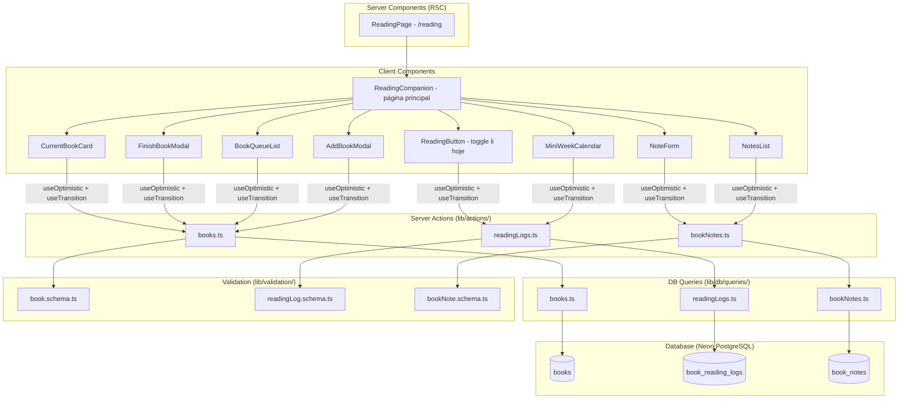

# Design Document — Companheiro de Leitura (Reading Companion)

## Overview

O **Companheiro de Leitura** é o primeiro utilitário do app **semana.**, adicionando à plataforma a capacidade de acompanhar leitura de forma leve e sem pressão. Ele se compõe de cinco módulos interdependentes:

1. **Livro Atual** — Exibição e gestão do livro sendo lido (máximo 1 por usuário).
2. **Registros de Leitura** — Marcação diária de "li hoje" com mini-calendário semanal e retroatividade.
3. **Notas Rápidas** — Anotações livres associadas ao livro atual, sem dependência de dias lidos.
4. **Conclusão de Livro** — Mover livro para concluídos com avaliação e resenha opcionais.
5. **Fila de Próximos** — Lista de livros a ler futuramente, sem pressão de prazo.

Princípio fundamental: **ZERO culpa, cobrança ou pressão**. Campos opcionais nunca bloqueiam ações principais. Toda ação central é executável em poucos segundos.

### Decisões de Design

| Decisão | Racional |
|---------|----------|
| Máximo 1 livro atual por usuário | Ponto de foco único; evita overwhelm de gerenciar múltiplas leituras paralelas. |
| `status` enum em `books` (`reading`, `queued`, `finished`) | Evita múltiplas tabelas para o mesmo conceito; simplifica queries de transição. |
| Registros de leitura como tabela separada (`book_reading_logs`) | Permite consulta por data sem varrer notas; suporta mini-calendário semanal. |
| Notas independentes de registros de leitura | Pensamentos não devem depender de ter "lido" formalmente; sem acoplamento. |
| Unique constraint em `(bookId, date)` em `book_reading_logs` | Garante no máximo 1 registro por dia por livro no banco, sem duplicatas. |
| Devolução à fila ao substituir livro atual | Preserva dados (notas/registros) e mantém o livro acessível; sem perda de informação. |
| Campos de avaliação/resenha na própria tabela `books` | Evita join extra; dados de conclusão pertencem ao livro e só existem após conclusão. |
| Schema aditivo (sem alterações em tabelas existentes) | Coerente com o princípio de não-destruição e isolamento de utilitários. |

---

## Architecture



### Fluxo de Dados

1. **Leitura**: `ReadingPage` (RSC) busca livro atual, notas, registros da semana e fila via queries; repassa para `ReadingCompanion` (client).
2. **Mutação**: Client Components usam `useTransition` + `useOptimistic` para chamar Server Actions.
3. **Revalidação**: Server Actions chamam `revalidatePath("/reading")` após sucesso.
4. **Rollback**: Em caso de erro, o estado otimista é revertido e um aviso inline é exibido.

---

## Components and Interfaces

### ReadingPage (Server Component — RSC)

```typescript
// app/(app)/reading/page.tsx
// Busca todos os dados necessários e renderiza ReadingCompanion
```

### ReadingCompanion (Client Component — Container)

```typescript
interface ReadingCompanionProps {
  currentBook: CurrentBookDisplay | null;
  weekReadingDays: string[];              // datas yyyy-MM-dd com registro esta semana
  notes: BookNoteDisplay[];
  finishedBooks: FinishedBookDisplay[];
  queue: QueuedBookDisplay[];
}
```

### CurrentBookCard

```typescript
interface CurrentBookCardProps {
  book: CurrentBookDisplay | null;
  onFinish: () => void;
  onUpdateProgress: (progress: string) => void;
}

interface CurrentBookDisplay {
  id: string;
  title: string;
  author: string | null;
  progress: string | null;
  startedAt: string;
}
```

### ReadingButton (Toggle "Li Hoje")

```typescript
interface ReadingButtonProps {
  bookId: string;
  todayMarked: boolean;
}
```

**Comportamento:**
- Se `todayMarked === false`: botão "Marquei que li hoje" → cria registro
- Se `todayMarked === true`: botão "✓ Lido hoje" (estado marcado) → permite desmarcar

### MiniWeekCalendar

```typescript
interface MiniWeekCalendarProps {
  bookId: string;
  weekStart: string;              // yyyy-MM-dd (segunda-feira)
  readDays: string[];             // datas com registro nesta semana
}
```

**Comportamento:**
- Exibe 7 células (Seg–Dom) com indicação visual de quais dias possuem registro
- Click em dia passado: toggle registro retroativo
- Dia futuro: desabilitado
- Dia corrente: usa ReadingButton

### NoteForm / NotesList

```typescript
interface NoteFormProps {
  bookId: string;
}

interface NotesListProps {
  notes: BookNoteDisplay[];
}

interface BookNoteDisplay {
  id: string;
  content: string;
  createdAt: string;
}
```

### FinishBookModal

```typescript
interface FinishBookModalProps {
  bookId: string;
  bookTitle: string;
  onClose: () => void;
}
```

**Campos:**
- Avaliação (emoji selector ou nota 1–5) — opcional
- Resenha (textarea max 2000 chars) — opcional
- Botão "Concluir" sempre habilitado (campos opcionais nunca bloqueiam)

### BookQueueList

```typescript
interface BookQueueListProps {
  queue: QueuedBookDisplay[];
  hasCurrentBook: boolean;
}

interface QueuedBookDisplay {
  id: string;
  title: string;
  author: string | null;
  createdAt: string;
}
```

**Comportamento:**
- Exibe livros em ordem de adição (mais antigo primeiro)
- "Começar a ler": se não há livro atual, promove diretamente; se há, solicita confirmação de substituição
- "Remover": solicita confirmação antes de excluir

### AddBookModal

```typescript
interface AddBookModalProps {
  mode: "current" | "queue";       // adicionar como atual ou na fila
  hasCurrentBook: boolean;
  onClose: () => void;
}
```

**Campos:**
- Título (obrigatório, 1–200 chars)
- Autor (opcional, max 200 chars)

### FinishedBookDisplay

```typescript
interface FinishedBookDisplay {
  id: string;
  title: string;
  author: string | null;
  rating: number | null;
  review: string | null;
  finishedAt: string;
}
```

---

### Server Actions

#### `lib/actions/books.ts`

```typescript
"use server";

// Adicionar livro à fila
export async function addBookToQueue(input: unknown): Promise<ActionResult>;

// Adicionar livro diretamente como atual (com substituição se necessário)
export async function addBookAsCurrent(input: unknown): Promise<ActionResult>;

// Promover livro da fila para atual
export async function startReadingFromQueue(input: unknown): Promise<ActionResult>;

// Atualizar progresso do livro atual
export async function updateBookProgress(input: unknown): Promise<ActionResult>;

// Concluir livro atual (mover para finished)
export async function finishCurrentBook(input: unknown): Promise<ActionResult>;

// Remover livro da fila
export async function removeBookFromQueue(input: unknown): Promise<ActionResult>;
```

#### `lib/actions/readingLogs.ts`

```typescript
"use server";

// Marcar/desmarcar leitura de um dia (toggle)
export async function toggleReadingDay(input: unknown): Promise<ActionResult>;
```

#### `lib/actions/bookNotes.ts`

```typescript
"use server";

// Criar nota de leitura
export async function createBookNote(input: unknown): Promise<ActionResult>;

// Excluir nota de leitura
export async function deleteBookNote(input: unknown): Promise<ActionResult>;
```

---

## Data Models

### Drizzle Schema Additions (`drizzle/schema.ts`)

```typescript
/**
 * Tabela books — livros do usuário (atual, fila e concluídos)
 * Status controla o ciclo de vida: queued → reading → finished
 * Máximo 1 livro com status "reading" por usuário (enforced via Server Action)
 */
export const books = pgTable("books", {
  id: uuid("id").primaryKey().defaultRandom(),
  userId: uuid("user_id")
    .notNull()
    .references(() => users.id, { onDelete: "cascade" }),
  title: text("title").notNull(),                          // 1–200 chars
  author: text("author"),                                  // nullable, max 200 chars
  status: text("status").notNull().default("queued"),      // "queued" | "reading" | "finished"
  progress: text("progress"),                              // nullable, max 50 chars (ex: "pág. 120")
  rating: integer("rating"),                               // nullable, 1–5 (apenas quando finished)
  review: text("review"),                                  // nullable, max 2000 chars
  startedAt: timestamp("started_at", { withTimezone: true }),   // quando virou "reading"
  finishedAt: timestamp("finished_at", { withTimezone: true }), // quando virou "finished"
  createdAt: timestamp("created_at", { withTimezone: true })
    .notNull()
    .defaultNow(),
});

/**
 * Tabela book_reading_logs — registros de leitura por dia
 * Unique constraint em (bookId, date) garante no máximo 1 por dia por livro
 */
export const bookReadingLogs = pgTable(
  "book_reading_logs",
  {
    id: uuid("id").primaryKey().defaultRandom(),
    bookId: uuid("book_id")
      .notNull()
      .references(() => books.id, { onDelete: "cascade" }),
    date: date("date").notNull(),
    createdAt: timestamp("created_at", { withTimezone: true })
      .notNull()
      .defaultNow(),
  },
  (table) => ({
    bookDateUnique: uniqueIndex("book_reading_logs_book_id_date_unique").on(
      table.bookId,
      table.date
    ),
  })
);

/**
 * Tabela book_notes — notas de leitura associadas a um livro
 */
export const bookNotes = pgTable("book_notes", {
  id: uuid("id").primaryKey().defaultRandom(),
  bookId: uuid("book_id")
    .notNull()
    .references(() => books.id, { onDelete: "cascade" }),
  content: text("content").notNull(),     // 1–1000 chars
  createdAt: timestamp("created_at", { withTimezone: true })
    .notNull()
    .defaultNow(),
});
```

### Drizzle Relations (adições)

```typescript
export const booksRelations = relations(books, ({ one, many }) => ({
  user: one(users, {
    fields: [books.userId],
    references: [users.id],
  }),
  readingLogs: many(bookReadingLogs),
  notes: many(bookNotes),
}));

export const bookReadingLogsRelations = relations(bookReadingLogs, ({ one }) => ({
  book: one(books, {
    fields: [bookReadingLogs.bookId],
    references: [books.id],
  }),
}));

export const bookNotesRelations = relations(bookNotes, ({ one }) => ({
  book: one(books, {
    fields: [bookNotes.bookId],
    references: [books.id],
  }),
}));
```

### Zod Validation Schemas

#### `lib/validation/book.schema.ts`

```typescript
import { z } from "zod";

const titleSchema = z
  .string()
  .min(1, "Título é obrigatório")
  .max(200, "Título deve ter no máximo 200 caracteres")
  .refine((s) => s.trim().length > 0, "Título não pode conter apenas espaços");

const authorSchema = z
  .string()
  .max(200, "Autor deve ter no máximo 200 caracteres")
  .nullable()
  .optional();

const progressSchema = z
  .string()
  .max(50, "Progresso deve ter no máximo 50 caracteres")
  .nullable()
  .optional();

const bookIdSchema = z.string().uuid("bookId deve ser um UUID válido");

export const addBookSchema = z.object({
  title: titleSchema,
  author: authorSchema,
});

export const updateProgressSchema = z.object({
  bookId: bookIdSchema,
  progress: progressSchema,
});

export const finishBookSchema = z.object({
  bookId: bookIdSchema,
  rating: z.number().int().min(1).max(5).nullable().optional(),
  review: z.string().max(2000).nullable().optional(),
});

export const startReadingSchema = z.object({
  bookId: bookIdSchema,
});

export const removeBookSchema = z.object({
  bookId: bookIdSchema,
});
```

#### `lib/validation/readingLog.schema.ts`

```typescript
import { z } from "zod";

const dateSchema = z
  .string()
  .regex(/^\d{4}-\d{2}-\d{2}$/, "Data deve estar no formato yyyy-MM-dd");

const bookIdSchema = z.string().uuid("bookId deve ser um UUID válido");

export const toggleReadingDaySchema = z.object({
  bookId: bookIdSchema,
  date: dateSchema,
});
```

#### `lib/validation/bookNote.schema.ts`

```typescript
import { z } from "zod";

const contentSchema = z
  .string()
  .min(1, "A nota não pode ser vazia")
  .max(1000, "A nota deve ter no máximo 1000 caracteres")
  .refine((s) => s.trim().length > 0, "A nota não pode conter apenas espaços");

const bookIdSchema = z.string().uuid("bookId deve ser um UUID válido");
const noteIdSchema = z.string().uuid("noteId deve ser um UUID válido");

export const createBookNoteSchema = z.object({
  bookId: bookIdSchema,
  content: contentSchema,
});

export const deleteBookNoteSchema = z.object({
  noteId: noteIdSchema,
});
```

### TypeScript Types

```typescript
// lib/types/reading.ts
export interface CurrentBookDisplay {
  id: string;
  title: string;
  author: string | null;
  progress: string | null;
  startedAt: string;
}

export interface QueuedBookDisplay {
  id: string;
  title: string;
  author: string | null;
  createdAt: string;
}

export interface FinishedBookDisplay {
  id: string;
  title: string;
  author: string | null;
  rating: number | null;
  review: string | null;
  finishedAt: string;
}

export interface BookNoteDisplay {
  id: string;
  content: string;
  createdAt: string;
}
```

---


## Correctness Properties

*A property is a characteristic or behavior that should hold true across all valid executions of a system — essentially, a formal statement about what the system should do. Properties serve as the bridge between human-readable specifications and machine-verifiable correctness guarantees.*

### Property 1: At most one current book per user

*For any* sequence of book operations (add as current, start from queue, finish, swap) applied to a user, the count of books with status `"reading"` for that user should never exceed 1.

**Validates: Requirements 1.1**

### Property 2: Toggle reading day round-trip

*For any* valid book with status `"reading"` and any valid date (today or past), toggling the reading mark twice should return to the original state — if the day was unmarked, after two toggles it remains unmarked; if marked, it remains marked.

**Validates: Requirements 2.2, 2.4**

### Property 3: At most one reading log per day per book

*For any* book and date combination, no matter how many toggle-mark operations are performed, the count of `book_reading_logs` records for that `(bookId, date)` pair should be at most 1.

**Validates: Requirements 2.5**

### Property 4: Finish book releases the current slot

*For any* book with status `"reading"` and any combination of optional rating (null or 1–5) and review (null or string up to 2000 chars), finishing the book should result in: (a) the book's status becoming `"finished"`, (b) `finishedAt` being non-null, and (c) querying for the user's current book returning null.

**Validates: Requirements 4.2, 4.3**

### Property 5: Finish preserves associated data

*For any* book with status `"reading"` that has N reading logs and M notes, after finishing the book, the count of reading logs and notes associated with that book should remain exactly N and M respectively.

**Validates: Requirements 4.5**

### Property 6: Promote to current when slot is free

*For any* book with status `"queued"` belonging to a user with no current book (no books with status `"reading"`), starting that book should result in: (a) the book's status becoming `"reading"`, (b) `startedAt` being non-null, and (c) the book no longer appearing in the queue.

**Validates: Requirements 5.3, 6.1**

### Property 7: Swap demotes current and promotes new

*For any* user with a current book A (status `"reading"`) and a target book B (status `"queued"` or new), confirming the swap should result in: (a) A's status becoming `"queued"`, (b) B's status becoming `"reading"`, (c) A's existing notes and reading logs remaining intact, and (d) exactly 1 book with status `"reading"` for the user.

**Validates: Requirements 5.5, 6.3**

### Property 8: Ordering invariants

*For any* set of records:
- Notes for a book should be returned in reverse chronological order (most recent `createdAt` first).
- Finished books should be returned in reverse chronological order (most recent `finishedAt` first).
- Queued books should be returned in chronological order (oldest `createdAt` first).

**Validates: Requirements 3.3, 4.4, 5.7**

### Property 9: User data isolation

*For any* two distinct users A and B, all queries and mutations executed by user A should never return or affect books, reading logs, or notes belonging to user B. Operations on resources owned by another user should be rejected.

**Validates: Requirements 7.2, 7.3**

### Property 10: Input validation round-trip

*For any* valid input (title 1–200 non-whitespace-only chars, author optional max 200 chars, progress optional max 50 chars, note content 1–1000 non-whitespace-only chars), the Zod schemas should accept the input. For any invalid input (empty, whitespace-only, or exceeding max length), the schemas should reject it.

**Validates: Requirements 1.4, 3.1, 5.1**

### Property 11: Optional fields never block primary actions

*For any* book with status `"reading"` and `progress = null`, all primary actions (toggle reading day, create note, finish book) should succeed without requiring progress to be filled. Similarly, finish should succeed with `rating = null` and `review = null`.

**Validates: Requirements 1.5, 4.3**

---

## Error Handling

### Strategy

Todas as mutações seguem o padrão já estabelecido no projeto:

| Camada | Tratamento |
|--------|------------|
| **Client (validação)** | Bloqueio de input (maxLength) impede envio de dados inválidos. |
| **Client (otimismo)** | `useOptimistic` atualiza a UI imediatamente; rollback em caso de erro. |
| **Server Action (Zod)** | `safeParse` → retorna `{ success: false, error }` se inválido. |
| **Server Action (auth)** | Verifica `getCurrentUserId()` → retorna erro "Não autorizado" se falhar. |
| **Server Action (ownership)** | Verifica se o recurso pertence ao usuário → rejeita sem revelar existência. |
| **Server Action (DB)** | Try/catch → retorna erro genérico; nunca expõe detalhes do banco. |
| **Client (rollback)** | Detecta `success: false`, reverte estado otimista, exibe aviso inline. |

### Erros específicos do Companheiro de Leitura

| Cenário | Resposta |
|---------|----------|
| Tentar marcar leitura sem livro atual | `"Selecione ou adicione um livro antes de registrar leitura"` |
| Tentar criar nota sem livro atual | `"Selecione ou adicione um livro para criar notas"` |
| `bookId` não pertence ao usuário | `"Não autorizado"` (sem revelar existência) |
| Conflito de unique constraint em `book_reading_logs` | Silenciosamente ignorado (upsert/toggle lida com isso) |
| Tentar concluir livro que não está com status "reading" | `"Este livro não está sendo lido no momento"` |
| Tentar promover livro que não está na fila | `"Este livro não está na fila"` |

### Avisos inline

- Sem modais de erro (coerente com princípio zero-pressão).
- Mensagens breves e neutras: "Não foi possível salvar. Tente novamente."
- Desaparecem após 5 segundos ou na próxima interação bem-sucedida.

---

## Testing Strategy

### Dual Testing Approach

O projeto utiliza **Vitest** como test runner e **fast-check** para property-based testing.

#### Property-Based Tests (PBT)

- **Biblioteca**: `fast-check` (já instalada no projeto)
- **Mínimo 100 iterações** por property test
- **Tag**: Cada teste deve conter um comentário referenciando a propriedade do design:
  ```
  // Feature: reading-companion, Property {N}: {título}
  ```

**Testes de propriedade a implementar:**

| # | Property | Módulo testado |
|---|----------|----------------|
| 1 | At most one current book | `lib/actions/books.ts` + `lib/db/queries/books.ts` |
| 2 | Toggle reading day round-trip | `lib/actions/readingLogs.ts` |
| 3 | At most one reading log per day | `lib/db/queries/readingLogs.ts` |
| 4 | Finish releases current slot | `lib/actions/books.ts` (finishCurrentBook) |
| 5 | Finish preserves data | `lib/actions/books.ts` + `lib/db/queries/bookNotes.ts` |
| 6 | Promote to current (slot free) | `lib/actions/books.ts` (startReadingFromQueue / addBookAsCurrent) |
| 7 | Swap demotes + promotes | `lib/actions/books.ts` (startReadingFromQueue com current existente) |
| 8 | Ordering invariants | `lib/db/queries/books.ts` + `lib/db/queries/bookNotes.ts` |
| 9 | User data isolation | `lib/db/queries/books.ts` (cross-user) |
| 10 | Input validation | `lib/validation/book.schema.ts` + `bookNote.schema.ts` + `readingLog.schema.ts` |
| 11 | Optional fields don't block | `lib/actions/books.ts` + `readingLogs.ts` + `bookNotes.ts` |

#### Unit Tests (example-based)

- Empty states: tela sem livro atual, fila vazia, lista de concluídos vazia
- UI states: botão toggle (marcado/desmarcado), mini-calendário visual
- Specific scenarios: confirmação de substituição, confirmação de exclusão
- Auto-populated timestamps: `createdAt`, `startedAt`, `finishedAt`
- Error responses: tentativa sem livro atual, recurso de outro usuário

#### Integration Tests

- Fluxos end-to-end: adicionar livro → marcar leituras → criar notas → concluir → verificar dados preservados
- Swap completo: livro A atual → começar livro B da fila → verificar A voltou para fila com dados intactos
- Isolamento de dados entre usuários
- Route protection: acesso não autenticado a `/reading`

### Estrutura de arquivos de teste

```
lib/validation/__tests__/book.schema.test.ts
lib/validation/__tests__/readingLog.schema.test.ts
lib/validation/__tests__/bookNote.schema.test.ts
lib/actions/__tests__/books.test.ts
lib/actions/__tests__/readingLogs.test.ts
lib/actions/__tests__/bookNotes.test.ts
lib/db/queries/__tests__/books.test.ts
lib/db/queries/__tests__/readingLogs.test.ts
lib/db/queries/__tests__/bookNotes.test.ts
app/(app)/reading/__tests__/page.test.tsx
```
