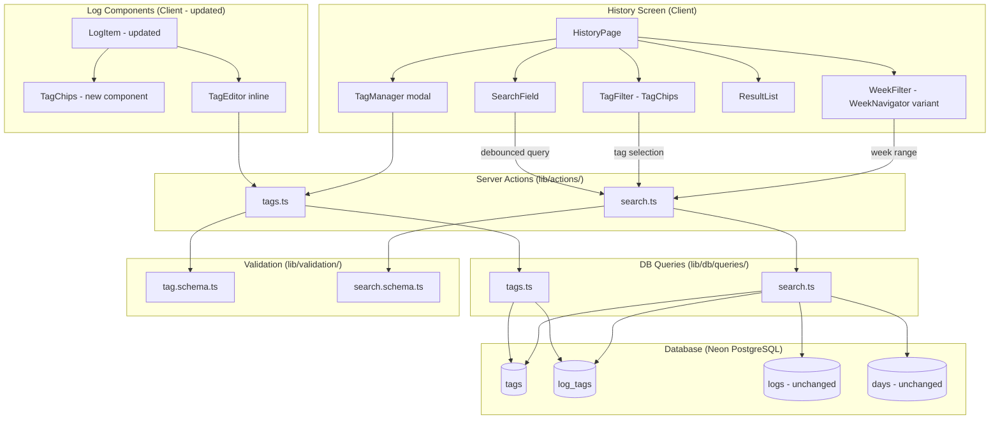

# Design Document — Tags and History

## Overview

Tags and History completa a Fase 3 do app, adicionando duas capacidades complementares: (1) um sistema de tags flexível para log entries e (2) uma tela unificada de histórico com busca textual, filtro por tags e filtro por semana.

O design segue os princípios do produto: velocidade sobre estrutura, zero pressão (tags nunca obrigatórias), e reuso de padrões de UI existentes (chips, navegação semanal). Todas as mudanças de schema são puramente aditivas — duas tabelas novas (`tags`, `log_tags`), sem ALTER em tabelas existentes.

### Decisões de Design

| Decisão | Racional |
|---------|----------|
| Duas tabelas novas (tags, log_tags) sem ALTER | Additivity constraint. Isolamento total de features existentes. |
| UNIQUE(user_id, lower(name)) no DB | Garante unicidade case-insensitive no nível mais confiável (banco). |
| TagChips com role="group" + toggle buttons | Multi-select semântico, distinto do radio-group de TaskChips. |
| OR logic entre tags, AND entre tipos de filtro | OR dentro de tags = mais resultados = menos frustração. AND entre tipos = refinamento progressivo. |
| unaccent + ILIKE para busca | Solução nativa do Postgres, sem dependência externa. Accent+case insensitive. |
| Período default "todas as semanas" | Sem fricção inicial — o usuário busca sem precisar escolher período primeiro. |
| Tags editáveis inline no log item | Sem navegação extra — princípio de ação em <10s. |
| Tag retida quando removida de todos os logs | Tag pertence ao usuário, não aos logs. Deleção explícita necessária. |
| WeekNavigator reutilizado com estado "all" | Pattern recognition — mesmo componente com estado adicional. |


---

## Architecture




### Fluxo de Dados

1. **Tag Creation**: Usuário digita nome → TagEditor chama `createTag` action → valida com Zod → insere em `tags` → retorna tag criada.
2. **Tag Association**: Usuário seleciona tag no TagEditor de um log → `addTagToLog` action → insere em `log_tags` → revalidate path.
3. **Tag Removal (from log)**: Usuário deseleciona tag → `removeTagFromLog` action → deleta row em `log_tags` → revalidate path.
4. **Tag Deletion (explicit)**: Usuário confirma deleção no TagManager → `deleteTag` action → cascade remove de `log_tags` + delete de `tags`.
5. **Search**: Usuário digita texto / seleciona tags / navega semanas → `searchLogs` action → query combinada → retorna resultados com data/hora.

### Rota da History Screen

Nova rota: `/app/(app)/history/page.tsx` — Server Component que carrega tags do usuário e renderiza a HistoryPage (Client Component) com estado de filtros.

---

## Components and Interfaces

### TagChips (New — Multi-Select)

```typescript
interface TagChipsProps {
  tags: { id: string; name: string }[];
  selectedTagIds: Set<string>;
  onToggle: (tagId: string) => void;
  size?: "sm" | "md";
}
```

**Comportamento:**
- Container com `role="group"` e `aria-label="Filtrar por tags"`
- Cada chip é um `button` com `aria-pressed={selected}`
- Toggle semantics: click seleciona/deseleciona
- Chips selecionados recebem classe `.tag-chip--active`
- Variant `sm` para uso dentro do LogItem, `md` para History Screen


---

### TagEditor (Inline — Client Component)

```typescript
interface TagEditorProps {
  logId: string;
  currentTags: { id: string; name: string }[];
  allUserTags: { id: string; name: string }[];
  date: string;
}
```

**Comportamento:**
- Aparece inline no LogItem ao clicar em "Tags"
- Input de texto para digitar/criar tags (autocomplete com tags existentes)
- Sugestão de tag existente quando match case-insensitive é detectado
- Chips das tags atuais com botão "×" para remover associação
- Chips das tags sugeridas clicáveis para adicionar

---

### TagManager (Modal — Client Component)

```typescript
interface TagManagerProps {
  tags: { id: string; name: string; logCount: number }[];
  onDelete: (tagId: string) => void;
}
```

**Comportamento:**
- Acessível via botão "Gerenciar tags" no History Screen
- Lista todas as tags do usuário com contagem de uso
- Botão de exclusão por tag → exibe warning inline
- Warning: "Esta tag será removida de X registros. Confirmar?"
- Confirmação explícita obrigatória (dois cliques: "Excluir" → "Confirmar exclusão")

---

### HistoryPage (Client Component)

```typescript
interface HistoryPageProps {
  userTags: { id: string; name: string }[];
  initialResults: SearchResult[];
}
```

**Comportamento:**
- Gerencia estado dos 3 filtros: `searchText`, `selectedTagIds`, `weekRange`
- Chama `searchLogs` action via `useTransition` a cada mudança de filtro
- SearchField com debounce de 300ms no texto
- TagChips para filtro de tags (OR logic interna)
- WeekFilter com estado especial "Todas as semanas" (default)
- ResultList renderiza resultados com data/hora e chips de tags


---

### SearchResult Type

```typescript
interface SearchResult {
  logId: string;
  content: string;
  date: string;        // yyyy-MM-dd
  time: string;        // HH:mm
  tags: { id: string; name: string }[];
  source: "log" | "mood_note";
}
```

---

### WeekFilter (Variant of WeekNavigator)

```typescript
interface WeekFilterProps {
  selectedWeek: Date | null;  // null = "todas as semanas"
  onWeekChange: (week: Date | null) => void;
}
```

**Comportamento:**
- Reusa padrão visual do `WeekNavigator` (setas prev/next)
- Estado especial `null` = "Todas as semanas" (default)
- Botão "Todas" para limpar seleção de semana
- Label mostra `weekLabel(date)` quando semana selecionada, ou "Todas as semanas" quando null

---

### LogItem (Updated)

Adições ao `LogItem` existente:
- Renderiza `TagChips` (variant `sm`) abaixo do conteúdo quando `log.tags.length > 0`
- Botão "Tags" nos actions que abre o `TagEditor` inline
- Quando `log.tags.length === 0`, nenhum wrapper extra é renderizado (preserva layout)

---

### Server Actions

#### `lib/actions/tags.ts`

```typescript
"use server";

type ActionResult = { success: true } | { success: false; error: string };

// Criar uma nova tag para o usuário
export async function createTag(input: unknown): Promise<ActionResult & { tag?: Tag }>;

// Associar tag a um log entry
export async function addTagToLog(input: unknown): Promise<ActionResult>;

// Remover associação tag ↔ log
export async function removeTagFromLog(input: unknown): Promise<ActionResult>;

// Deletar tag (com cascade)
export async function deleteTag(input: unknown): Promise<ActionResult>;

// Listar todas as tags do usuário (para sugestões)
export async function getUserTags(): Promise<Tag[]>;
```


#### `lib/actions/search.ts`

```typescript
"use server";

export interface SearchFilters {
  text?: string;
  tagIds?: string[];
  weekStart?: string;  // yyyy-MM-dd, null = all weeks
}

// Buscar logs com filtros combinados
export async function searchLogs(input: unknown): Promise<SearchResult[]>;
```

---

## Data Models

### New Tables (Drizzle Schema)

```typescript
/**
 * Tabela tags — tags definidas pelo usuário para categorização de logs
 * UNIQUE constraint em (user_id, name) com comparação case-insensitive
 */
export const tags = pgTable(
  "tags",
  {
    id: uuid("id").primaryKey().defaultRandom(),
    userId: uuid("user_id")
      .notNull()
      .references(() => users.id, { onDelete: "cascade" }),
    name: text("name").notNull(),
    createdAt: timestamp("created_at", { withTimezone: true })
      .notNull()
      .defaultNow(),
  },
  (table) => ({
    userNameUnique: uniqueIndex("tags_user_id_name_unique")
      .on(table.userId, table.name),
  })
);

/**
 * Tabela log_tags — junção many-to-many entre logs e tags
 * Composite PK (log_id, tag_id), cascade em ambas FKs
 */
export const logTags = pgTable(
  "log_tags",
  {
    logId: uuid("log_id")
      .notNull()
      .references(() => logs.id, { onDelete: "cascade" }),
    tagId: uuid("tag_id")
      .notNull()
      .references(() => tags.id, { onDelete: "cascade" }),
  },
  (table) => ({
    pk: primaryKey({ columns: [table.logId, table.tagId] }),
  })
);
```


### Drizzle Relations

```typescript
export const tagsRelations = relations(tags, ({ one, many }) => ({
  user: one(users, {
    fields: [tags.userId],
    references: [users.id],
  }),
  logTags: many(logTags),
}));

export const logTagsRelations = relations(logTags, ({ one }) => ({
  log: one(logs, {
    fields: [logTags.logId],
    references: [logs.id],
  }),
  tag: one(tags, {
    fields: [logTags.tagId],
    references: [tags.id],
  }),
}));
```

### Case-Insensitive Uniqueness

A nível de banco, o unique index usa `lower(name)` para garantir que "Trabalho" e "trabalho" sejam considerados a mesma tag:

```sql
CREATE UNIQUE INDEX tags_user_id_name_unique
  ON tags (user_id, lower(name));
```

No Drizzle, isso requer uma raw SQL migration ou custom index expression.

### Accent-Insensitive Search

A busca textual usa a extensão `unaccent` do PostgreSQL:

```sql
-- Ativar extensão (migration one-time)
CREATE EXTENSION IF NOT EXISTS unaccent;

-- Query de busca
SELECT l.* FROM logs l
  INNER JOIN days d ON l.day_id = d.id
  LEFT JOIN log_tags lt ON lt.log_id = l.id
WHERE d.user_id = $1
  AND (unaccent(lower(l.content)) LIKE '%' || unaccent(lower($2)) || '%'
       OR unaccent(lower(d.mood_note)) LIKE '%' || unaccent(lower($2)) || '%')
  -- tag filter (OR within)
  AND ($3::uuid[] IS NULL OR lt.tag_id = ANY($3))
  -- week filter
  AND ($4::date IS NULL OR d.date >= $4 AND d.date < $4 + INTERVAL '7 days')
ORDER BY l.created_at DESC;
```


### Zod Validation Schemas

#### `lib/validation/tag.schema.ts`

```typescript
import { z } from "zod";

const tagNameSchema = z
  .string()
  .min(1, "O nome da tag não pode ser vazio")
  .max(30, "O nome da tag deve ter no máximo 30 caracteres")
  .refine((s) => s.trim().length > 0, "O nome não pode conter apenas espaços")
  .transform((s) => s.trim());

const logIdSchema = z.string().uuid("logId deve ser um UUID válido");
const tagIdSchema = z.string().uuid("tagId deve ser um UUID válido");
const dateSchema = z
  .string()
  .regex(/^\d{4}-\d{2}-\d{2}$/, "Data deve estar no formato yyyy-MM-dd");

export const createTagSchema = z.object({
  name: tagNameSchema,
});

export const addTagToLogSchema = z.object({
  logId: logIdSchema,
  tagId: tagIdSchema,
  date: dateSchema,
});

export const removeTagFromLogSchema = z.object({
  logId: logIdSchema,
  tagId: tagIdSchema,
  date: dateSchema,
});

export const deleteTagSchema = z.object({
  tagId: tagIdSchema,
});

export type CreateTagInput = z.infer<typeof createTagSchema>;
export type AddTagToLogInput = z.infer<typeof addTagToLogSchema>;
export type RemoveTagFromLogInput = z.infer<typeof removeTagFromLogSchema>;
export type DeleteTagInput = z.infer<typeof deleteTagSchema>;
```

#### `lib/validation/search.schema.ts`

```typescript
import { z } from "zod";

const dateSchema = z
  .string()
  .regex(/^\d{4}-\d{2}-\d{2}$/, "Data deve estar no formato yyyy-MM-dd");

export const searchLogsSchema = z.object({
  text: z.string().max(200).optional().default(""),
  tagIds: z.array(z.string().uuid()).optional().default([]),
  weekStart: dateSchema.nullable().optional().default(null),
});

export type SearchLogsInput = z.infer<typeof searchLogsSchema>;
```


### DB Queries

#### `lib/db/queries/tags.ts`

```typescript
import { eq, and, sql } from "drizzle-orm";
import { db } from "@/lib/db/client";
import { tags, logTags } from "@/drizzle/schema";

export type Tag = { id: string; name: string; createdAt: Date };

export async function createTag(userId: string, name: string): Promise<Tag> {
  const [tag] = await db.insert(tags).values({ userId, name }).returning();
  return tag;
}

export async function getUserTags(userId: string): Promise<Tag[]> {
  return db.select().from(tags).where(eq(tags.userId, userId));
}

export async function findTagByName(
  userId: string,
  name: string
): Promise<Tag | undefined> {
  const [tag] = await db
    .select()
    .from(tags)
    .where(
      and(
        eq(tags.userId, userId),
        sql`lower(${tags.name}) = lower(${name})`
      )
    )
    .limit(1);
  return tag;
}

export async function deleteTagById(tagId: string): Promise<void> {
  await db.delete(tags).where(eq(tags.id, tagId));
}

export async function addTagToLog(logId: string, tagId: string): Promise<void> {
  await db.insert(logTags).values({ logId, tagId }).onConflictDoNothing();
}

export async function removeTagFromLog(logId: string, tagId: string): Promise<void> {
  await db
    .delete(logTags)
    .where(and(eq(logTags.logId, logId), eq(logTags.tagId, tagId)));
}

export async function getTagsForLog(logId: string): Promise<Tag[]> {
  const result = await db
    .select({ id: tags.id, name: tags.name, createdAt: tags.createdAt })
    .from(logTags)
    .innerJoin(tags, eq(logTags.tagId, tags.id))
    .where(eq(logTags.logId, logId));
  return result;
}

export async function getTagWithLogCount(
  userId: string
): Promise<(Tag & { logCount: number })[]> {
  // Returns all user tags with count of associated logs
  const result = await db
    .select({
      id: tags.id,
      name: tags.name,
      createdAt: tags.createdAt,
      logCount: sql<number>`count(${logTags.logId})::int`,
    })
    .from(tags)
    .leftJoin(logTags, eq(logTags.tagId, tags.id))
    .where(eq(tags.userId, userId))
    .groupBy(tags.id, tags.name, tags.createdAt);
  return result;
}
```


#### `lib/db/queries/search.ts`

```typescript
import { eq, and, sql, desc, inArray } from "drizzle-orm";
import { db } from "@/lib/db/client";
import { logs, days, logTags, tags } from "@/drizzle/schema";

export interface SearchResult {
  logId: string;
  content: string;
  date: string;
  time: string;
  tags: { id: string; name: string }[];
  source: "log" | "mood_note";
}

export async function searchLogs(
  userId: string,
  filters: { text: string; tagIds: string[]; weekStart: string | null }
): Promise<SearchResult[]> {
  // Build dynamic query with Drizzle's sql template
  // Combines text (unaccent+ILIKE), tag (OR via ANY), and week (date range) filters
  // Returns logs + mood_note matches unified, ordered by created_at DESC
  // Implementation uses raw SQL for unaccent + flexible filtering
}
```

---

## Correctness Properties

*A property is a characteristic or behavior that should hold true across all valid executions of a system — essentially, a formal statement about what the system should do. Properties serve as the bridge between human-readable specifications and machine-verifiable correctness guarantees.*

### Property 1: Tag creation produces valid record with case-insensitive uniqueness

*For any* valid tag name string (1–30 non-whitespace-only characters), creating a tag SHALL produce a record with a UUID id, the correct user reference, the trimmed name, and a timestamp. Attempting to create a second tag with a case-insensitive match of the same name for the same user SHALL be rejected.

**Validates: Requirements 1.1, 1.2, 1.4**


### Property 2: Case-insensitive tag lookup returns existing match

*For any* existing tag and any case-variant of its name (uppercase, lowercase, mixed), the tag lookup function SHALL return the existing tag, enabling suggestion before duplicate creation.

**Validates: Requirements 1.3**

### Property 3: Tag association count matches input

*For any* log entry and any set of N distinct valid tags (0 ≤ N), associating all N tags with the log SHALL result in exactly N rows in the log_tags junction table for that log.

**Validates: Requirements 2.1, 4.2**

### Property 4: Tag association round-trip (add then remove)

*For any* log entry and any valid tag, adding the tag to the log and then removing it SHALL result in zero junction rows for that (log, tag) pair, leaving the tag itself still present in the user's tag list.

**Validates: Requirements 4.2, 4.3, 4.4**

### Property 5: Cascade on log deletion removes all tag associations

*For any* log entry with N associated tags, deleting the log SHALL result in zero rows in log_tags referencing that log_id, while all N tags remain in the tags table.

**Validates: Requirements 2.4**

### Property 6: Cascade on tag deletion removes all log associations

*For any* tag associated with M log entries, deleting the tag SHALL result in zero rows in log_tags referencing that tag_id, and the tag SHALL no longer exist in the tags table.

**Validates: Requirements 2.5, 5.3**


### Property 7: Tag chips render for each associated tag

*For any* log entry with N tags (N ≥ 1), rendering the log item SHALL produce exactly N tag chip elements, each containing the tag name. When N = 0, no tag container element SHALL be rendered.

**Validates: Requirements 3.1, 3.2**

### Property 8: Search returns results matching text from both log content and mood notes

*For any* search text substring present in either a log's content or a day's mood_note, the search function SHALL include that record in results. The match SHALL be case-insensitive and accent-insensitive.

**Validates: Requirements 6.1, 6.2**

### Property 9: Search results include date and time

*For any* non-empty search result set, every result SHALL contain a valid date (yyyy-MM-dd) and time (HH:mm) field representing the log's temporal context.

**Validates: Requirements 6.3**

### Property 10: Tag filter uses OR logic (any selected tag matches)

*For any* set of selected tag IDs (size ≥ 1), the search results SHALL contain only log entries that have at least one of the selected tags. Every log entry that has at least one of the selected tags SHALL appear in the results (when no other filter restricts it).

**Validates: Requirements 7.2, 9.2**

### Property 11: Week filter restricts results to date range

*For any* selected week (defined by a Monday start date), all search results SHALL have a date within that 7-day range [weekStart, weekStart + 6 days]. No log outside that range SHALL appear.

**Validates: Requirements 8.3**


### Property 12: Combined filters apply AND logic between types

*For any* combination of active filters (text, tags, week), every result in the search output SHALL satisfy ALL active filter conditions simultaneously. A result that fails any single filter condition SHALL NOT appear.

**Validates: Requirements 9.1, 8.4**

### Property 13: Cleared filters return all logs in reverse chronological order

*For any* user with N log entries, when all filters are cleared (empty text, no tags selected, all weeks), the search SHALL return all N entries ordered by created_at descending.

**Validates: Requirements 9.3**

---

## Error Handling

### Strategy

O padrão segue o modelo já estabelecido no projeto:

| Camada | Tratamento |
|--------|------------|
| **Client (validação)** | `maxLength=30` no input de tag name. Debounce 300ms no campo de busca. |
| **Client (UI)** | Resultado vazio exibe mensagem neutra "Nada encontrado ainda" (sem error styling). |
| **Server Action (Zod)** | `safeParse` → retorna `{ success: false, error }` se input inválido. |
| **Server Action (auth)** | Verifica `getCurrentUserId()` → retorna "Não autorizado" se falhar. |
| **Server Action (ownership)** | Verifica que o log/tag pertence ao usuário antes de mutações. |
| **Server Action (duplicate)** | Unique constraint violation → retorna "Tag já existe" em vez de erro genérico. |
| **Server Action (DB)** | Try/catch → retorna erro genérico; nunca expõe detalhes do banco. |

### Cenários específicos

| Cenário | Resposta |
|---------|----------|
| Tag name vazio ou whitespace | Zod rejeita; retorna "O nome da tag não pode ser vazio" |
| Tag name > 30 chars | Input bloqueado no client; Zod rejeita no server |
| Tag duplicada (case-insensitive) | Retorna `{ success: false, error: "Tag já existe" }` com sugestão da existente |
| Associação duplicada (log+tag) | `onConflictDoNothing` — operação idempotente, retorna success |
| Log/Tag não pertence ao usuário | Retorna "Não autorizado" |
| DB indisponível | Retorna "Não foi possível completar a ação. Tente novamente." |
| Busca sem resultados | UI exibe "Nada encontrado ainda" (neutro, sem erro) |
| Deleção de tag sem confirmação | Bloqueada pelo client — botão de confirm obrigatório |


---

## Testing Strategy

### Dual Testing Approach

O projeto utiliza **Vitest** como test runner e **fast-check** para property-based testing (ambos já instalados).

#### Property-Based Tests (PBT)

- **Biblioteca**: `fast-check` (já instalada)
- **Mínimo 100 iterações** por property test
- **Tag**: Cada teste contém comentário referenciando a propriedade:
  ```
  // Feature: tags-and-history, Property {N}: {título}
  ```

**Testes de propriedade a implementar:**

| # | Property | Módulo testado |
|---|----------|----------------|
| 1 | Tag creation + case-insensitive uniqueness | `lib/db/queries/tags.ts` |
| 2 | Case-insensitive tag lookup | `lib/db/queries/tags.ts` |
| 3 | Tag association count | `lib/db/queries/tags.ts` |
| 4 | Tag association round-trip | `lib/db/queries/tags.ts` |
| 5 | Cascade on log deletion | `lib/db/queries/tags.ts` + DB cascade |
| 6 | Cascade on tag deletion | `lib/db/queries/tags.ts` + DB cascade |
| 7 | Tag chips render count | `components/logs/TagChips.tsx` |
| 8 | Search matches content + mood_note | `lib/db/queries/search.ts` |
| 9 | Search results include date/time | `lib/db/queries/search.ts` |
| 10 | Tag filter OR logic | `lib/db/queries/search.ts` |
| 11 | Week filter date range | `lib/db/queries/search.ts` |
| 12 | Combined AND logic | `lib/db/queries/search.ts` |
| 13 | Cleared filters = all logs desc | `lib/db/queries/search.ts` |

#### Unit Tests (example-based)

- TagChips render com role="group" e aria-pressed
- TagEditor: autocomplete sugere tag existente
- TagManager: warning exibido antes de confirmar deleção
- TagManager: deleção bloqueada sem confirmação explícita
- LogItem sem tags: nenhum wrapper extra renderizado
- HistoryPage: estado inicial (all weeks, no tags, empty text)
- HistoryPage: mensagem neutra quando sem resultados
- WeekFilter: estado "Todas as semanas" como default
- Zod schemas: rejeição de inputs inválidos (exemplos concretos)

#### Integration Tests

- Fluxo completo: criar tag → associar a log → buscar por tag → encontrar log
- Deletar tag → verificar que logs perdem associação mas não são deletados
- Busca com acentos: "ação" encontra "Acao" e vice-versa
- Filtro combinado: texto + tag + semana retorna interseção correta
- Log deletion cascades tag associations

### Estrutura de arquivos de teste

```
lib/validation/__tests__/tag.schema.test.ts
lib/validation/__tests__/search.schema.test.ts
lib/db/queries/__tests__/tags.test.ts
lib/db/queries/__tests__/search.test.ts
components/logs/__tests__/TagChips.test.tsx
components/logs/__tests__/TagEditor.test.tsx
app/(app)/history/__tests__/HistoryPage.test.tsx
```
