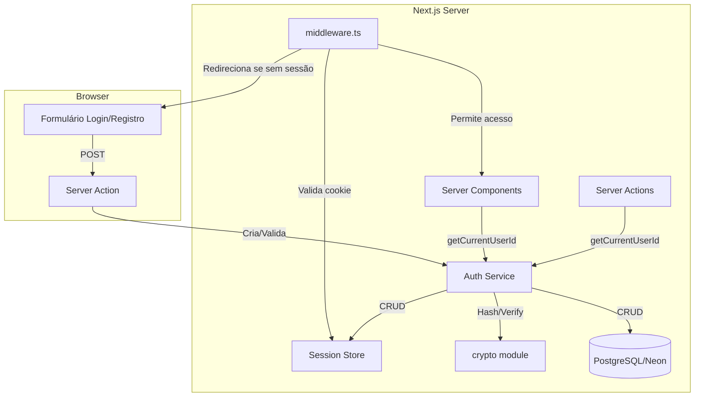
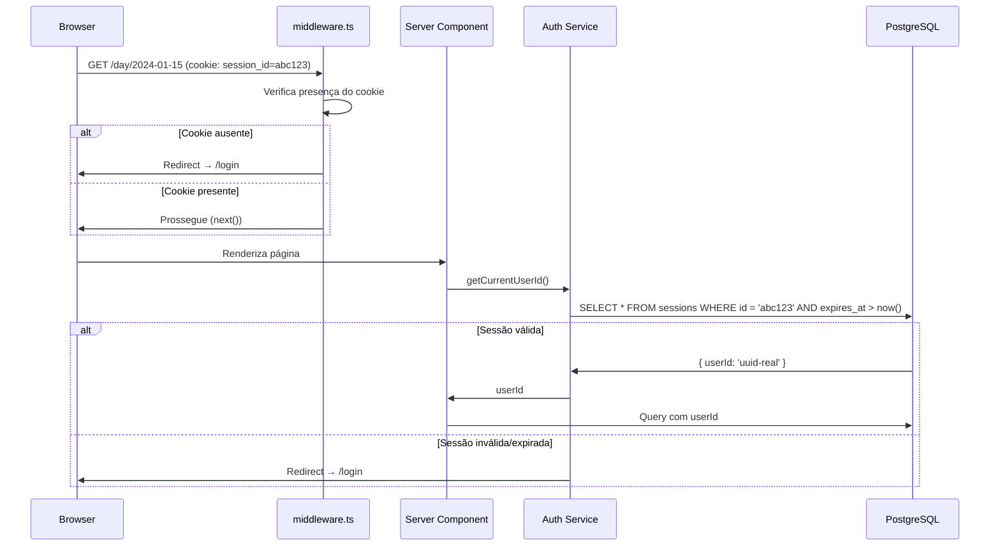

# Design Document: User Authentication

## Overview

Este documento descreve o design técnico do sistema de autenticação para o **semana.** — substituindo o stub hardcoded em `lib/auth.ts` por autenticação real com email e senha, gerenciamento de sessão via cookies e proteção de rotas.

### Decisões Técnicas de Alto Nível

| Decisão | Escolha | Justificativa |
|---------|---------|---------------|
| Hashing de senha | `scrypt` (via `crypto` nativo do Node.js) | Não requer dependências externas; disponível em Node ≥ 16; resistente a ataques de GPU |
| Armazenamento de sessão | Tabela `sessions` no PostgreSQL | Permite invalidação server-side, compartilha infraestrutura existente (Neon), evita JWTs opacos |
| Cookie de sessão | HTTP-only, Secure, SameSite=Lax, max-age=30d | Previne XSS (HTTP-only) e CSRF básico (SameSite=Lax); persiste entre fechamentos do browser |
| Proteção de rotas | Middleware do Next.js (`middleware.ts`) | Intercepta requisições antes de renderizar; único ponto de controle para rotas protegidas |
| Rate limiting | Tabela `login_attempts` no banco | Simples de implementar sem Redis; suficiente para escala de app single-user-at-a-time |
| Validação | Zod (já presente no projeto) | Reutiliza dependência existente; tipo-safe; integração direta com server actions |
| IDs de sessão | `crypto.randomBytes(32).toString('hex')` | 256 bits de entropia; sem colisão prática |

---

## Architecture

### High-Level Architecture



### Request Flow — Rota Protegida



### Request Flow — Login

```mermaid
sequenceDiagram
    participant B as Browser
    participant SA as Server Action (login)
    participant Auth as Auth Service
    participant DB as PostgreSQL

    B->>SA: POST { email, password }
    SA->>Auth: validateCredentials(email, password)
    Auth->>DB: SELECT * FROM users WHERE email = normalize(email)
    alt Usuário não encontrado
        Auth->>SA: { error: 'invalid_credentials' }
    else Usuário encontrado
        Auth->>Auth: scrypt.verify(password, user.password_hash)
        alt Senha incorreta
            Auth->>DB: INSERT INTO login_attempts (email, ...)
            Auth->>SA: { error: 'invalid_credentials' }
        else Senha correta
            Auth->>DB: DELETE FROM login_attempts WHERE email = ...
            Auth->>DB: INSERT INTO sessions (id, user_id, expires_at)
            Auth->>SA: { success: true, sessionId }
            SA->>B: Set-Cookie: session_id=...; HttpOnly; Secure; SameSite=Lax; Max-Age=2592000
            SA->>B: Redirect → /
        end
    end
```

---

## Components and Interfaces

### Módulos e Responsabilidades

```
lib/
├── auth.ts                    # Função pública getCurrentUserId() — interface principal
├── auth/
│   ├── session.ts             # Criação, validação, renovação e invalidação de sessões
│   ├── password.ts            # Hashing e verificação com scrypt
│   ├── rate-limit.ts          # Verificação e registro de tentativas falhas
│   └── schemas.ts             # Zod schemas para login e registro
├── db/
│   └── queries/
│       └── auth.ts            # Queries: findUserByEmail, createUser, CRUD sessions, attempts
app/
├── (auth)/
│   ├── login/
│   │   └── page.tsx           # Página de login (Server Component + Client Form)
│   └── register/
│       └── page.tsx           # Página de registro (Server Component + Client Form)
├── (app)/
│   └── layout.tsx             # Layout protegido (já existente, sem alterações de estrutura)
middleware.ts                   # Proteção de rotas (cookie check + redirect)
drizzle/
└── schema.ts                  # Atualização: campos email/password_hash + tabela sessions + login_attempts
```

### Interfaces TypeScript

```typescript
// lib/auth/session.ts
export interface Session {
  id: string;          // 64-char hex token
  userId: string;      // UUID do usuário
  expiresAt: Date;     // Data de expiração (30 dias rolling)
  createdAt: Date;
}

export async function createSession(userId: string): Promise<string>; // retorna sessionId
export async function validateSession(sessionId: string): Promise<Session | null>;
export async function renewSession(sessionId: string): Promise<void>;
export async function invalidateSession(sessionId: string): Promise<void>;

// lib/auth/password.ts
export async function hashPassword(plaintext: string): Promise<string>;
export async function verifyPassword(plaintext: string, hash: string): Promise<boolean>;

// lib/auth/rate-limit.ts
export interface RateLimitResult {
  allowed: boolean;
  retryAfterSeconds?: number; // presente quando blocked
}
export async function checkRateLimit(email: string): Promise<RateLimitResult>;
export async function recordFailedAttempt(email: string): Promise<void>;
export async function clearFailedAttempts(email: string): Promise<void>;

// lib/auth/schemas.ts
import { z } from 'zod';

export const loginSchema: z.ZodObject<{ email: string; password: string }>;
export const registerSchema: z.ZodObject<{
  email: string;
  password: string;
  confirmPassword: string;
}>;

// lib/auth.ts (interface pública — atualizada)
export async function getCurrentUserId(): Promise<string>;
// Em Server Component: redirect('/login') se não autenticado
// Em Server Action: throw Error se não autenticado
```

### Server Actions

```typescript
// lib/actions/auth.ts
export async function registerAction(formData: FormData): Promise<ActionResult>;
export async function loginAction(formData: FormData): Promise<ActionResult>;
export async function logoutAction(): Promise<void>;

interface ActionResult {
  success: boolean;
  error?: string;
  fieldErrors?: Record<string, string>;
}
```

---

## Data Models

### Alterações no Schema (drizzle/schema.ts)

#### Tabela `users` — campos adicionados

```typescript
export const users = pgTable("users", {
  id: uuid("id").primaryKey().defaultRandom(),
  email: text("email").notNull().unique(),           // NOVO
  passwordHash: text("password_hash").notNull(),     // NOVO
  createdAt: timestamp("created_at", { withTimezone: true }).notNull().defaultNow(),
});
```

#### Tabela `sessions` — nova

```typescript
export const sessions = pgTable("sessions", {
  id: text("id").primaryKey(),  // 64-char hex token (crypto.randomBytes(32))
  userId: uuid("user_id")
    .notNull()
    .references(() => users.id, { onDelete: "cascade" }),
  expiresAt: timestamp("expires_at", { withTimezone: true }).notNull(),
  createdAt: timestamp("created_at", { withTimezone: true }).notNull().defaultNow(),
});
```

#### Tabela `login_attempts` — nova

```typescript
export const loginAttempts = pgTable("login_attempts", {
  id: uuid("id").primaryKey().defaultRandom(),
  email: text("email").notNull(),
  attemptedAt: timestamp("attempted_at", { withTimezone: true }).notNull().defaultNow(),
});
```

### Cookie Structure

| Atributo | Valor |
|----------|-------|
| Name | `session_id` |
| Value | 64-char hex string |
| HttpOnly | `true` |
| Secure | `true` (produção) / `false` (dev) |
| SameSite | `Lax` |
| Path | `/` |
| Max-Age | `2592000` (30 dias em segundos) |

### Middleware Logic (Pseudocódigo)

```typescript
// middleware.ts
const protectedPrefix = '/(app)';  // grupo de rotas protegidas
const publicPaths = ['/login', '/register'];

export function middleware(request: NextRequest) {
  const { pathname } = request.nextUrl;
  const sessionCookie = request.cookies.get('session_id');

  // Rotas públicas com sessão ativa → redirect para home
  if (publicPaths.some(p => pathname.startsWith(p)) && sessionCookie) {
    return NextResponse.redirect(new URL('/', request.url));
  }

  // Rotas protegidas sem cookie → redirect para login
  if (!publicPaths.some(p => pathname.startsWith(p)) && !sessionCookie) {
    return NextResponse.redirect(new URL('/login', request.url));
  }

  return NextResponse.next();
}

export const config = {
  matcher: ['/((?!_next/static|_next/image|favicon.ico|.*\\..*).*)'],
};
```

> **Nota:** O middleware verifica apenas a *presença* do cookie (é leve e rápido). A validação completa (expiração, existência no banco) acontece em `getCurrentUserId()` dentro do Server Component/Action. Isso garante que o middleware não faz queries ao banco em cada requisição de assets.

---


## Correctness Properties

*A property is a characteristic or behavior that should hold true across all valid executions of a system — essentially, a formal statement about what the system should do. Properties serve as the bridge between human-readable specifications and machine-verifiable correctness guarantees.*

### Property 1: Password hashing round-trip

*For any* password string of 8-128 characters, hashing it with `hashPassword()` then verifying with `verifyPassword(password, hash)` SHALL return `true`, and the hash SHALL NOT equal the plaintext password.

**Validates: Requirements 1.8, 1.2**

### Property 2: Email normalization is idempotent and case-insensitive

*For any* email string, normalizing it (lowercase + trim) and then normalizing again SHALL produce the same result. Additionally, for any two email strings that differ only in casing or leading/trailing whitespace, normalization SHALL produce identical output.

**Validates: Requirements 5.7, 1.2**

### Property 3: Duplicate email registration is rejected

*For any* valid email/password combination that is already registered in the system, attempting to register again with the same email (regardless of casing or whitespace) SHALL fail with a duplicate-email error without creating a second user record.

**Validates: Requirements 1.4**

### Property 4: Email schema validation rejects invalid formats

*For any* string that does NOT conform to the simplified RFC 5322 email format (or exceeds 254 characters), passing it through the login or register Zod schema SHALL produce a validation error on the email field.

**Validates: Requirements 1.5, 2.5**

### Property 5: Password length boundaries

*For any* string of length < 8 or > 128, the register schema SHALL reject it with a length error. Conversely, *for any* string of length between 8 and 128 (inclusive), regardless of character composition, the schema SHALL accept it as a valid password.

**Validates: Requirements 1.6, 6.6**

### Property 6: Confirm password mismatch rejected

*For any* two distinct strings provided as password and confirmPassword in the register schema, validation SHALL fail with a mismatch error.

**Validates: Requirements 1.7**

### Property 7: Login round-trip (register then login)

*For any* valid email and password, if a user is registered with those credentials, then logging in with the same email (in any casing/whitespace variant) and the same password SHALL succeed and produce a valid session.

**Validates: Requirements 2.2**

### Property 8: Invalid credentials produce generic error

*For any* email/password pair where either (a) the email does not exist in the database or (b) the password does not match the stored hash, the login function SHALL return the same error shape and message, without revealing which field is incorrect.

**Validates: Requirements 2.3**

### Property 9: Rate limiting blocks after threshold

*For any* email address, if 5 failed login attempts are recorded within a 15-minute window, the next login attempt for that email SHALL be rejected with a rate-limit error. After 5 minutes of no attempts, the system SHALL allow login attempts again.

**Validates: Requirements 2.7**

### Property 10: Session lifecycle (create → validate → invalidate)

*For any* valid userId, creating a session SHALL return a token that, when validated, returns that same userId. After invalidating that session, validating the same token SHALL return null.

**Validates: Requirements 3.2, 3.3, 4.4**

### Property 11: Session expiry is 30 days rolling

*For any* session, the initial `expiresAt` SHALL be approximately 30 days after creation. After renewal, the new `expiresAt` SHALL be approximately 30 days from the renewal time (not the original creation time).

**Validates: Requirements 4.2, 4.3**

### Property 12: Data isolation between users

*For any* two distinct users A and B, when user A queries their data (logs, days, tasks, weekPlans, reminders), the result set SHALL never contain records belonging to user B, and vice versa.

**Validates: Requirements 5.5, 5.6**

### Property 13: Error messages are concise and blame-free

*For any* error message produced by the authentication module (schemas + actions), the message SHALL be at most 80 characters in length and SHALL NOT contain blame-attributing words (e.g., "você errou", "incorreto por sua culpa").

**Validates: Requirements 6.4**

---

## Error Handling

### Estratégia por Camada

| Camada | Tipo de Erro | Comportamento |
|--------|-------------|---------------|
| Client (Zod schema) | Validação de formato | Mensagem inline no campo; formulário não é submetido |
| Server Action | Credenciais inválidas | Retorna `{ error: 'invalid_credentials' }` — mensagem genérica |
| Server Action | Email duplicado | Retorna `{ error: 'email_exists' }` — mensagem específica no campo |
| Server Action | Rate limit | Retorna `{ error: 'rate_limited', retryAfterSeconds }` |
| Server Action | Erro inesperado | Retorna `{ error: 'unknown' }` — mensagem genérica; loga detalhes no server |
| Middleware | Cookie ausente | Redirect para `/login` (sem mensagem) |
| `getCurrentUserId()` | Sessão inválida/expirada | Server Component: `redirect('/login')` / Server Action: `throw Error` |
| `validateSession()` | DB indisponível | Retorna `null` (trata como não autenticado) — loga erro internamente |

### Princípios

1. **Nunca revelar informações de segurança**: Erros de login não indicam se é o email ou a senha que está errado.
2. **Graceful degradation**: Erro de DB na validação de sessão = não autenticado (não crash).
3. **Preservar estado do usuário**: Em caso de erro no formulário, valores preenchidos são mantidos (exceto senha em login com falha).
4. **Timeout**: Formulários definem timeout de 30s; após isso, reabilitam interação e mostram erro de comunicação.
5. **Logging server-side**: Erros inesperados são logados com stack trace no servidor mas nunca expostos ao cliente.

---

## Testing Strategy

### Approach

O sistema de autenticação será testado com uma combinação de **testes de propriedade** (para lógica pura e invariantes universais) e **testes unitários de exemplo** (para casos específicos, UI e integrações).

### Property-Based Tests (Vitest + fast-check)

Cada propriedade do design será implementada como um teste de propriedade com mínimo de **100 iterações**. A library **fast-check** (já instalada) será usada.

**Módulos testados com PBT:**
- `lib/auth/password.ts` — Properties 1, 2 (hash round-trip, normalization)
- `lib/auth/schemas.ts` — Properties 4, 5, 6 (schema validation)
- `lib/auth/session.ts` — Properties 10, 11 (session lifecycle)
- `lib/auth/rate-limit.ts` — Property 9 (rate limiting)
- `lib/db/queries/auth.ts` — Properties 3, 7, 8, 12 (registration, login, data isolation)

**Configuração:**
- Mínimo 100 iterações por property test
- Cada teste marcado com tag: `Feature: user-authentication, Property {N}: {description}`
- Generators customizados para: emails válidos/inválidos, senhas válidas/inválidas, UUIDs

### Unit Tests (Vitest)

**Cenários cobertos:**
- Middleware: redirect correto para rotas protegidas/públicas
- UI: loading states, autofocus, autocomplete attributes, error clearing on input
- Integration: `getCurrentUserId()` redirect vs throw behavior
- Edge cases: empty strings, campo vazio, timeout de 30s

### Test Organization

```
lib/auth/__tests__/
├── password.test.ts       # Properties 1, 2 (PBT)
├── schemas.test.ts        # Properties 4, 5, 6, 13 (PBT)
├── session.test.ts        # Properties 10, 11 (PBT)
├── rate-limit.test.ts     # Property 9 (PBT)
├── auth-queries.test.ts   # Properties 3, 7, 8, 12 (PBT with mocked DB)
└── middleware.test.ts     # Unit tests (example-based)
app/(auth)/__tests__/
├── login.test.tsx         # UI unit tests
└── register.test.tsx      # UI unit tests
```

### Mocking Strategy

- **Database**: Mock Drizzle queries para testes de propriedade (evita dependência de DB real)
- **crypto**: Usar implementação real de `scrypt` (é rápido o suficiente para 100 iterações)
- **cookies**: Mock `next/headers` para simular presença/ausência de cookies
- **redirect**: Mock `next/navigation` para capturar redirects em testes
