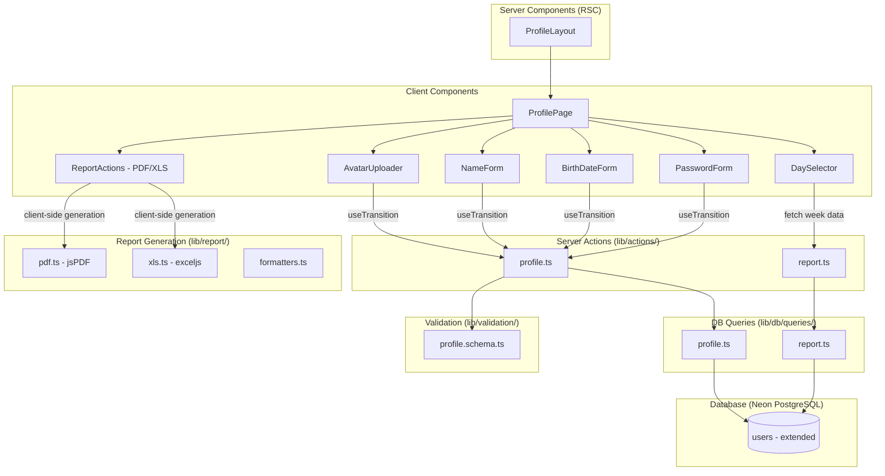

# Design Document — User Profile and Export

## Overview

O módulo de Perfil e Exportação adiciona ao app **semana.** duas capacidades complementares:

1. **Perfil do Usuário** — Página `/profile` para gerenciar dados pessoais (nome, avatar, data de nascimento, senha). Todos os campos são estritamente opcionais — o app funciona integralmente sem nenhum dado de perfil preenchido.
2. **Relatório Semanal** — Exportação de dados semanais (logs, tarefas, leitura) em PDF ou XLS, destinada a compartilhamento com psicólogo.

Princípio fundamental: **feedback leve e não intrusivo**. Erros inline, sem modais bloqueantes. Sucesso sutil que desaparece naturalmente.

### Decisões de Design

| Decisão | Racional |
|---------|----------|
| Avatar armazenado como base64 data URL no campo `avatarUrl` | Evita complexidade de storage externo (S3/Cloudflare R2) para imagens pequenas (≤256x256). Limita tamanho final a ~100KB post-resize. |
| Resize/crop no client via Canvas API nativa | Sem dependência extra para resize. Canvas API é universalmente suportada e suficiente para crop quadrado + downscale. |
| `jsPDF` para geração de PDF | Leve (~300KB), API imperativa ideal para layout A4 programático, roda no client (browser download direto). Não requer server-side rendering. |
| `exceljs` para geração de XLS | API moderna com promises, suporte nativo a múltiplas sheets, formatação rica, e licença MIT. Roda no client para download direto. |
| Exportação client-side (não Server Action) | PDF/XLS são gerados no browser a partir de dados já buscados via Server Action. Evita timeout de serverless functions e permite download direto sem intermediário. |
| Novos campos na tabela `users` (não tabela separada) | Profile data é 1:1 com user, acesso frequente. Campos nullable evitam migration complexa e respeitam princípio de campos opcionais. |
| Validação de idade calculada no momento da submissão | Age range [13, 120] calculado com `differenceInYears(today, birthDate)`. Sem re-validação contínua. |

---

## Architecture



### Fluxo de dados

1. **Perfil — Leitura**: `ProfileLayout` (RSC) busca dados do usuário via query e repassa para componentes client.
2. **Perfil — Mutação**: Client Components usam `useTransition` para chamar Server Actions de atualização.
3. **Perfil — Feedback**: Após mutação, `revalidatePath("/profile")` atualiza RSC. Erros exibidos inline.
4. **Relatório — Dados**: Server Action `getWeekReportData` busca logs + tasks + reading para os dias selecionados.
5. **Relatório — Geração**: Dados retornados ao client, que gera PDF/XLS localmente e dispara download.

---

## Components and Interfaces

### ProfilePage (Client Component)

```typescript
interface ProfilePageProps {
  user: UserProfile;
}

interface UserProfile {
  id: string;
  email: string;
  name: string | null;
  avatarUrl: string | null;    // base64 data URL ou null
  birthDate: string | null;    // yyyy-MM-dd ou null
  createdAt: Date;
}
```

**Seções da página:**
- Avatar + nome (topo)
- Formulário de nome
- Formulário de data de nascimento (com idade calculada)
- Formulário de alteração de senha
- Seção "Exportar relatório semanal" (DaySelector + botões PDF/XLS)
- Link para voltar à home

---

### AvatarUploader (Client Component)

```typescript
interface AvatarUploaderProps {
  currentAvatarUrl: string | null;
  userName: string | null;
  userEmail: string;
}
```

**Estado interno:**
- `isUploading: boolean`
- `error: string | null`

**Fluxo de upload:**
1. Click na área do avatar → `<input type="file" accept="image/jpeg,image/png,image/webp">`
2. Valida tamanho (≤ 2MB) e tipo MIME
3. Carrega imagem em `<canvas>` 256x256 (crop central quadrado)
4. Exporta como data URL JPEG quality 0.85
5. Chama Server Action `updateAvatar(dataUrl)`
6. Em caso de sucesso: atualiza UI. Em caso de erro: exibe mensagem inline.

**Placeholder (sem avatar):**
- Círculo com iniciais: primeira letra do primeiro nome + primeira letra do último nome
- Fallback: primeira letra do email

---

### NameForm (Client Component)

```typescript
interface NameFormProps {
  currentName: string | null;
}
```

**Comportamento:**
- Input controlado com `defaultValue` do nome atual
- Submit via Enter ou botão "Salvar"
- Validação client-side: trim + length [2, 100]
- Server Action: `updateName(name)`
- Feedback: mensagem de erro inline ou sucesso silencioso (valor atualiza)

---

### BirthDateForm (Client Component)

```typescript
interface BirthDateFormProps {
  currentBirthDate: string | null;  // yyyy-MM-dd
}
```

**Comportamento:**
- Input type="date" com valor atual
- Exibe idade calculada ao lado: "{X} anos"
- Validação: idade ∈ [13, 120] usando `differenceInYears`
- Server Action: `updateBirthDate(date)`
- Feedback: erro inline se idade fora do range

---

### PasswordForm (Client Component)

```typescript
interface PasswordFormProps {}
```

**Estado interno:**
- `currentPassword: string`
- `newPassword: string`
- `confirmPassword: string`
- `error: string | null`
- `success: string | null`
- `isSubmitting: boolean`

**Validação client-side:**
- Nova senha: [8, 128] caracteres
- Confirmação deve ser igual à nova senha

**Server Action:** `changePassword({ currentPassword, newPassword })`

**Feedback:**
- Sucesso: "Senha alterada com sucesso" (desaparece após 5s)
- Erro: mensagem específica inline
- Durante submit: botão desabilitado + loading indicator

---

### DaySelector (Client Component)

```typescript
interface DaySelectorProps {
  weekStart: string;            // yyyy-MM-dd (segunda-feira)
  daysWithData: string[];       // datas que possuem pelo menos 1 log
}
```

**Estado interno:**
- `selectedDays: Set<string>` — inicializado com `daysWithData`
- `weekOffset: number` — para navegar semanas anteriores (0 = semana atual)

**Comportamento:**
- Exibe 7 dias (seg-dom) com labels em pt-BR
- Checkbox por dia; dot/badge para dias com dados
- Pré-seleciona dias com dados
- Permite navegar para semanas anteriores via setas
- Validação: mínimo 1 dia selecionado para exportar

---

### ReportActions (Client Component)

```typescript
interface ReportActionsProps {
  userName: string | null;
}
```

**Comportamento:**
- Dois botões: "Exportar PDF" e "Exportar Planilha"
- Ao clicar: chama Server Action `getWeekReportData(selectedDays)` → recebe dados → gera arquivo local → dispara download
- Loading state durante busca + geração
- Erro inline se falhar

---

### Server Actions

#### `lib/actions/profile.ts`

```typescript
"use server";

export async function updateName(input: unknown): Promise<ActionResult>;
export async function updateAvatar(input: unknown): Promise<ActionResult>;
export async function updateBirthDate(input: unknown): Promise<ActionResult>;
export async function changePassword(input: unknown): Promise<ActionResult>;
```

#### `lib/actions/report.ts`

```typescript
"use server";

export async function getWeekReportData(
  input: unknown
): Promise<WeekReportData | { success: false; error: string }>;
```

---

## Data Models

### Schema Changes (`drizzle/schema.ts`)

Adicionar 3 campos nullable à tabela `users`:

```typescript
export const users = pgTable("users", {
  id: uuid("id").primaryKey().defaultRandom(),
  email: text("email").notNull().unique(),
  passwordHash: text("password_hash").notNull(),
  name: text("name"),                    // 2-100 chars, nullable
  avatarUrl: text("avatar_url"),         // base64 data URL, nullable
  birthDate: date("birth_date"),         // yyyy-MM-dd, nullable
  createdAt: timestamp("created_at", { withTimezone: true }).notNull().defaultNow(),
});
```

**Migration:** `ALTER TABLE users ADD COLUMN name TEXT, ADD COLUMN avatar_url TEXT, ADD COLUMN birth_date DATE;`

### Zod Validation Schemas

#### `lib/validation/profile.schema.ts`

```typescript
import { z } from "zod";
import { differenceInYears } from "date-fns";

export const updateNameSchema = z.object({
  name: z
    .string()
    .transform((s) => s.trim())
    .pipe(
      z.string()
        .min(2, "Nome deve ter pelo menos 2 caracteres")
        .max(100, "Nome deve ter no máximo 100 caracteres")
    ),
});

export const updateAvatarSchema = z.object({
  avatarUrl: z
    .string()
    .startsWith("data:image/", "Formato de imagem inválido")
    .max(500_000, "Imagem processada muito grande"),  // ~350KB base64 limit
});

export const updateBirthDateSchema = z.object({
  birthDate: z
    .string()
    .regex(/^\d{4}-\d{2}-\d{2}$/, "Data inválida")
    .refine((dateStr) => {
      const date = new Date(dateStr);
      return !isNaN(date.getTime());
    }, "Data inválida")
    .refine((dateStr) => {
      const age = differenceInYears(new Date(), new Date(dateStr));
      return age >= 13 && age <= 120;
    }, "Idade deve estar entre 13 e 120 anos"),
});

export const changePasswordSchema = z.object({
  currentPassword: z.string().min(1, "Senha atual é obrigatória"),
  newPassword: z
    .string()
    .min(8, "A senha deve ter pelo menos 8 caracteres")
    .max(128, "A senha deve ter no máximo 128 caracteres"),
});

export const getWeekReportSchema = z.object({
  dates: z
    .array(z.string().regex(/^\d{4}-\d{2}-\d{2}$/))
    .min(1, "Selecione pelo menos um dia")
    .max(7),
});
```

### TypeScript Types

```typescript
// lib/types/profile.ts

export interface UserProfile {
  id: string;
  email: string;
  name: string | null;
  avatarUrl: string | null;
  birthDate: string | null;
  createdAt: Date;
}

// lib/types/report.ts

export interface WeekReportData {
  userName: string | null;
  dateRange: { start: string; end: string };
  days: ReportDay[];
}

export interface ReportDay {
  date: string;
  logs: ReportLog[];
  taskProgress: ReportTask[];
  readingActivity: ReportReading | null;
}

export interface ReportLog {
  content: string;
  createdAt: string;    // ISO timestamp
}

export interface ReportTask {
  name: string;
  goal: number;
  done: number;
}

export interface ReportReading {
  bookTitle: string;
  date: string;
}
```

### DB Queries

#### `lib/db/queries/profile.ts`

```typescript
export async function getUserProfile(userId: string): Promise<UserProfile | null>;
export async function updateUserName(userId: string, name: string): Promise<void>;
export async function updateUserAvatar(userId: string, avatarUrl: string): Promise<void>;
export async function updateUserBirthDate(userId: string, birthDate: string): Promise<void>;
export async function updateUserPasswordHash(userId: string, hash: string): Promise<void>;
export async function getUserPasswordHash(userId: string): Promise<string | null>;
```

#### `lib/db/queries/report.ts`

```typescript
export async function getReportLogs(
  userId: string, 
  dates: string[]
): Promise<Array<{ date: string; content: string; createdAt: Date }>>;

export async function getReportTaskProgress(
  userId: string, 
  weekStart: string
): Promise<Array<{ name: string; goal: number; done: number }>>;

export async function getReportReadingActivity(
  userId: string, 
  dates: string[]
): Promise<Array<{ date: string; bookTitle: string }>>;

export async function getDaysWithLogs(
  userId: string,
  weekStart: string
): Promise<string[]>;
```

---

## Correctness Properties

*A property is a characteristic or behavior that should hold true across all valid executions of a system — essentially, a formal statement about what the system should do. Properties serve as the bridge between human-readable specifications and machine-verifiable correctness guarantees.*

### Property 1: Image resize always produces 256x256 square

*For any* input image with arbitrary width and height (both ≥ 1px), the resize/crop function SHALL produce an output image of exactly 256×256 pixels, regardless of the original aspect ratio or dimensions.

**Validates: Requirements 2.2**

### Property 2: Avatar file validation

*For any* file metadata (MIME type and byte size), the avatar validation function SHALL accept the file if and only if the MIME type is one of `image/jpeg`, `image/png`, or `image/webp` AND the size is ≤ 2,097,152 bytes (2 MB). All other files SHALL be rejected with the appropriate error message.

**Validates: Requirements 2.4, 2.5, 2.6**

### Property 3: Initials extraction

*For any* combination of user name (string or null) and email (string), the initials function SHALL produce: (a) first letter of first word + first letter of last word of the name when name has 2+ words, (b) first letter of name when name is a single word, or (c) first letter of email when name is null or empty.

**Validates: Requirements 2.7**

### Property 4: Name validation after trim

*For any* string input, the name validation schema SHALL accept the input if and only if, after trimming leading and trailing whitespace, the resulting length is in the range [2, 100]. Strings that are empty, whitespace-only, or whose trimmed length is < 2 or > 100 SHALL be rejected.

**Validates: Requirements 3.2, 3.3, 3.4**

### Property 5: Birth date age validation

*For any* date string in valid yyyy-MM-dd format, the birth date validation schema SHALL accept the date if and only if `differenceInYears(today, date)` produces a value in the range [13, 120]. Dates outside this range or in invalid format SHALL be rejected.

**Validates: Requirements 4.1, 4.2, 4.3, 4.4**

### Property 6: Password change round-trip

*For any* valid new password (8–128 characters), after a successful password change, calling `verifyPassword(newPassword, storedHash)` SHALL return true, and calling `verifyPassword(oldPassword, storedHash)` SHALL return false.

**Validates: Requirements 5.1**

### Property 7: Password length validation

*For any* string, the password validation schema SHALL accept it if and only if its length is in the range [8, 128]. Strings shorter than 8 or longer than 128 characters SHALL be rejected.

**Validates: Requirements 5.4, 5.5, 5.6**

### Property 8: Day selector initialization matches days with data

*For any* subset of weekday dates that have at least one log entry, the DaySelector component's initial `selectedDays` state SHALL equal exactly that subset, and visual indicators (dots/badges) SHALL appear for exactly those days.

**Validates: Requirements 6.1, 6.3**

### Property 9: Report filename format

*For any* user name (string or null) and any valid date range (start, end), the filename generator SHALL produce a string matching the pattern `semana_[slug]_[start]_[end].[ext]` where `[slug]` is the lowercased, hyphenated name (or "usuario" when name is null/empty), dates are in DD-MM-YYYY format, and `[ext]` is "pdf" or "xlsx" as specified.

**Validates: Requirements 7.5, 8.5**

### Property 10: Report data retrieval returns correct data for selected days

*For any* set of selected dates belonging to a user, the report data query SHALL return: (a) all logs for those dates with correct content and timestamps, (b) task progress from the week plan covering those dates with correct name/goal/done, and (c) reading activity for those dates with correct book titles. No data from unselected days or other users SHALL appear.

**Validates: Requirements 9.1, 9.2, 9.3, 10.1, 10.2**

### Property 11: Report data chronological ordering

*For any* set of report data containing multiple days and multiple logs per day, the days SHALL be ordered from earliest to latest date, and logs within each day SHALL be ordered by ascending creation timestamp.

**Validates: Requirements 9.4, 9.5**

### Property 12: XLS report structure

*For any* valid WeekReportData with at least one day containing data, the generated XLS workbook SHALL contain exactly 3 sheets named "Registros", "Tarefas", and "Leitura", each with a header row containing the user name (or "Usuário" fallback) and date range, followed by the corresponding data rows from selected days only.

**Validates: Requirements 8.2, 8.3**

---

## Error Handling

### Strategy

Todas as mutações seguem o padrão já estabelecido no projeto:

| Camada | Tratamento |
|--------|------------|
| **Client (validação)** | Validação client-side antes de enviar (tamanho de arquivo, formato, length de strings). |
| **Client (otimismo)** | `useTransition` para loading states; campos retêm valor anterior em caso de erro. |
| **Server Action (Zod)** | `safeParse` → retorna `{ success: false, error }` se inválido. |
| **Server Action (auth)** | Verifica `getCurrentUserId()` → redirect para `/login` se falhar. |
| **Server Action (DB)** | Try/catch → retorna erro genérico; nunca expõe detalhes do banco. |
| **Client (feedback)** | Detecta `success: false`, exibe mensagem inline, preserva estado anterior. |

### Erros específicos do módulo

| Cenário | Resposta |
|---------|----------|
| Arquivo > 2MB | `"Imagem deve ter no máximo 2 MB"` (client-side, antes de upload) |
| Formato de imagem inválido | `"Formato aceito: JPEG, PNG ou WebP"` (client-side) |
| Canvas resize falha | `"Erro ao salvar foto. Tente novamente."` |
| Senha atual incorreta | `"Senha atual incorreta"` |
| Senhas não coincidem | `"As senhas não coincidem"` (client-side) |
| Nome muito curto (< 2 após trim) | `"Nome deve ter pelo menos 2 caracteres"` |
| Nome muito longo (> 100) | `"Nome deve ter no máximo 100 caracteres"` |
| Idade fora de [13, 120] | `"Idade deve estar entre 13 e 120 anos"` |
| Data inválida | `"Data inválida"` |
| PDF/XLS falha na geração | `"Erro ao gerar [PDF/planilha]. Tente novamente."` |
| Nenhum dia selecionado | `"Selecione pelo menos um dia"` (bloqueia botões de export) |

### Princípios de feedback

- **Sem modais bloqueantes** — coerente com o princípio zero-pressão.
- **Mensagens breves e neutras** em pt-BR.
- **Sucesso silencioso** — campo atualiza, nenhuma mensagem aparece (exceto senha: msg temporária 5s).
- **Erros desaparecem** na próxima tentativa bem-sucedida.
- **Loading states** sutis: spinner no avatar, botão desabilitado na senha/export.

---

## Testing Strategy

### Dual Testing Approach

O projeto utiliza **Vitest** como test runner e **fast-check** para property-based testing.

#### Property-Based Tests (PBT)

- **Biblioteca**: `fast-check` (já instalada)
- **Mínimo 100 iterações** por property test
- **Tag**: Cada teste deve conter um comentário referenciando a propriedade do design:
  ```
  // Feature: user-profile-and-export, Property {N}: {título}
  ```

**Testes de propriedade a implementar:**

| # | Property | Módulo testado |
|---|----------|----------------|
| 1 | Image resize produces 256x256 | `lib/utils/image.ts` (função pura de dimensões) |
| 2 | Avatar file validation | `lib/validation/profile.schema.ts` |
| 3 | Initials extraction | `lib/utils/initials.ts` |
| 4 | Name validation after trim | `lib/validation/profile.schema.ts` |
| 5 | Birth date age validation | `lib/validation/profile.schema.ts` |
| 6 | Password change round-trip | `lib/actions/profile.ts` + `lib/auth/password.ts` |
| 7 | Password length validation | `lib/validation/profile.schema.ts` |
| 8 | Day selector initialization | `components/profile/DaySelector.tsx` |
| 9 | Report filename format | `lib/report/formatters.ts` |
| 10 | Report data retrieval | `lib/db/queries/report.ts` |
| 11 | Report data ordering | `lib/db/queries/report.ts` |
| 12 | XLS report structure | `lib/report/xls.ts` |

#### Unit Tests (example-based)

- Renderização de componentes (ProfilePage, AvatarUploader, PasswordForm)
- Empty states (perfil sem dados, semana sem registros)
- Interações de UI (click avatar → file input, submit forms)
- PDF geração com dados mockados (verificar que não lança exceção)
- Comportamento de timeout da mensagem de sucesso da senha
- Mensagem "Nenhum registro encontrado" quando todos os dias estão vazios

#### Integration Tests

- Fluxo completo: atualizar nome → verificar no banco → verificar no RSC
- Alterar senha → logout → login com nova senha
- Buscar dados de relatório com múltiplos dias → verificar completude
- Autenticação: verificar que queries filtram por userId corretamente

### Estrutura de arquivos de teste

```
lib/validation/__tests__/profile.schema.test.ts
lib/actions/__tests__/profile.test.ts
lib/db/queries/__tests__/profile.test.ts
lib/db/queries/__tests__/report.test.ts
lib/utils/__tests__/initials.test.ts
lib/utils/__tests__/image.test.ts
lib/report/__tests__/formatters.test.ts
lib/report/__tests__/xls.test.ts
lib/report/__tests__/pdf.test.ts
components/profile/__tests__/DaySelector.test.tsx
components/profile/__tests__/AvatarUploader.test.tsx
components/profile/__tests__/PasswordForm.test.tsx
```

### Dependências a adicionar

```json
{
  "dependencies": {
    "jspdf": "^2.5.2",
    "exceljs": "^4.4.0"
  }
}
```

> Nota: O resize de imagem será implementado com Canvas API nativa do browser, sem dependência adicional.
