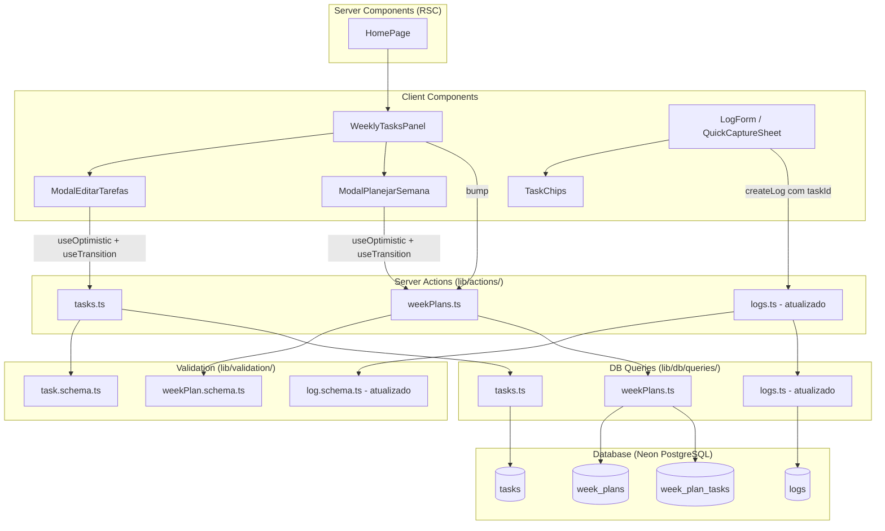

# Design Document — Weekly Task System

## Overview

O sistema de tarefas semanais adiciona ao app **semana.** a capacidade de planejar atividades recorrentes por semana de forma leve e sem pressão. Ele se compõe de quatro módulos interdependentes:

1. **Biblioteca de Tarefas** — CRUD de templates reutilizáveis (tabela `tasks`).
2. **Plano Semanal** — Seleção e configuração de tarefas ativas por semana (`week_plans` + `week_plan_tasks`).
3. **Contadores** — Exibição `feito/meta` com bump manual e auto-incremento/decremento via logs.
4. **Chips de Tarefa** — Vinculação opcional de logs a tarefas ativas (`weekPlanTaskId` na tabela `logs`).

Princípio fundamental: **ZERO culpa, cobrança ou pressão**. Contadores são estritamente informativos.

### Decisões de Design

| Decisão | Racional |
|---------|----------|
| `weekPlanTaskId` em `logs` (não `taskId`) | Vincula o log à instância da tarefa naquela semana, permitindo rastrear progresso sem ambiguidade entre semanas. |
| Bump sem criar log | Permite progresso rápido para atividades que não precisam de registro textual. |
| `done` nunca < 0 | Evita estados inválidos ao deletar logs vinculados. |
| Planos independentes por semana | Alterações retroativas são proibidas; cada semana é imutável em relação a outras. |
| Exclusão de task preserva `week_plan_tasks` | Histórico de planos antigos permanece íntegro. |

---

## Architecture



### Fluxo de dados

1. **Leitura**: `HomePage` (RSC) busca tarefas ativas da semana via query em `week_plan_tasks` e repassa para `WeeklyTasksPanel`.
2. **Mutação**: Client Components usam `useTransition` + `useOptimistic` para chamar Server Actions.
3. **Revalidação**: Server Actions chamam `revalidatePath("/")` após sucesso para atualizar o RSC.
4. **Rollback**: Em caso de erro, o estado otimista é revertido e um aviso inline é exibido.

---

## Components and Interfaces

### WeeklyTasksPanel (Client Component)

```typescript
interface WeeklyTasksPanelProps {
  weekStart: string;                    // yyyy-MM-dd
  activeTasks: ActiveTaskDisplay[];     // tarefas ativas com contadores
  allTasks: TaskLibraryItem[];          // biblioteca completa (para modais)
}

interface ActiveTaskDisplay {
  weekPlanTaskId: string;
  taskId: string;
  name: string;
  goal: number;
  done: number;
}

interface TaskLibraryItem {
  id: string;
  name: string;
  defaultQty: number;
}
```

**Estado interno:**
- `showEditModal: boolean`
- `showPlanModal: boolean`
- `optimisticTasks: ActiveTaskDisplay[]` (via `useOptimistic`)

**Ações:**
- Abrir/fechar `ModalEditarTarefas`
- Abrir/fechar `ModalPlanejarSemana`
- Bump (incrementar `done` de uma tarefa)

---

### ModalEditarTarefas (Client Component)

```typescript
interface ModalEditarTarefasProps {
  tasks: TaskLibraryItem[];
  onClose: () => void;
}
```

**Funcionalidades:**
- Adicionar tarefa (nome + qty padrão)
- Editar nome ou qty padrão de tarefa existente
- Remover tarefa (com confirmação)
- Lista vazia: mensagem "Nenhuma tarefa criada ainda."
- Validação inline: nome max 100 chars (bloqueio no input), qty clamped 1–99

---

### ModalPlanejarSemana (Client Component)

```typescript
interface ModalPlanejarSemanaProps {
  weekStart: string;
  tasks: TaskLibraryItem[];
  currentPlan: WeekPlanTaskInput[];     // tarefas já ativas nesta semana
  onClose: () => void;
}

interface WeekPlanTaskInput {
  taskId: string;
  goal: number;
  active: boolean;
}
```

**Funcionalidades:**
- Checkbox por tarefa (ativar/desativar)
- Campo qty editável por tarefa (clamped 1–99)
- Salvar plano (Server Action `saveWeekPlan`)
- Biblioteca vazia: mensagem "Adicione tarefas na biblioteca primeiro." + botão desabilitado

---

### TaskChips (Client Component)

```typescript
interface TaskChipsProps {
  activeTasks: ActiveTaskDisplay[];
  selectedTaskId: string | null;        // null = chip "nenhuma"
  onSelect: (weekPlanTaskId: string | null) => void;
}
```

**Funcionalidades:**
- Chip "nenhuma" sempre primeiro (selecionado por padrão)
- Apenas 1 chip selecionado por vez (radio-like)
- Oculto se `activeTasks` está vazio
- Scroll horizontal se necessário

---

### Server Actions

#### `lib/actions/tasks.ts`

```typescript
"use server";

// Criar tarefa na biblioteca
export async function createTask(input: unknown): Promise<ActionResult>;

// Editar tarefa na biblioteca
export async function updateTask(input: unknown): Promise<ActionResult>;

// Remover tarefa da biblioteca
export async function deleteTask(input: unknown): Promise<ActionResult>;
```

#### `lib/actions/weekPlans.ts`

```typescript
"use server";

// Salvar plano semanal (upsert completo)
export async function saveWeekPlan(input: unknown): Promise<ActionResult>;

// Bump: incrementar done de uma week_plan_task
export async function bumpTask(input: unknown): Promise<ActionResult>;
```

#### `lib/actions/logs.ts` (atualizado)

```typescript
// createLog agora aceita weekPlanTaskId opcional
// Se weekPlanTaskId presente e válido: cria log + incrementa done
// deleteLog: se log tinha weekPlanTaskId, decrementa done (min 0)
```

---

## Data Models

### Drizzle Schema Additions (`drizzle/schema.ts`)

```typescript
/**
 * Tabela tasks — biblioteca de tarefas recorrentes do usuário
 */
export const tasks = pgTable("tasks", {
  id: uuid("id").primaryKey().defaultRandom(),
  userId: uuid("user_id")
    .notNull()
    .references(() => users.id, { onDelete: "cascade" }),
  name: text("name").notNull(),           // max 100 chars (validado via Zod)
  defaultQty: integer("default_qty").notNull().default(1),  // 1–99
  createdAt: timestamp("created_at", { withTimezone: true })
    .notNull()
    .defaultNow(),
});

/**
 * Tabela week_plans — plano semanal por usuário
 * Unique constraint em (userId, weekStart)
 */
export const weekPlans = pgTable(
  "week_plans",
  {
    id: uuid("id").primaryKey().defaultRandom(),
    userId: uuid("user_id")
      .notNull()
      .references(() => users.id, { onDelete: "cascade" }),
    weekStart: date("week_start").notNull(),
    createdAt: timestamp("created_at", { withTimezone: true })
      .notNull()
      .defaultNow(),
  },
  (table) => ({
    userWeekUnique: uniqueIndex("week_plans_user_id_week_start_unique").on(
      table.userId,
      table.weekStart
    ),
  })
);

/**
 * Tabela week_plan_tasks — tarefas ativas em um plano semanal
 */
export const weekPlanTasks = pgTable("week_plan_tasks", {
  id: uuid("id").primaryKey().defaultRandom(),
  weekPlanId: uuid("week_plan_id")
    .notNull()
    .references(() => weekPlans.id, { onDelete: "cascade" }),
  taskId: uuid("task_id")
    .notNull()
    .references(() => tasks.id, { onDelete: "restrict" }),
  goal: integer("goal").notNull().default(1),   // 1–99
  done: integer("done").notNull().default(0),   // >= 0
  createdAt: timestamp("created_at", { withTimezone: true })
    .notNull()
    .defaultNow(),
});

// Alteração na tabela logs — adicionar FK para week_plan_tasks
// Campo: weekPlanTaskId uuid nullable
export const logs = pgTable("logs", {
  id: uuid("id").primaryKey().defaultRandom(),
  dayId: uuid("day_id")
    .notNull()
    .references(() => days.id, { onDelete: "cascade" }),
  content: text("content").notNull(),
  mood: integer("mood"),
  weekPlanTaskId: uuid("week_plan_task_id")
    .references(() => weekPlanTasks.id, { onDelete: "set null" }),
  createdAt: timestamp("created_at", { withTimezone: true })
    .notNull()
    .defaultNow(),
});
```

### Zod Validation Schemas

#### `lib/validation/task.schema.ts`

```typescript
import { z } from "zod";

const taskNameSchema = z
  .string()
  .min(1)
  .max(100)
  .refine((s) => s.trim().length > 0);

const defaultQtySchema = z.number().int().min(1).max(99);

export const createTaskSchema = z.object({
  name: taskNameSchema,
  defaultQty: defaultQtySchema,
});

export const updateTaskSchema = z.object({
  taskId: z.string().uuid(),
  name: taskNameSchema.optional(),
  defaultQty: defaultQtySchema.optional(),
});

export const deleteTaskSchema = z.object({
  taskId: z.string().uuid(),
});
```

#### `lib/validation/weekPlan.schema.ts`

```typescript
import { z } from "zod";

const weekStartSchema = z
  .string()
  .regex(/^\d{4}-\d{2}-\d{2}$/);

const planTaskSchema = z.object({
  taskId: z.string().uuid(),
  goal: z.number().int().min(1).max(99),
});

export const saveWeekPlanSchema = z.object({
  weekStart: weekStartSchema,
  tasks: z.array(planTaskSchema),   // array vazio = plano sem tarefas
});

export const bumpTaskSchema = z.object({
  weekPlanTaskId: z.string().uuid(),
});
```

#### `lib/validation/log.schema.ts` (atualização)

```typescript
// Adicionar ao createLogSchema:
weekPlanTaskId: z.string().uuid().nullable().optional(),
```

### TypeScript Types

```typescript
// lib/types/tasks.ts
export interface TaskLibraryItem {
  id: string;
  name: string;
  defaultQty: number;
}

export interface ActiveTaskDisplay {
  weekPlanTaskId: string;
  taskId: string;
  name: string;
  goal: number;
  done: number;
}

export interface WeekPlanSummary {
  weekPlanId: string;
  weekStart: string;
  tasks: ActiveTaskDisplay[];
}
```

---


## Correctness Properties

*A property is a characteristic or behavior that should hold true across all valid executions of a system — essentially, a formal statement about what the system should do. Properties serve as the bridge between human-readable specifications and machine-verifiable correctness guarantees.*

### Property 1: Task creation round-trip

*For any* valid task name (1–100 non-whitespace-only chars) and valid defaultQty (1–99), creating a task and then querying the user's library should return a task with the same name and defaultQty.

**Validates: Requirements 1.2**

### Property 2: Whitespace-only names rejected

*For any* string composed entirely of whitespace characters (spaces, tabs, newlines), attempting to create a task with that name should be rejected and the library should remain unchanged.

**Validates: Requirements 1.3**

### Property 3: Quantity clamping invariant

*For any* integer value, the clamp function should produce a result in [1, 99] equal to `min(max(value, 1), 99)`. This applies to both `defaultQty` in the task library and `goal` in the week plan.

**Validates: Requirements 1.5, 2.3**

### Property 4: Plan saves only active tasks

*For any* set of tasks where a subset is marked as active, saving the week plan should persist exactly the active subset — no more, no less. The resulting plan's task count equals the number of active checkboxes.

**Validates: Requirements 2.2**

### Property 5: Reducing goal preserves done

*For any* week plan task with existing done value, updating the goal to any new value (including values less than done) should leave the done field unchanged.

**Validates: Requirements 2.5**

### Property 6: Week plan isolation

*For any* two distinct weekStart values belonging to the same user, modifying the plan of one week should not alter the tasks, goals, or done values of the other week's plan.

**Validates: Requirements 2.7**

### Property 7: Counter display format

*For any* (done, goal) pair where done ≥ 0 and goal ∈ [1, 99], the counter display function should produce exactly the string `"{done}/{goal}"`.

**Validates: Requirements 3.1**

### Property 8: Increment invariant (bump and log-creation)

*For any* week plan task with current done value `d`, both the bump action and creating a log linked to that task should result in done = `d + 1`, regardless of whether `d` is less than, equal to, or greater than goal.

**Validates: Requirements 3.2, 3.3, 3.7**

### Property 9: Decrement with floor at zero

*For any* week plan task with current done value `d`, deleting a log that was linked to that task should result in done = `max(d - 1, 0)`. The done field never becomes negative.

**Validates: Requirements 3.4**

### Property 10: Chip selection invariant

*For any* set of active tasks and any sequence of chip selections, exactly one chip is in the "active" state at any time. When no selection has been made, the "nenhuma" chip (always rendered first) is the default selection.

**Validates: Requirements 4.2, 4.3**

### Property 11: Chip-to-weekPlanTaskId mapping

*For any* chip selection, if the "nenhuma" chip is selected then the resulting log's weekPlanTaskId is null; if any other chip is selected then the resulting log's weekPlanTaskId equals that chip's weekPlanTaskId.

**Validates: Requirements 4.4, 4.5**

### Property 12: weekPlanTaskId validation

*For any* string, the Zod schema for createLog should accept the string as weekPlanTaskId if and only if it is a valid UUID v4 or null. Invalid strings are rejected with an appropriate error.

**Validates: Requirements 4.8**

---

## Error Handling

### Strategy

Todas as mutações seguem o padrão já estabelecido no projeto:

| Camada | Tratamento |
|--------|------------|
| **Client (validação)** | Bloqueio de input (maxLength, clamp) impede envio de dados inválidos. |
| **Client (otimismo)** | `useOptimistic` atualiza a UI imediatamente; rollback em caso de erro. |
| **Server Action (Zod)** | `safeParse` → retorna `{ success: false, error }` se inválido. |
| **Server Action (auth)** | Verifica `getCurrentUserId()` → retorna erro "Não autorizado" se falhar. |
| **Server Action (DB)** | Try/catch → retorna erro genérico; nunca expõe detalhes do banco. |
| **Client (rollback)** | Detecta `success: false`, reverte estado otimista, exibe aviso inline. |

### Erros específicos do sistema de tarefas

| Cenário | Resposta |
|---------|----------|
| `weekPlanTaskId` não pertence ao usuário/semana | `"Tarefa inválida para esta semana"` |
| Tentativa de decrementar `done` abaixo de 0 | Silenciosamente mantém `done = 0` |
| Conflito de unique constraint em `week_plans` | Upsert via `ON CONFLICT DO UPDATE` |
| Exclusão de task com `week_plan_tasks` referenciando | `onDelete: "restrict"` previne; Server Action retorna erro amigável |

### Avisos inline

- Sem modais de erro (coerente com o princípio zero-pressão).
- Mensagens breves e neutras: "Não foi possível salvar. Tente novamente."
- Desaparecem após 5 segundos ou na próxima interação bem-sucedida.

---

## Testing Strategy

### Dual Testing Approach

O projeto já utiliza **Vitest** como test runner e **fast-check** para property-based testing.

#### Property-Based Tests (PBT)

- **Biblioteca**: `fast-check` (já instalada no projeto)
- **Mínimo 100 iterações** por property test
- **Tag**: Cada teste deve conter um comentário referenciando a propriedade do design:
  ```
  // Feature: weekly-task-system, Property {N}: {título}
  ```

**Testes de propriedade a implementar:**

| # | Property | Módulo testado |
|---|----------|----------------|
| 1 | Task creation round-trip | `lib/actions/tasks.ts` + `lib/db/queries/tasks.ts` |
| 2 | Whitespace names rejected | `lib/validation/task.schema.ts` |
| 3 | Quantity clamping | `lib/utils/clamp.ts` (função pura) |
| 4 | Plan saves only active tasks | `lib/actions/weekPlans.ts` |
| 5 | Reducing goal preserves done | `lib/actions/weekPlans.ts` |
| 6 | Week plan isolation | `lib/db/queries/weekPlans.ts` |
| 7 | Counter display format | `components/home/TaskCounter.tsx` (função pura) |
| 8 | Increment invariant | `lib/actions/weekPlans.ts` (bumpTask + createLog) |
| 9 | Decrement with floor | `lib/actions/logs.ts` (deleteLog) |
| 10 | Chip selection invariant | `components/logs/TaskChips.tsx` |
| 11 | Chip-to-weekPlanTaskId mapping | `components/logs/TaskChips.tsx` |
| 12 | weekPlanTaskId validation | `lib/validation/log.schema.ts` |

#### Unit Tests (example-based)

- Cenários específicos de UI (empty states, modal open/close)
- Edge cases cobertos pelos geradores de property tests
- Error handling (mock de falhas de rede)
- Rendering de componentes (badge de tarefa no log)

#### Integration Tests

- Fluxos end-to-end: criar tarefa → adicionar ao plano → criar log vinculado → verificar done incrementado
- Isolamento entre semanas
- Referential integrity (delete task não quebra week_plan_tasks)

### Estrutura de arquivos de teste

```
lib/validation/__tests__/task.schema.test.ts
lib/validation/__tests__/weekPlan.schema.test.ts
lib/actions/__tests__/tasks.test.ts
lib/actions/__tests__/weekPlans.test.ts
lib/db/queries/__tests__/tasks.test.ts
lib/db/queries/__tests__/weekPlans.test.ts
components/home/__tests__/WeeklyTasksPanel.test.tsx
components/logs/__tests__/TaskChips.test.tsx
lib/utils/__tests__/clamp.test.ts
```
